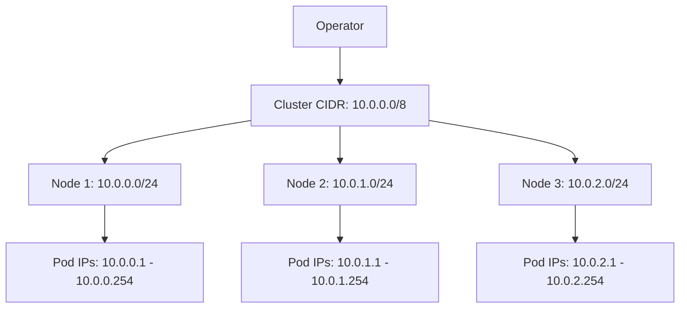

# Configuring Operational Details in Cilium IPAM

Author: [nawazdhandala](https://github.com/nawazdhandala)

Tags: Cilium, Kubernetes, IPAM, Networking, Configuration

Description: A detailed guide to configuring Cilium IPAM operational parameters including pool sizes, allocation modes, and garbage collection for production Kubernetes clusters.

---

## Introduction

Cilium IPAM (IP Address Management) handles the allocation of IP addresses to pods. The operational details of IPAM configuration determine how quickly pods get IPs, how efficiently address space is used, and what happens when address pools are exhausted. Getting these details right is critical for clusters that scale frequently or have tight IP address budgets.

Cilium supports several IPAM modes: cluster-pool (the default, where the operator divides a large CIDR into per-node pools), Kubernetes host-scope (delegating to the Kubernetes node CIDR allocator), and cloud-provider modes (AWS ENI, Azure IPAM). Each mode has different operational parameters.

This guide focuses on the operational tuning of Cilium IPAM regardless of the mode you choose.

## Prerequisites

- Kubernetes cluster (v1.25+) with Cilium installed
- Helm v3 and kubectl configured
- Understanding of your IP address requirements and constraints

## Cluster Pool IPAM Configuration

The cluster-pool mode is the most common and provides the most control:

```yaml
# cilium-ipam.yaml
ipam:
  mode: cluster-pool
  operator:
    # The overall CIDR to allocate from
    clusterPoolIPv4PodCIDRList:
      - "10.0.0.0/8"
    # Size of per-node allocation (each node gets a /24)
    clusterPoolIPv4MaskSize: 24
```

```bash
helm upgrade cilium cilium/cilium \
  --namespace kube-system \
  --reuse-values \
  -f cilium-ipam.yaml
```

### Choosing the Right Mask Size

| Mask Size | IPs per Node | Best For |
|-----------|-------------|----------|
| /24       | 254         | Standard workloads |
| /25       | 126         | Many nodes, moderate pods |
| /26       | 62          | Very large clusters, few pods per node |
| /23       | 510         | Dense nodes with many pods |



## Tuning IP Allocation Performance

### Pre-allocation Settings

Configure how many IPs are pre-allocated before pods request them:

```yaml
ipam:
  mode: cluster-pool
  operator:
    clusterPoolIPv4PodCIDRList:
      - "10.0.0.0/8"
    clusterPoolIPv4MaskSize: 24
```

### Garbage Collection

Control how quickly released IPs are reclaimed:

```bash
helm upgrade cilium cilium/cilium \
  --namespace kube-system \
  --reuse-values \
  --set endpointGCInterval="5m0s"
```

## Multi-Pool IPAM

For clusters that need different IP ranges for different workloads:

```yaml
apiVersion: cilium.io/v2alpha1
kind: CiliumPodIPPool
metadata:
  name: special-pool
spec:
  ipv4:
    cidrs:
      - "172.16.0.0/16"
    maskSize: 24
```

## Verification

```bash
# Check IPAM status
cilium status | grep IPAM

# View per-node allocations
kubectl get ciliumnodes -o json | \
  jq '.items[] | {name: .metadata.name, podCIDRs: .spec.ipam.podCIDRs}'

# Check IP utilization
cilium status --verbose | grep -A10 "IPAM"

# Verify no IP exhaustion
kubectl get events --field-selector reason=FailedScheduling | grep -i "ip"
```

## Troubleshooting

- **Pods stuck waiting for IP**: Check if the node CIDR pool is exhausted. Reduce mask size or add more CIDRs.
- **IP address conflicts**: Ensure cluster CIDR does not overlap with node, service, or external networks.
- **Slow pod startup**: Pre-allocation may be too conservative. Check operator logs for allocation latency.
- **IPAM mode change**: Changing IPAM modes requires cluster recreation. Plan this during initial setup.

## Conclusion

Cilium IPAM operational configuration directly affects pod scheduling speed and IP address efficiency. Choose your CIDR ranges and mask sizes based on cluster scale, tune garbage collection for your workload churn rate, and monitor IP utilization to prevent exhaustion. These operational details are easy to overlook but critical for production stability.