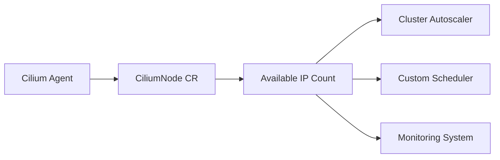

# Configuring Available IP Publication in Cilium IPAM

Author: [nawazdhandala](https://github.com/nawazdhandala)

Tags: Cilium, Kubernetes, IPAM, Networking, Configuration

Description: How to configure Cilium IPAM to publish available IP counts, enabling external systems and autoscalers to make informed scheduling decisions.

---

## Introduction

Cilium IPAM can publish the number of available IP addresses per node, which is useful for cluster autoscalers and custom scheduling logic. When external systems know how many IPs are available on each node, they can make better decisions about where to schedule pods and when to scale the cluster.

IP availability publication works through the CiliumNode custom resource, where each node reports its current IP pool status. This data is accessible via the Kubernetes API and can be consumed by monitoring systems, autoscalers, and custom controllers.

This guide covers configuring IP availability publication and integrating it with common cluster management tools.

## Prerequisites

- Kubernetes cluster with Cilium installed (v1.14+)
- kubectl and Helm v3 configured
- Optional: Cluster autoscaler or custom controller

## Enabling IP Availability Publication

IP availability data is published in CiliumNode resources by default. Verify it is working:

```bash
# Check CiliumNode for IP availability data
kubectl get ciliumnodes -o json | jq '.items[] | {
  name: .metadata.name,
  available: (.spec.ipam.pool // {} | length),
  used: (.status.ipam.used // {} | length)
}'
```

### Configuring the Operator for Publication

```yaml
# cilium-ip-publication.yaml
ipam:
  mode: cluster-pool
  operator:
    clusterPoolIPv4PodCIDRList:
      - "10.0.0.0/8"
    clusterPoolIPv4MaskSize: 24
operator:
  replicas: 2
```

```bash
helm upgrade cilium cilium/cilium \
  --namespace kube-system \
  --reuse-values \
  -f cilium-ip-publication.yaml
```

## Reading Published IP Data

```bash
# Get available IPs per node
kubectl get ciliumnodes -o json | jq -r '.items[] |
  "\(.metadata.name): available=\((.spec.ipam.pool // {} | length) - (.status.ipam.used // {} | length))"'

# Watch for changes in real time
kubectl get ciliumnodes -w
```



## Integration with Cluster Autoscaler

```bash
#!/bin/bash
# check-ip-capacity.sh - Use as pre-scale check

MIN_AVAILABLE=10
LOW_NODES=0

kubectl get ciliumnodes -o json | jq -r --argjson min "$MIN_AVAILABLE" '
  .items[] |
  ((.spec.ipam.pool // {} | length) - (.status.ipam.used // {} | length)) as $avail |
  if $avail < $min then
    "LOW: \(.metadata.name) has \($avail) IPs available"
  else empty end'
```

## Monitoring Published Data

```promql
# Track available IPs per node
cilium_ipam_available

# Alert when nodes are running low
cilium_ipam_available < 10
```

```yaml
apiVersion: monitoring.coreos.com/v1
kind: PrometheusRule
metadata:
  name: cilium-ip-availability
  namespace: monitoring
spec:
  groups:
    - name: ip-availability
      rules:
        - alert: LowIPAvailability
          expr: cilium_ipam_available < 10
          for: 5m
          labels:
            severity: warning
          annotations:
            summary: "Node {{ $labels.node }} has fewer than 10 IPs available"
```

## Verification

```bash
cilium status | grep IPAM
kubectl get ciliumnodes -o wide
kubectl run test-ip --image=nginx:1.27 --restart=Never
kubectl get pod test-ip -o wide
kubectl delete pod test-ip
```

## Troubleshooting

- **CiliumNode shows no pool data**: Check IPAM mode is configured. Verify operator is running.
- **Available count seems wrong**: Agent may be behind on reporting. Wait for next sync cycle.
- **Autoscaler not reading data**: Verify the autoscaler has RBAC to read CiliumNode resources.
- **Data not updating**: Restart the agent on the affected node.

## Conclusion

Publishing available IP counts through CiliumNode resources enables intelligent scheduling and capacity planning. Integrate this data with your cluster autoscaler and monitoring to prevent IP exhaustion and ensure smooth pod scheduling.