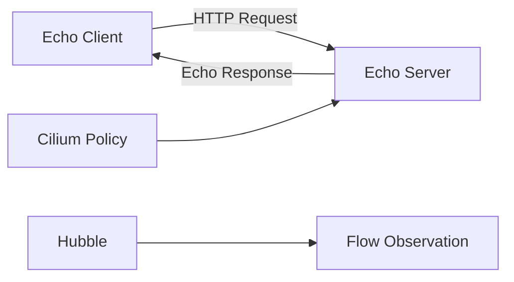

# Configuring the Cilium Echo App for Testing

Author: [nawazdhandala](https://github.com/nawazdhandala)

Tags: Cilium, Kubernetes, Testing, Echo App, Networking

Description: How to deploy and configure the Cilium echo app for testing connectivity, network policies, and L7 traffic management in Cilium-managed clusters.

---

## Introduction

The Cilium echo app is a purpose-built test application that helps validate networking, policy enforcement, and L7 traffic management. It provides HTTP and gRPC endpoints that echo request details back to the caller, making it easy to verify routing, headers, and policy behavior.

Using the echo app is the recommended way to test Cilium features before deploying them in production. It is lightweight, provides detailed request/response information, and is designed to work with Cilium connectivity tests.

## Prerequisites

- Kubernetes cluster with Cilium installed
- kubectl configured
- Cilium CLI installed

## Deploying the Echo App

```bash
# Deploy the echo app using the connectivity test
cilium connectivity test --deploy-only

# Or deploy manually
kubectl create namespace cilium-test
kubectl apply -n cilium-test -f \
  https://raw.githubusercontent.com/cilium/cilium/main/examples/kubernetes/connectivity-check/connectivity-check.yaml
```

### Manual Deployment

```yaml
# echo-server.yaml
apiVersion: apps/v1
kind: Deployment
metadata:
  name: echo-server
  namespace: cilium-test
spec:
  replicas: 2
  selector:
    matchLabels:
      app: echo-server
  template:
    metadata:
      labels:
        app: echo-server
    spec:
      containers:
        - name: echo-server
          image: quay.io/cilium/json-mock:v1.3.8
          ports:
            - containerPort: 8080
              name: http
          readinessProbe:
            httpGet:
              path: /
              port: 8080
---
apiVersion: v1
kind: Service
metadata:
  name: echo-server
  namespace: cilium-test
spec:
  selector:
    app: echo-server
  ports:
    - port: 8080
      targetPort: 8080
      name: http
```

```bash
kubectl apply -f echo-server.yaml
```

## Configuring the Echo App

### Deploy a Client Pod

```yaml
# echo-client.yaml
apiVersion: apps/v1
kind: Deployment
metadata:
  name: echo-client
  namespace: cilium-test
spec:
  replicas: 1
  selector:
    matchLabels:
      app: echo-client
  template:
    metadata:
      labels:
        app: echo-client
    spec:
      containers:
        - name: client
          image: quay.io/cilium/alpine-curl:v1.9.0
          command: ["sleep", "infinity"]
```

```bash
kubectl apply -f echo-client.yaml
```



## Testing Connectivity

```bash
# Test basic connectivity
kubectl exec -n cilium-test deploy/echo-client -- \
  curl -s http://echo-server:8080/

# Test with specific headers
kubectl exec -n cilium-test deploy/echo-client -- \
  curl -s -H "X-Test: hello" http://echo-server:8080/

# Test specific paths
kubectl exec -n cilium-test deploy/echo-client -- \
  curl -s http://echo-server:8080/api/v1/test
```

## Testing with Network Policies

```yaml
# echo-policy.yaml
apiVersion: cilium.io/v2
kind: CiliumNetworkPolicy
metadata:
  name: echo-l7-policy
  namespace: cilium-test
spec:
  endpointSelector:
    matchLabels:
      app: echo-server
  ingress:
    - fromEndpoints:
        - matchLabels:
            app: echo-client
      toPorts:
        - ports:
            - port: "8080"
              protocol: TCP
          rules:
            http:
              - method: GET
                path: "/api/.*"
```

```bash
kubectl apply -f echo-policy.yaml

# This should work (matches policy)
kubectl exec -n cilium-test deploy/echo-client -- \
  curl -s http://echo-server:8080/api/test

# This should be denied (POST not allowed)
kubectl exec -n cilium-test deploy/echo-client -- \
  curl -s -X POST http://echo-server:8080/api/test
```

## Verification

```bash
kubectl get pods -n cilium-test
kubectl get svc -n cilium-test
cilium connectivity test
```

## Troubleshooting

- **Echo app not starting**: Check image pull permissions. The images are on quay.io.
- **Connectivity test fails**: Verify Cilium agent is healthy on all nodes.
- **L7 policy not working**: Ensure Envoy proxy is enabled in Cilium.
- **Pods stuck in Pending**: Check resource limits and node capacity.

## Conclusion

The Cilium echo app provides a controlled environment for testing connectivity, policies, and L7 traffic management. Deploy it in a test namespace, run connectivity tests, and use it to validate policies before applying them to production workloads.