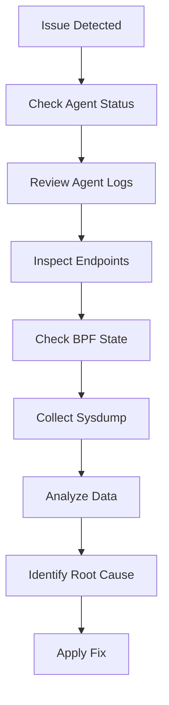

# How to Diagnose Deploy 5 namespaces with 25 deployments on each namespace

Author: [nawazdhandala](https://github.com/nawazdhandala)

Tags: Cilium, Performance, Kubernetes

Description: A practical guide covering how to diagnose deploy 5 namespaces with 25 deployments on each namespace in cilium performance with step-by-step instructions and real-world examples for production Kube...

---

## Introduction

Large-scale deployments across multiple namespaces stress-test Cilium's identity management, policy computation, and endpoint programming capabilities. Understanding the behavior at scale is essential for capacity planning.

In this guide, we cover managing multi-namespace deployments with Cilium in a Kubernetes environment. Cilium leverages eBPF technology to provide high-performance networking, security, and observability for cloud-native workloads. The eBPF programs are loaded directly into the Linux kernel, enabling efficient packet processing without the overhead of traditional iptables-based networking stacks.

Whether you are running a small development cluster or a large production environment with thousands of pods, the techniques in this guide will help you maintain a reliable Cilium deployment. We provide step-by-step instructions with real commands and configuration examples that you can adapt to your environment.

## Prerequisites

- A running Kubernetes cluster (v1.21+) with Cilium installed (v1.14+)
- `kubectl` configured for cluster access
- `cilium` CLI installed (matching your Cilium version)
- Helm 3.x for configuration management
- Basic familiarity with Kubernetes networking concepts
- Access to cluster nodes for troubleshooting (recommended)
- Prometheus and Grafana for metrics visualization (recommended)

## Assessing the Current State

Start by gathering information about the current state of your Cilium deployment and the specific issue you are investigating.

```bash
# Check Cilium agent status on all nodes
cilium status --verbose

# Look for error patterns in agent logs
kubectl logs -n kube-system -l k8s-app=cilium --tail=200 -c cilium-agent | grep -i -E "error|warn|timeout|fail"

# Check resource consumption of Cilium agents
kubectl top pods -n kube-system -l k8s-app=cilium --sort-by=memory

# Verify the identity management subsystem
cilium identity list | wc -l
echo "Identity count: $(cilium identity list -o json 2>/dev/null | python3 -c 'import json,sys; print(len(json.load(sys.stdin)))' 2>/dev/null || echo 'check manually')"
```

## Running Diagnostic Commands

Use Cilium's built-in diagnostic tools to identify the root cause of the issue.

```bash
# Check endpoint health across the cluster
cilium endpoint list | grep -v ready

# Inspect BPF datapath state
cilium bpf ct list global | tail -20
cilium bpf lb list | head -20

# Check for policy-related issues
cilium policy get | head -30

# Verify node-to-node connectivity
cilium health status
```

## Analyzing Diagnostic Data

Collect and analyze diagnostic data to build a complete picture of the issue.

```bash
# Collect a comprehensive sysdump for analysis
cilium sysdump --output-filename cilium-diagnostic

# Check for common issues in the sysdump
# The sysdump includes agent logs, BPF maps, and cluster state

# Examine Cilium metrics for anomalies
cilium metrics list | grep -E "errors|drops|failures"

# Check Kubernetes events for Cilium-related issues
kubectl get events -n kube-system --sort-by='.lastTimestamp' | grep -i cilium | tail -20
```



## Root Cause Analysis

Based on the diagnostic data, determine the root cause and plan the remediation.

```bash
# Common root causes and their indicators:

# 1. Identity exhaustion - high identity count
cilium identity list | wc -l

# 2. Resource pressure - high CPU/memory usage
kubectl top pods -n kube-system -l k8s-app=cilium

# 3. API server throttling - slow responses
kubectl logs -n kube-system -l k8s-app=cilium --tail=100 | grep -i "throttl"

# 4. BPF map full - map capacity errors
kubectl logs -n kube-system -l k8s-app=cilium --tail=100 | grep -i "map full"
```


## Verification

After completing the steps above, run a comprehensive verification to confirm everything is working as expected.

```bash
# Check overall Cilium deployment health
cilium status --verbose

# Verify inter-node connectivity
cilium health status

# Confirm all Cilium pods are running and ready
kubectl get pods -n kube-system -l k8s-app=cilium -o wide

# Verify the Cilium operator is healthy
kubectl get pods -n kube-system -l name=cilium-operator

# Check for recent error events
kubectl get events -n kube-system --sort-by='.lastTimestamp' | grep cilium | tail -10

# Run a connectivity test to validate the data plane
cilium connectivity test --single-node

# Verify endpoint count matches expected pod count
echo "Cilium endpoints: $(cilium endpoint list -o json 2>/dev/null | python3 -c 'import json,sys; print(len(json.load(sys.stdin)))' 2>/dev/null || echo 'N/A')"
```

## Troubleshooting

If you encounter issues during or after the steps in this guide, use the following troubleshooting procedures:

- **Cilium agent not starting**: Check resource limits and node capacity with `kubectl describe pod -n kube-system -l k8s-app=cilium`. Verify the BPF filesystem is mounted at `/sys/fs/bpf` and the kernel version is 4.19 or later. Check init container logs with `kubectl logs -n kube-system <pod> -c cilium-init`.

- **Connectivity failures**: Run `cilium connectivity test` and inspect the specific failing test case. Check for conflicting network policies with `cilium policy get`. Verify inter-node tunnel connectivity with `cilium bpf tunnel list`.

- **Configuration not applied**: Verify the Helm values or ConfigMap are correctly formatted. Run `kubectl rollout restart daemonset/cilium -n kube-system` and wait for the rollout to complete. Confirm with `cilium config view`.

- **High resource usage**: Review resource consumption with `kubectl top pods -n kube-system -l k8s-app=cilium`. Consider tuning label exclusion to reduce identity count. Increase agent memory limits if needed. Check `cilium metrics list | grep process_resident_memory`.

- **Endpoints stuck in regenerating state**: This usually indicates the agent is overloaded or encountering errors during BPF program compilation. Check agent logs with `kubectl logs -n kube-system -l k8s-app=cilium --tail=200 | grep -i error`.

- **Policy not being enforced**: Verify the policy selectors match the intended pods using `cilium endpoint list`. Confirm the policy is applied with `cilium policy get`. Check that the endpoint has the correct identity with `cilium endpoint get <id>`.

To collect a comprehensive diagnostic bundle for further analysis:

```bash
# Generate a Cilium sysdump containing all diagnostic information
# This collects logs, configs, BPF maps, and cluster state
cilium sysdump --output-filename cilium-diag-$(date +%Y%m%d)
```

## Conclusion

This guide covered managing multi-namespace deployments with Cilium with practical steps you can apply to your Kubernetes cluster. Regular monitoring, systematic validation, and proactive management are essential for maintaining a healthy Cilium deployment at any scale.

Key takeaways from this guide:

- Always assess the current state before making changes to your Cilium configuration
- Use Helm for configuration management to ensure consistency and reproducibility across environments
- Monitor Cilium metrics through Prometheus to detect issues before they impact workloads
- Test changes in a staging environment before applying them to production clusters
- Maintain runbooks documenting your Cilium configuration decisions and operational procedures
- Use `cilium sysdump` to collect comprehensive diagnostic data when investigating issues

As your cluster grows and evolves, revisit these configurations periodically and adjust them to match your current requirements. The Cilium community and documentation are excellent resources for staying current with best practices and new features.
