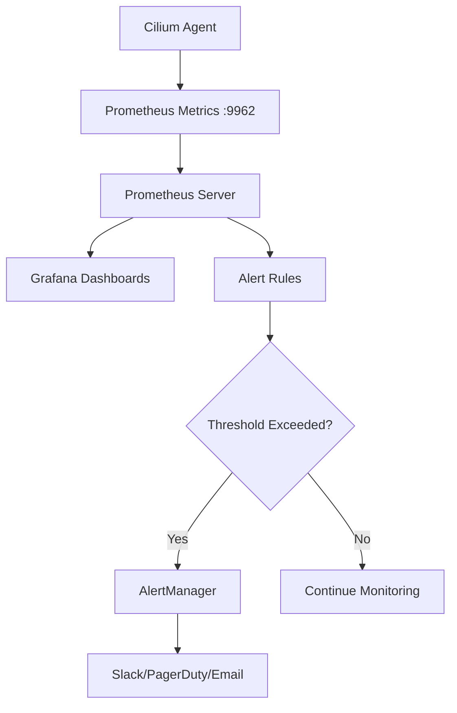

# How to Monitor Automatic Adjustment in Cilium configuration

Author: [nawazdhandala](https://github.com/nawazdhandala)

Tags: Cilium, Monitoring, Configuration, Automation

Description: A practical guide covering how to monitor automatic adjustment in cilium configuration with step-by-step instructions and real-world examples for production Kubernetes clusters.

---

## Introduction

Runtime configuration and state changes in Cilium, such as endpoint regeneration, identity allocation, and policy updates, can be monitored through Cilium's Prometheus metrics and CLI tools. This visibility reduces operational overhead and helps maintain performance as cluster conditions change.

In this guide, we cover how to monitor Cilium configuration and runtime state in a Kubernetes environment. Cilium leverages eBPF technology to provide high-performance networking, security, and observability for cloud-native workloads. The eBPF programs are loaded directly into the Linux kernel, enabling efficient packet processing without the overhead of traditional iptables-based networking stacks.

Whether you are running a small development cluster or a large production environment with thousands of pods, the techniques in this guide will help you maintain a reliable Cilium deployment. We provide step-by-step instructions with real commands and configuration examples that you can adapt to your environment.

## Prerequisites

- A running Kubernetes cluster supported by your Cilium release (for Cilium 1.19, Kubernetes 1.31-1.34 are e2e tested) with Cilium installed
- `kubectl` configured for cluster access
- `cilium` CLI installed (matching your Cilium version)
- Helm 3.x for configuration management
- Basic familiarity with Kubernetes networking concepts
- Access to cluster nodes for troubleshooting (recommended)
- Prometheus and Grafana for metrics visualization (recommended)

## Setting Up Monitoring

Enable Prometheus metrics collection for Cilium to gain visibility into the networking stack.

```bash
# Enable Prometheus metrics in Cilium

helm upgrade cilium cilium/cilium \
  --namespace kube-system \
  --reuse-values \
  --set prometheus.enabled=true \
  --set operator.prometheus.enabled=true \
  --set hubble.enabled=true \
  --set hubble.metrics.enableOpenMetrics=true \
  --set hubble.metrics.enabled="{dns,drop,tcp,flow,port-distribution,icmp}"

# Verify metrics are available from a Cilium agent
kubectl exec -n kube-system -l k8s-app=cilium -c cilium-agent -- cilium-dbg metrics list | head -10
```

## Key Metrics to Monitor

Track these critical metrics for Cilium automatic adjustment features:

```bash
# Identity management metrics
kubectl exec -n kube-system -l k8s-app=cilium -c cilium-agent -- cilium-dbg metrics list | grep -E "identity|identity_gc|ipcache"

# Endpoint health metrics
kubectl exec -n kube-system -l k8s-app=cilium -c cilium-agent -- cilium-dbg metrics list | grep -E "endpoint|endpoint_regeneration"

# Policy metrics
kubectl exec -n kube-system -l k8s-app=cilium -c cilium-agent -- cilium-dbg metrics list | grep -E "policy|policy_implementation|policy_incremental"

# Datapath performance metrics
kubectl exec -n kube-system -l k8s-app=cilium -c cilium-agent -- cilium-dbg metrics list | grep -E "datapath|forward|drop"

# Agent resource metrics
kubectl exec -n kube-system -l k8s-app=cilium -c cilium-agent -- cilium-dbg metrics list | grep -E "go_|process_"
```

## Creating Dashboards and Alerts

### Grafana Dashboard

Import the official Cilium Grafana dashboards for comprehensive visualization:

```bash
# The Cilium Helm chart can deploy Grafana dashboard ConfigMaps for Grafana sidecars
helm upgrade cilium cilium/cilium \
  --namespace kube-system \
  --reuse-values \
  --set dashboards.enabled=true \
  --set hubble.metrics.dashboards.enabled=true \
  --set operator.dashboards.enabled=true
```

### Prometheus Alert Rules

```yaml
# cilium-monitoring-alerts.yaml
# Alert rules for Cilium monitoring
apiVersion: monitoring.coreos.com/v1
kind: PrometheusRule
metadata:
  name: cilium-monitoring
  namespace: kube-system
spec:
  groups:
    - name: cilium-monitoring
      rules:
        - alert: CiliumAgentUnhealthy
          expr: cilium_unreachable_health_endpoints > 0
          for: 5m
          labels:
            severity: warning
          annotations:
            summary: "Cilium has unreachable health endpoints"
        - alert: CiliumEndpointRegenerationSlow
          expr: rate(cilium_endpoint_regeneration_time_stats_seconds_sum[5m]) / rate(cilium_endpoint_regeneration_time_stats_seconds_count[5m]) > 5
          for: 10m
          labels:
            severity: warning
          annotations:
            summary: "Cilium endpoint regeneration is slow"
        - alert: CiliumHighDropRate
          expr: rate(cilium_drop_count_total[5m]) > 100
          for: 5m
          labels:
            severity: critical
          annotations:
            summary: "Cilium is dropping packets at a high rate"
```

```bash
# Apply the alert rules
kubectl apply -f cilium-monitoring-alerts.yaml
```



## Ongoing Monitoring Best Practices

```bash
# Set up a daily health check script
#!/bin/bash
# cilium-health-check.sh

echo "=== Cilium Health Check $(date) ==="
echo ""
echo "Agent Status:"
cilium status
echo ""
echo "Identity Count: $(kubectl get ciliumidentities --no-headers 2>/dev/null | wc -l)"
echo "Endpoint Count: $(kubectl get ciliumendpoints -A --no-headers 2>/dev/null | wc -l)"
echo ""
echo "Resource Usage:"
kubectl top pods -n kube-system -l k8s-app=cilium --no-headers 2>/dev/null
echo ""
echo "Recent Errors:"
kubectl logs -n kube-system -l k8s-app=cilium --tail=50 --since=24h 2>/dev/null | grep -c -i error
```


## Verification

After completing the steps above, run a comprehensive verification to confirm everything is working as expected.

```bash
# Check overall Cilium deployment health
cilium status --verbose

# Verify inter-node connectivity from a Cilium agent
kubectl exec -n kube-system -l k8s-app=cilium -c cilium-agent -- cilium-health status

# Confirm all Cilium pods are running and ready
kubectl get pods -n kube-system -l k8s-app=cilium -o wide

# Verify the Cilium operator is healthy
kubectl get pods -n kube-system -l io.cilium/app=operator

# Check for recent error events
kubectl get events -n kube-system --sort-by='.lastTimestamp' | grep cilium | tail -10

# Run a connectivity test to validate the data plane
cilium connectivity test --single-node

# Verify endpoint count matches expected pod count
echo "Cilium endpoints: $(kubectl get ciliumendpoints -A -o json 2>/dev/null | python3 -c 'import json,sys; print(len(json.load(sys.stdin).get(\"items\", [])))' 2>/dev/null || echo 'N/A')"
```

## Troubleshooting

If you encounter issues during or after the steps in this guide, use the following troubleshooting procedures:

- **Cilium agent not starting**: Check resource limits and node capacity with `kubectl describe pod -n kube-system -l k8s-app=cilium`. Verify the BPF filesystem is mounted at `/sys/fs/bpf` and that the node kernel meets Cilium's system requirements, such as Linux 5.10 or later or an equivalent vendor kernel. Check init container logs with `kubectl logs -n kube-system <pod> -c cilium-init`.

- **Connectivity failures**: Run `cilium connectivity test` and inspect the specific failing test case. Check for conflicting Kubernetes and Cilium network policies with `kubectl get networkpolicies,ciliumnetworkpolicies,ciliumclusterwidenetworkpolicies -A`. Verify the configured routing or tunnel mode with `cilium config view`.

- **Configuration not applied**: Verify the Helm values or ConfigMap are correctly formatted. Run `kubectl rollout restart daemonset/cilium -n kube-system` and wait for the rollout to complete. Confirm with `cilium config view`.

- **High resource usage**: Review resource consumption with `kubectl top pods -n kube-system -l k8s-app=cilium`. Consider tuning label exclusion to reduce identity count. Increase agent memory limits if needed. Check `kubectl exec -n kube-system -l k8s-app=cilium -c cilium-agent -- cilium-dbg metrics list | grep process_`.

- **Endpoints stuck in regenerating state**: This usually indicates the agent is overloaded or encountering errors during BPF program compilation. Check agent logs with `kubectl logs -n kube-system -l k8s-app=cilium --tail=200 | grep -i error`.

- **Policy not being enforced**: Verify the policy selectors match the intended pods using `kubectl get ciliumendpoints -A`. Confirm the policy is applied with `kubectl get networkpolicies,ciliumnetworkpolicies,ciliumclusterwidenetworkpolicies -A`. Check that the endpoint has the correct identity with `kubectl exec -n kube-system -l k8s-app=cilium -c cilium-agent -- cilium-dbg endpoint get <id>`.

To collect a comprehensive diagnostic bundle for further analysis:

```bash
# Generate a Cilium sysdump containing all diagnostic information
# This collects logs, configs, BPF maps, and cluster state
cilium sysdump --output-filename cilium-diag-$(date +%Y%m%d)
```

## Conclusion

This guide covered Cilium configuration and runtime monitoring with practical steps you can apply to your Kubernetes cluster. Regular monitoring, systematic validation, and proactive management are essential for maintaining a healthy Cilium deployment at any scale.

Key takeaways from this guide:

- Always assess the current state before making changes to your Cilium configuration
- Use Helm for configuration management to ensure consistency and reproducibility across environments
- Monitor Cilium metrics through Prometheus to detect issues before they impact workloads
- Test changes in a staging environment before applying them to production clusters
- Maintain runbooks documenting your Cilium configuration decisions and operational procedures
- Use `cilium sysdump` to collect comprehensive diagnostic data when investigating issues

As your cluster grows and evolves, revisit these configurations periodically and adjust them to match your current requirements. The Cilium community and documentation are excellent resources for staying current with best practices and new features.
