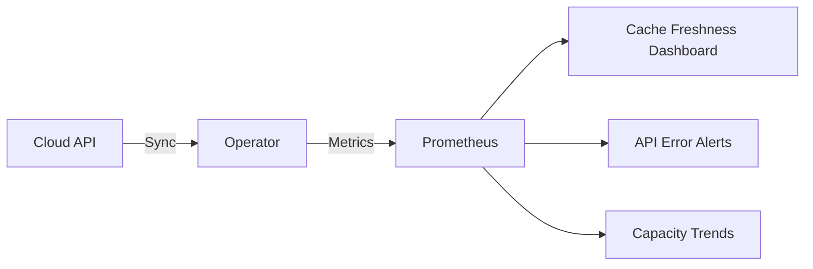

# Monitoring Interface and Subnet Cache in Cilium IPAM

Author: [nawazdhandala](https://github.com/nawazdhandala)

Tags: Cilium, Kubernetes, IPAM, Monitoring, Cloud Networking

Description: How to monitor the health and freshness of interface, subnet, and virtual network caching in Cilium IPAM for cloud environments.

---

## Introduction

Monitoring the IPAM cache in cloud environments ensures that Cilium maintains an accurate view of network resources. Cache monitoring tracks sync frequency, data freshness, and any errors during cache updates. This is essential for cloud deployments where network topology can change dynamically.

The key signals to monitor are cache update frequency, API error rates, discrepancies between cached and actual data, and the age of cached entries.

## Prerequisites

- Kubernetes cluster on a cloud provider with Cilium
- Prometheus and Grafana deployed
- kubectl configured

## Setting Up Cache Monitoring

### Operator Metrics

```yaml
operator:
  prometheus:
    enabled: true
    serviceMonitor:
      enabled: true
```

```promql
# Operator API call rates (cloud provider)
rate(cilium_operator_api_call_duration_seconds_count[5m])

# API errors
rate(cilium_operator_api_call_duration_seconds_count{status="error"}[5m])

# Resync interval
cilium_operator_ipam_resync_total
```

## Custom Cache Monitor

```bash
#!/bin/bash
# monitor-ipam-cache.sh

echo "=== IPAM Cache Monitor ==="
echo "Timestamp: $(date -u)"

# Check all nodes have current cache data
kubectl get ciliumnodes -o json | jq -r '.items[] | {
  node: .metadata.name,
  interfaces: (.spec.azure.interfaces // .spec.eni.enis // {} | length),
  used: (.status.ipam.used // {} | length)
} | "\(.node): \(.interfaces) interfaces, \(.used) IPs used"'

# Check operator health
OPERATOR_RESTARTS=$(kubectl get pods -n kube-system -l name=cilium-operator \
  -o jsonpath='{.items[0].status.containerStatuses[0].restartCount}')
echo "Operator restarts: $OPERATOR_RESTARTS"
```



## Alert Rules

```yaml
apiVersion: monitoring.coreos.com/v1
kind: PrometheusRule
metadata:
  name: cilium-ipam-cache-alerts
  namespace: monitoring
spec:
  groups:
    - name: cilium-ipam-cache
      rules:
        - alert: CiliumIPAMCacheSyncErrors
          expr: >
            rate(cilium_operator_api_call_duration_seconds_count{
              status="error"}[5m]) > 0
          for: 10m
          labels:
            severity: warning
          annotations:
            summary: "IPAM cache sync errors detected"
```

## Verification

```bash
kubectl port-forward -n kube-system deploy/cilium-operator 9963:9963 &
curl -s http://localhost:9963/metrics | grep ipam
cilium status
```

## Troubleshooting

- **No cache metrics**: Enable operator Prometheus metrics.
- **High API error rate**: Check cloud credentials and API rate limits.
- **Cache data never updates**: Operator may be stuck. Restart and monitor.
- **Metrics show zero interfaces**: Verify cloud IPAM mode is configured correctly.

## Conclusion

Monitoring the IPAM cache ensures Cilium maintains accurate cloud networking data. Track API call rates, sync errors, and cache freshness to detect issues before they affect pod IP allocation.