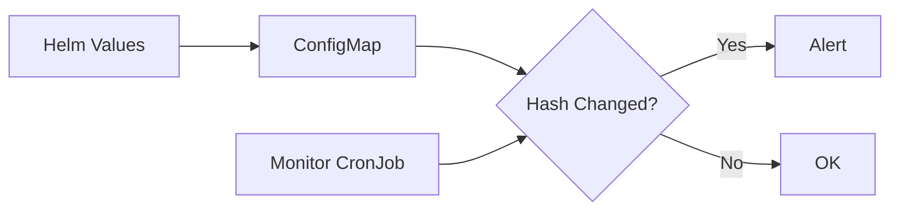

# Monitoring Cilium Configuration Changes and Health

Author: [nawazdhandala](https://github.com/nawazdhandala)

Tags: Cilium, Kubernetes, Monitoring, Configuration, Observability

Description: How to monitor Cilium configuration state, detect drift, and track configuration-related health metrics in production Kubernetes clusters.

---

## Introduction

Monitoring Cilium configuration means tracking whether the running configuration matches your intent, detecting unauthorized ConfigMap changes, and alerting on configuration-related failures like agent restarts.

Configuration drift is common in long-running clusters. Someone edits the ConfigMap directly, a Helm upgrade partially fails, or agents run different versions. Without monitoring, these compound until an outage occurs.

This guide sets up monitoring for configuration state, drift detection, and health metrics.

## Prerequisites

- Kubernetes cluster with Cilium installed
- Prometheus and Grafana deployed
- kubectl and Cilium CLI configured

## Monitoring Agent Configuration State

```yaml
prometheus:
  enabled: true
  port: 9962
  serviceMonitor:
    enabled: true
```

Key metrics:

```promql
# Agent uptime (detects restarts from bad config)
cilium_agent_uptime_seconds

# BPF map operations
rate(cilium_bpf_map_ops_total{operation="update"}[5m])
```

## ConfigMap Change Detection

```bash
#!/bin/bash
# monitor-config-changes.sh

CURRENT_HASH=$(kubectl get configmap cilium-config -n kube-system \
  -o json | jq -S '.data' | sha256sum | cut -d' ' -f1)

STORED_HASH_FILE="/tmp/cilium-config-hash"
if [ -f "$STORED_HASH_FILE" ]; then
  STORED_HASH=$(cat "$STORED_HASH_FILE")
  if [ "$CURRENT_HASH" != "$STORED_HASH" ]; then
    echo "ALERT: Cilium ConfigMap has changed!"
  fi
fi
echo "$CURRENT_HASH" > "$STORED_HASH_FILE"
```



## Version Consistency Monitoring

```bash
#!/bin/bash
IMAGES=$(kubectl get pods -n kube-system -l k8s-app=cilium \
  -o jsonpath='{.items[*].spec.containers[0].image}')
UNIQUE=$(echo "$IMAGES" | tr ' ' '\n' | sort -u)
COUNT=$(echo "$UNIQUE" | wc -l)

if [ "$COUNT" -gt 1 ]; then
  echo "ALERT: Multiple Cilium versions: $UNIQUE"
else
  echo "OK: All agents running $(echo $UNIQUE)"
fi
```

## Alert Rules

```yaml
apiVersion: monitoring.coreos.com/v1
kind: PrometheusRule
metadata:
  name: cilium-config-alerts
  namespace: monitoring
spec:
  groups:
    - name: cilium-config
      rules:
        - alert: CiliumAgentFrequentRestarts
          expr: >
            sum(rate(kube_pod_container_status_restarts_total{
              container="cilium-agent"}[30m])) > 2
          for: 5m
          labels:
            severity: critical
          annotations:
            summary: "Cilium agent restarting frequently"
        - alert: CiliumAgentVersionMismatch
          expr: >
            count(count by (container_image)
              (kube_pod_container_info{container="cilium-agent"})) > 1
          for: 30m
          labels:
            severity: warning
          annotations:
            summary: "Multiple Cilium agent versions detected"
```

## Verification

```bash
kubectl port-forward -n kube-system svc/cilium-agent 9962:9962 &
curl -s http://localhost:9962/metrics | grep cilium_agent_uptime
cilium status
```

## Troubleshooting

- **Agent uptime metric missing**: Enable Prometheus metrics in Helm values.
- **False alerts during upgrades**: Add maintenance window or increase `for` duration.
- **ConfigMap changes frequently**: Use Kubernetes audit logs to track who is modifying it.
- **Version mismatch persists**: Check DaemonSet rollout status.

## Conclusion

Monitoring Cilium configuration protects against drift, unauthorized changes, and upgrade issues. Combine agent health metrics, ConfigMap hash tracking, and version consistency checks for comprehensive visibility.