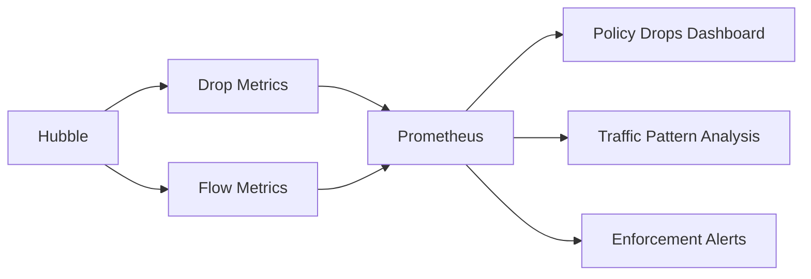

# Monitoring Cilium Default Deny Ingress Policy Effectiveness

Author: [nawazdhandala](https://github.com/nawazdhandala)

Tags: Cilium, Kubernetes, Network Policy, Monitoring, Security

Description: How to monitor Cilium default deny ingress policy enforcement to track blocked traffic, detect policy gaps, and measure security posture.

---

## Introduction

Monitoring default deny ingress policies provides visibility into what traffic is being blocked, helps you identify missing allow policies, and measures your overall security posture. Without monitoring, you cannot tell if the default deny is actually working or if there are gaps in enforcement.

Key monitoring signals are drop rates by policy, the ratio of allowed to denied traffic, new traffic patterns that are not covered by allow policies, and endpoint enforcement status.

## Prerequisites

- Kubernetes cluster with Cilium and default deny policies
- Prometheus and Grafana deployed
- Hubble enabled

## Metrics for Policy Monitoring

```yaml
hubble:
  metrics:
    enabled:
      - drop
      - flow
      - "policy:sourceContext=app;destinationContext=app"
```

```promql
# Traffic dropped by policy
rate(hubble_drop_total{reason="POLICY_DENIED"}[5m])

# Policy verdict breakdown
rate(hubble_flows_processed_total{verdict="DROPPED"}[5m])
rate(hubble_flows_processed_total{verdict="FORWARDED"}[5m])

# Denied-to-allowed ratio
hubble_flows_processed_total{verdict="DROPPED"} /
  hubble_flows_processed_total{verdict="FORWARDED"}
```

## Hubble Flow Analysis

```bash
# See current policy drops
hubble observe --verdict DROPPED -n default --last 50

# Identify new communication patterns needing allow policies
hubble observe --verdict DROPPED -o json --last 500 | \
  jq -r '.flow | "\(.source.labels[0]) -> \(.destination.labels[0])::\(.l4.TCP.destination_port // .l4.UDP.destination_port)"' | \
  sort | uniq -c | sort -rn | head -20
```



## Alert Rules

```yaml
apiVersion: monitoring.coreos.com/v1
kind: PrometheusRule
metadata:
  name: cilium-default-deny-alerts
  namespace: monitoring
spec:
  groups:
    - name: default-deny
      rules:
        - alert: HighPolicyDropRate
          expr: rate(hubble_drop_total{reason="POLICY_DENIED"}[5m]) > 100
          for: 10m
          labels:
            severity: warning
          annotations:
            summary: "High policy drop rate - possible missing allow policy"
        - alert: PolicyNotEnforcing
          expr: sum(cilium_endpoint_state{endpoint_state="ready"}) > 0 and sum(cilium_policy_count) == 0
          for: 10m
          labels:
            severity: critical
          annotations:
            summary: "Endpoints running without any policies"
```

## Verification

```bash
hubble observe --verdict DROPPED --last 5
kubectl get ciliumnetworkpolicies --all-namespaces --no-headers | wc -l
cilium status
```

## Troubleshooting

- **Drop rate too high**: Review the drops to determine if legitimate traffic needs allow policies.
- **No drops at all**: Verify default deny is applied. A cluster with zero drops may not have policy enforcement.
- **Alert on enforcement gap**: Check all namespaces have default deny policies.

## Conclusion

Monitor default deny ingress to ensure it is working and to identify traffic patterns needing allow policies. Use Hubble for real-time flow analysis and Prometheus for trend tracking and alerting.