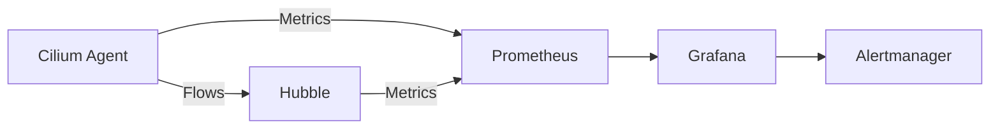

# Monitoring Cilium Endpoint CRD Resources in Production

Author: [nawazdhandala](https://github.com/nawazdhandala)

Tags: Cilium, Kubernetes, Monitoring, Endpoint, Observability

Description: A guide to monitoring CiliumEndpoint custom resources using Prometheus metrics, Hubble flows, and custom health checks for production Kubernetes clusters.

---

## Introduction

CiliumEndpoint resources represent the state of every network endpoint in your Cilium-managed cluster. Monitoring gives you visibility into endpoint health, identity distribution, policy enforcement status, and networking state.

Effective endpoint monitoring combines three layers: Cilium agent metrics for endpoint counts and state transitions, Hubble flow data for traffic patterns, and custom checks for endpoint consistency.

This guide covers setting up monitoring at each layer and building dashboards and alerts.

## Prerequisites

- Kubernetes cluster with Cilium installed (v1.14+)
- Prometheus and Grafana deployed
- Hubble enabled in Cilium
- kubectl and Cilium CLI configured

## Cilium Agent Metrics for Endpoints

```yaml
# cilium-monitoring-values.yaml
prometheus:
  enabled: true
  port: 9962
  serviceMonitor:
    enabled: true
    labels:
      release: prometheus
operator:
  prometheus:
    enabled: true
    serviceMonitor:
      enabled: true
```

```bash
helm upgrade cilium cilium/cilium \
  --namespace kube-system \
  --reuse-values \
  -f cilium-monitoring-values.yaml
```

Key metrics:

```promql
# Endpoints by state
cilium_endpoint_state{state="ready"}
cilium_endpoint_state{state="not-ready"}

# Endpoint regeneration duration
histogram_quantile(0.99, rate(cilium_endpoint_regeneration_time_stats_seconds_bucket[5m]))

# Regeneration count by outcome
rate(cilium_endpoint_regenerations_total[5m])
```

## Hubble Flow Monitoring

```yaml
hubble:
  enabled: true
  relay:
    enabled: true
  metrics:
    enabled:
      - dns
      - drop
      - tcp
      - flow
```

```bash
hubble observe --pod default/my-app --last 100
hubble observe --pod default/my-app --verdict DROPPED
```



## Setting Up Alerts

```yaml
apiVersion: monitoring.coreos.com/v1
kind: PrometheusRule
metadata:
  name: cilium-endpoint-alerts
  namespace: monitoring
spec:
  groups:
    - name: cilium-endpoints
      rules:
        - alert: CiliumEndpointsNotReady
          expr: sum(cilium_endpoint_state{state="not-ready"}) > 0
          for: 10m
          labels:
            severity: warning
          annotations:
            summary: "{{ $value }} endpoints not ready for 10+ minutes"
        - alert: CiliumEndpointRegenerationFailures
          expr: rate(cilium_endpoint_regenerations_total{outcome="fail"}[5m]) > 0
          for: 5m
          labels:
            severity: critical
          annotations:
            summary: "Endpoint regeneration failures detected"
```

## Custom Health Check

```bash
#!/bin/bash
# endpoint-health-check.sh
ENDPOINT_COUNT=$(kubectl get ciliumendpoints --all-namespaces --no-headers | wc -l)
POD_COUNT=$(kubectl get pods --all-namespaces --field-selector=status.phase=Running \
  -o json | jq '[.items[] | select(.spec.hostNetwork != true)] | length')
DIFF=$((POD_COUNT - ENDPOINT_COUNT))
if [ "$DIFF" -gt 5 ]; then
  echo "ALERT: $DIFF pods without endpoints"
fi
```

## Verification

```bash
kubectl port-forward -n kube-system svc/cilium-agent 9962:9962 &
curl -s http://localhost:9962/metrics | grep cilium_endpoint
hubble observe --last 10
```

## Troubleshooting

- **Metrics not appearing**: Verify ServiceMonitor labels match Prometheus config.
- **Hubble flows not visible**: Ensure Hubble relay is running. Test with `hubble status`.
- **Alert fatigue**: Tune thresholds. Set `for: 10m` to filter transient deployment events.

## Conclusion

Monitoring CiliumEndpoint CRDs requires Prometheus metrics for aggregate health, Hubble for per-flow visibility, and custom scripts for consistency checks. Watch endpoint state distribution, regeneration rate, and the pod-to-endpoint gap.