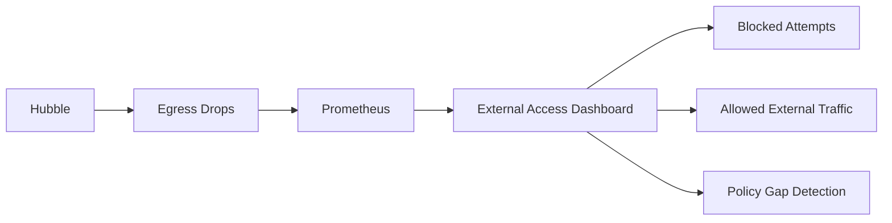

# Monitoring Cilium External Lock-Down Policy Effectiveness

Author: [nawazdhandala](https://github.com/nawazdhandala)

Tags: Cilium, Kubernetes, Network Policy, Monitoring, Security

Description: How to monitor Cilium external lock-down policies to track blocked egress attempts, detect policy gaps, and measure external access posture.

---

## Introduction

Monitoring external lock-down policies reveals which pods attempt external access and whether those attempts are allowed or blocked. This visibility is essential for identifying policy gaps, detecting potential data exfiltration, and auditing compliance with external access requirements.

## Prerequisites

- Kubernetes cluster with Cilium and external lock-down policies
- Prometheus and Grafana deployed
- Hubble enabled

## Monitoring Egress Drops

```promql
# Egress drops by policy
rate(hubble_drop_total{reason="POLICY_DENIED", direction="EGRESS"}[5m])

# Egress traffic by destination
rate(hubble_flows_processed_total{direction="EGRESS", verdict="DROPPED"}[5m])
```

```bash
# Monitor blocked external access attempts
hubble observe --verdict DROPPED --type l3/l4 -n default \
  --not --to-label io.kubernetes.pod.namespace --last 50

# See which pods are trying to reach external services
hubble observe --verdict DROPPED -n default -o json --last 100 | \
  jq -r '.flow | select(.destination.labels == null or (.destination.labels | length) == 0) | "\(.source.labels | join(",")) -> \(.IP.destination):\(.l4.TCP.destination_port // .l4.UDP.destination_port)"' | \
  sort | uniq -c | sort -rn | head -20
```



## Alert Rules

```yaml
apiVersion: monitoring.coreos.com/v1
kind: PrometheusRule
metadata:
  name: cilium-external-lockdown-alerts
  namespace: monitoring
spec:
  groups:
    - name: external-lockdown
      rules:
        - alert: UnexpectedExternalAccessAttempt
          expr: >
            rate(hubble_drop_total{
              reason="POLICY_DENIED",
              direction="EGRESS"}[5m]) > 50
          for: 10m
          labels:
            severity: warning
          annotations:
            summary: "High rate of blocked external access attempts"
```

## Verification

```bash
hubble observe --verdict DROPPED --last 10
kubectl get ciliumnetworkpolicies --all-namespaces --no-headers | wc -l
```

## Troubleshooting

- **Too many false positives**: Some pods legitimately need external access. Create specific allow policies.
- **No drops visible**: External lock-down may not be applied. Check policy existence.
- **FQDN traffic showing as drops**: DNS resolution must work for FQDN policies. Check DNS allow rule.

## Conclusion

Monitor external lock-down by tracking egress drop rates and identifying which pods attempt unauthorized external access. Use this data to refine allow policies and detect potential security issues.