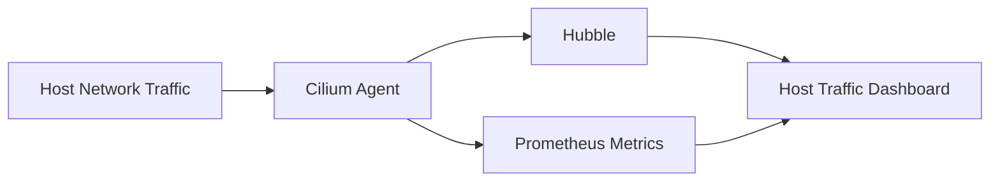

# Monitoring Cilium Host Network Mode Traffic

Author: [nawazdhandala](https://github.com/nawazdhandala)

Tags: Cilium, Kubernetes, Host Network, Monitoring, Networking

Description: How to monitor traffic for host network mode pods in Cilium using Hubble flows, Prometheus metrics, and host firewall events.

---

## Introduction

Monitoring host network mode traffic gives visibility into traffic entering and leaving nodes through host-networked pods. This is important because host-networked pods have broader network access than regular pods and need careful monitoring.

## Prerequisites

- Kubernetes cluster with Cilium and host firewall enabled
- Prometheus and Grafana deployed
- Hubble enabled

## Monitoring Host Traffic with Hubble

```bash
# Monitor host-originated traffic
hubble observe --from-identity reserved:host --last 50

# Monitor traffic to host
hubble observe --to-identity reserved:host --last 50

# Watch for drops on host traffic
hubble observe --from-identity reserved:host --verdict DROPPED --last 20
```

## Host Firewall Metrics

```promql
# Host endpoint drops
rate(cilium_drop_count_total{direction="INGRESS"}[5m])

# Host endpoint forward rate
rate(cilium_forward_count_total[5m])
```



## Alert Rules

```yaml
apiVersion: monitoring.coreos.com/v1
kind: PrometheusRule
metadata:
  name: cilium-host-network-alerts
  namespace: monitoring
spec:
  groups:
    - name: host-network
      rules:
        - alert: HostNetworkHighDropRate
          expr: rate(cilium_drop_count_total{direction="INGRESS"}[5m]) > 50
          for: 5m
          labels:
            severity: warning
          annotations:
            summary: "High drop rate on host traffic"
```

## Verification

```bash
hubble observe --from-identity reserved:host --last 5
cilium endpoint list | grep host
```

## Troubleshooting

- **No host traffic in Hubble**: Ensure host firewall is enabled.
- **Metrics not showing host traffic**: Check Cilium agent metrics are enabled.
- **Too many drops**: Review host firewall policies for missing allow rules.

## Conclusion

Monitor host network mode traffic through Hubble and Prometheus to maintain visibility into node-level traffic. Alert on unusual drop rates and track host traffic patterns for security auditing.