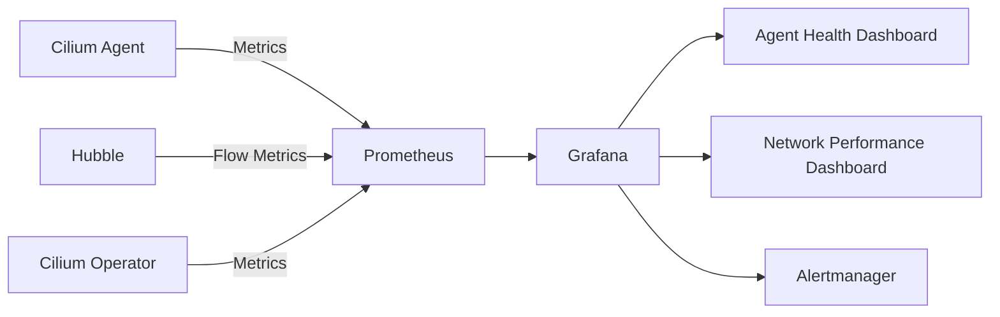

# Monitoring a Cilium Installation for Ongoing Health

Author: [nawazdhandala](https://github.com/nawazdhandala)

Tags: Cilium, Kubernetes, Monitoring, Installation, Observability

Description: How to set up ongoing monitoring for a Cilium installation to track agent health, networking performance, and feature status over time.

---

## Introduction

A Cilium installation needs continuous monitoring to catch issues like agent crashes, BPF program failures, IPAM exhaustion, and policy enforcement gaps. While initial validation confirms the installation works, ongoing monitoring ensures it stays healthy as the cluster evolves.

The key areas to monitor are agent health across all nodes, endpoint status and regeneration rates, Hubble flow metrics, and resource usage trends. This data helps you detect problems early and plan capacity.

This guide covers setting up comprehensive monitoring for a Cilium installation.

## Prerequisites

- Kubernetes cluster with Cilium installed
- Prometheus and Grafana deployed
- Hubble enabled in Cilium

## Agent Health Monitoring

```yaml
# Enable metrics in Cilium
prometheus:
  enabled: true
  port: 9962
  serviceMonitor:
    enabled: true
    labels:
      release: prometheus

operator:
  prometheus:
    enabled: true
    serviceMonitor:
      enabled: true

hubble:
  metrics:
    enabled:
      - dns
      - drop
      - tcp
      - flow
```

```bash
helm upgrade cilium cilium/cilium \
  --namespace kube-system \
  --reuse-values \
  --set prometheus.enabled=true \
  --set prometheus.serviceMonitor.enabled=true
```

Key health metrics:

```promql
# Agent process health
up{job="cilium"}

# Agent uptime (detect restarts)
cilium_agent_uptime_seconds

# Unreachable nodes
cilium_unreachable_nodes

# API rate limiting
rate(cilium_api_limiter_processed_requests_total[5m])
```

## Networking Performance Monitoring

```promql
# Forward and drop rates
rate(cilium_forward_count_total[5m])
rate(cilium_drop_count_total[5m])

# BPF map pressure
cilium_bpf_map_pressure

# Conntrack table utilization
cilium_ct_entries / cilium_ct_max_entries
```



## Alert Rules for Installation Health

```yaml
apiVersion: monitoring.coreos.com/v1
kind: PrometheusRule
metadata:
  name: cilium-health-alerts
  namespace: monitoring
spec:
  groups:
    - name: cilium-health
      rules:
        - alert: CiliumAgentDown
          expr: up{job="cilium"} == 0
          for: 5m
          labels:
            severity: critical
          annotations:
            summary: "Cilium agent down on {{ $labels.instance }}"
        - alert: CiliumUnreachableNodes
          expr: cilium_unreachable_nodes > 0
          for: 10m
          labels:
            severity: warning
          annotations:
            summary: "{{ $value }} unreachable nodes detected"
        - alert: CiliumHighDropRate
          expr: rate(cilium_drop_count_total[5m]) > 100
          for: 5m
          labels:
            severity: warning
          annotations:
            summary: "High packet drop rate on {{ $labels.instance }}"
```

## Custom Monitoring Dashboard

```bash
#!/bin/bash
# cilium-health-report.sh

echo "=== Cilium Installation Health Report ==="
echo "Date: $(date)"
echo ""

# Agent status
echo "--- Agent Status ---"
kubectl get daemonset cilium -n kube-system
echo ""

# Operator status
echo "--- Operator Status ---"
kubectl get deployment cilium-operator -n kube-system
echo ""

# Endpoint summary
echo "--- Endpoint Summary ---"
cilium endpoint list | tail -1
echo ""

# Connectivity
echo "--- Quick Connectivity Check ---"
cilium status --brief
```

## Verification

```bash
# Verify metrics are being collected
kubectl port-forward -n kube-system svc/cilium-agent 9962:9962 &
curl -s http://localhost:9962/metrics | head -20

# Verify Hubble metrics
cilium hubble port-forward &
hubble observe --last 5

# Check Grafana dashboards
kubectl port-forward -n monitoring svc/grafana 3000:3000
```

## Troubleshooting

- **Metrics gaps**: Check Prometheus scrape config and ServiceMonitor labels.
- **Agent restarts not alerting**: Verify alert rules are loaded in Prometheus.
- **Dashboard shows no data**: Ensure Prometheus is scraping the correct targets.
- **High drop rates after upgrade**: Normal during rolling updates. Wait for completion.

## Conclusion

Ongoing monitoring of a Cilium installation catches issues that initial validation cannot. Track agent health, networking performance, and resource usage to maintain a healthy cluster. Use Prometheus alerts for immediate issues and Grafana dashboards for trend analysis.