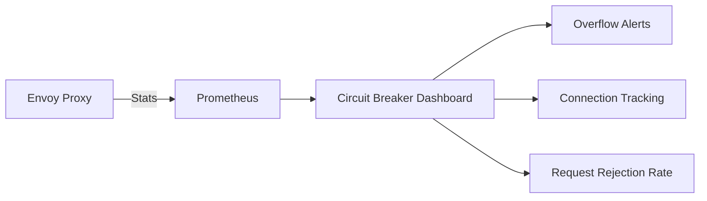

# Monitoring Cilium L7 Circuit Breaking in Production

Author: [nawazdhandala](https://github.com/nawazdhandala)

Tags: Cilium, Kubernetes, L7, Circuit Breaking, Monitoring

Description: How to monitor Cilium L7 circuit breaking with Prometheus metrics, Envoy stats, and Hubble flows to detect overload and circuit breaker activation.

---

## Introduction

Monitoring L7 circuit breaking in production helps you understand when services are under stress and when circuit breakers are protecting your system. Key metrics include circuit breaker open/close events, connection overflow counts, and request rejection rates.

## Prerequisites

- Kubernetes cluster with Cilium and L7 proxy enabled
- Prometheus and Grafana deployed
- Hubble enabled

## Key Circuit Breaking Metrics

```promql
# Circuit breaker overflow (connections rejected)
rate(envoy_cluster_upstream_cx_overflow[5m])

# Pending request overflow
rate(envoy_cluster_upstream_rq_pending_overflow[5m])

# Active connections per cluster
envoy_cluster_upstream_cx_active

# Request retry overflow
rate(envoy_cluster_upstream_rq_retry_overflow[5m])
```

## Monitoring with Hubble

```bash
# Watch for HTTP errors that may indicate circuit breaking
hubble observe --protocol http --verdict DROPPED -n default --last 20

# Filter for 503 responses (typical circuit breaker response)
hubble observe --protocol http -n default -o json --last 100 | \
  jq 'select(.flow.l7.http.code == 503)'
```



## Alert Rules

```yaml
apiVersion: monitoring.coreos.com/v1
kind: PrometheusRule
metadata:
  name: cilium-circuit-breaker-alerts
  namespace: monitoring
spec:
  groups:
    - name: circuit-breaking
      rules:
        - alert: CircuitBreakerActivated
          expr: rate(envoy_cluster_upstream_cx_overflow[5m]) > 0
          for: 5m
          labels:
            severity: warning
          annotations:
            summary: "Circuit breaker overflow on {{ $labels.envoy_cluster_name }}"
```

## Verification

```bash
kubectl exec -n kube-system <cilium-pod> -- \
  curl -s localhost:9901/stats | grep overflow
hubble observe --protocol http -n default --last 5
```

## Troubleshooting

- **No metrics from Envoy**: Check that L7 proxy is enabled and Prometheus scrapes Envoy stats.
- **Alert fatigue**: Tune thresholds. Brief overflows during deployments are normal.
- **Cannot identify which service**: Check the envoy_cluster_name label on metrics.

## Conclusion

Monitor circuit breaking with Envoy overflow metrics and Hubble L7 flow observation. Alert on sustained circuit breaker activation to investigate overloaded services before they cause cascading failures.