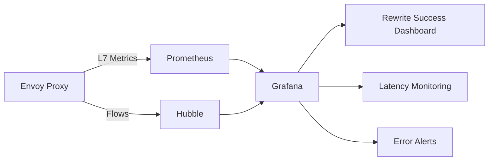

# Monitoring Cilium L7 Path Translation in Production

Author: [nawazdhandala](https://github.com/nawazdhandala)

Tags: Cilium, Kubernetes, L7, Monitoring, Envoy

Description: How to monitor Cilium L7 path translation performance and correctness using Envoy metrics, Hubble flows, and custom dashboards.

---

## Introduction

Monitoring L7 path translation in production ensures rewrites continue working correctly and do not introduce latency or errors. Key monitoring targets are rewrite success rates, latency added by the proxy, error rates on rewritten paths, and configuration drift.

## Prerequisites

- Kubernetes cluster with Cilium L7 proxy and path translation configured
- Prometheus and Grafana deployed
- Hubble enabled

## Key Metrics

```promql
# HTTP request rate through Envoy (includes rewritten paths)
rate(envoy_http_downstream_rq_total[5m])

# Latency added by proxy
histogram_quantile(0.99, rate(envoy_http_downstream_rq_time_bucket[5m]))

# Error rate on rewritten routes
rate(envoy_http_downstream_rq_xx{envoy_response_code_class="5"}[5m])
```

## Hubble L7 Flow Monitoring

```bash
# Monitor HTTP traffic with path details
hubble observe --protocol http -n default --last 20 -o json | \
  jq '.flow.l7.http | {url: .url, code: .code, method: .method}'

# Watch for errors on rewritten paths
hubble observe --protocol http -n default \
  --http-status 500-599 --last 20
```



## Alert Rules

```yaml
apiVersion: monitoring.coreos.com/v1
kind: PrometheusRule
metadata:
  name: cilium-path-translation-alerts
  namespace: monitoring
spec:
  groups:
    - name: path-translation
      rules:
        - alert: PathTranslationHighLatency
          expr: >
            histogram_quantile(0.99,
              rate(envoy_http_downstream_rq_time_bucket[5m])) > 2
          for: 10m
          labels:
            severity: warning
          annotations:
            summary: "L7 proxy adding significant latency"
```

## Verification

```bash
cilium status | grep "L7 Proxy"
hubble observe --protocol http -n default --last 5
kubectl get ciliumenvoyconfigs -n default
```

## Troubleshooting

- **Latency spike after enabling path translation**: Check Envoy resource usage. May need more CPU.
- **High error rate on rewritten paths**: The rewritten path may not match backend expectations.
- **No L7 metrics**: Ensure Envoy metrics are exposed and scraped by Prometheus.

## Conclusion

Monitor L7 path translation with Envoy proxy metrics and Hubble HTTP flows. Track latency, error rates, and request volumes to ensure rewrites work correctly in production.