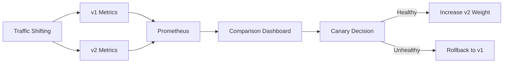

# Monitoring Cilium L7 Traffic Shifting in Production

Author: [nawazdhandala](https://github.com/nawazdhandala)

Tags: Cilium, Kubernetes, L7, Traffic Shifting, Monitoring

Description: How to monitor Cilium L7 traffic shifting to track distribution accuracy, error rates per version, and latency differences during canary deployments.

---

## Introduction

Monitoring traffic shifting during canary deployments is critical for deciding whether to proceed, rollback, or adjust weights. Key metrics are per-version request rates, error rates, and latency percentiles.

## Prerequisites

- Kubernetes cluster with Cilium L7 traffic shifting active
- Prometheus and Grafana deployed
- Hubble enabled

## Key Metrics

```promql
# Per-cluster request rate (shows traffic distribution)
rate(envoy_cluster_upstream_rq_total{envoy_cluster_name=~".*backend.*"}[5m])

# Error rate per version
rate(envoy_cluster_upstream_rq_xx{envoy_response_code_class="5", envoy_cluster_name=~".*backend.*"}[5m])

# Latency per version
histogram_quantile(0.99,
  rate(envoy_cluster_upstream_rq_time_bucket{envoy_cluster_name=~".*backend.*"}[5m]))
```

## Hubble Monitoring

```bash
# Monitor traffic to each version
hubble observe --protocol http --to-label version=v1 -n default --last 50
hubble observe --protocol http --to-label version=v2 -n default --last 50

# Compare error rates
hubble observe --protocol http --to-label version=v2 \
  --http-status 500-599 --last 20
```



## Alert Rules

```yaml
apiVersion: monitoring.coreos.com/v1
kind: PrometheusRule
metadata:
  name: cilium-canary-alerts
  namespace: monitoring
spec:
  groups:
    - name: canary
      rules:
        - alert: CanaryHighErrorRate
          expr: >
            rate(envoy_cluster_upstream_rq_xx{
              envoy_response_code_class="5",
              envoy_cluster_name=~".*v2.*"}[5m]) /
            rate(envoy_cluster_upstream_rq_total{
              envoy_cluster_name=~".*v2.*"}[5m]) > 0.05
          for: 5m
          labels:
            severity: critical
          annotations:
            summary: "Canary version error rate exceeding 5%"
```

## Verification

```bash
hubble observe --protocol http -n default --last 10
kubectl get ciliumenvoyconfigs -n default
```

## Troubleshooting

- **Cannot distinguish versions in metrics**: Use Envoy cluster name labels to separate v1 and v2.
- **Latency comparison shows no difference**: Both versions may be similarly performant. That is fine.
- **Error rate spikes on weight change**: Brief spikes during reconfiguration are normal.

## Conclusion

Monitor traffic shifting with per-version metrics for request rate, error rate, and latency. Use these to make data-driven decisions about canary progression or rollback.