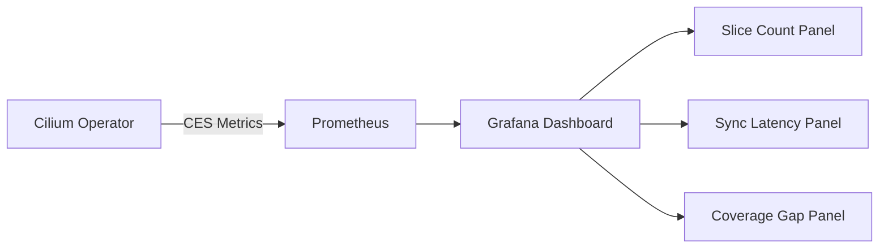

# Monitoring CiliumEndpointSlice Performance and Health

Author: [nawazdhandala](https://github.com/nawazdhandala)

Tags: Cilium, Kubernetes, Monitoring, EndpointSlice, Observability

Description: How to monitor CiliumEndpointSlice resources using Prometheus metrics, operator logs, and custom dashboards for scalable endpoint management in production.

---

## Introduction

CiliumEndpointSlice reduces API server load by batching endpoints into fewer resources. Monitoring CES verifies this optimization delivers its intended benefits and catches issues where the batching mechanism becomes a bottleneck or produces incorrect results.

Key CES metrics include slice count and size distribution, operator reconciliation rate and latency, API server request reduction, and synchronization gaps between CES and actual endpoint state.

This guide covers comprehensive CES monitoring with Prometheus, Grafana, and custom health checks.

## Prerequisites

- Kubernetes cluster with Cilium and CES enabled
- Prometheus and Grafana deployed
- kubectl and Cilium CLI configured

## Operator Metrics for CES

```yaml
operator:
  prometheus:
    enabled: true
    port: 9963
    serviceMonitor:
      enabled: true
      labels:
        release: prometheus
```

```bash
helm upgrade cilium cilium/cilium \
  --namespace kube-system \
  --reuse-values \
  --set operator.prometheus.enabled=true \
  --set operator.prometheus.serviceMonitor.enabled=true
```

Key metrics:

```promql
# CES reconciliation duration
histogram_quantile(0.99, rate(cilium_operator_ces_sync_total_bucket[5m]))

# Number of CES resources
cilium_operator_ces_slice_count

# Queue length for CES updates
cilium_operator_ces_queueing_delay_seconds
```

## Custom Monitoring Script

```bash
#!/bin/bash
# monitor-ces.sh

echo "=== CiliumEndpointSlice Monitor ==="

SLICE_COUNT=$(kubectl get ciliumendpointslices \
  --all-namespaces --no-headers | wc -l)
echo "Total CES resources: $SLICE_COUNT"

EP_IN_SLICES=$(kubectl get ciliumendpointslices --all-namespaces -o json | \
  jq '[.items[].endpoints[]?] | length')
echo "Endpoints in slices: $EP_IN_SLICES"

EP_INDIVIDUAL=$(kubectl get ciliumendpoints \
  --all-namespaces --no-headers | wc -l)
echo "Individual endpoints: $EP_INDIVIDUAL"

if [ "$SLICE_COUNT" -gt 0 ]; then
  RATIO=$(echo "scale=1; $EP_IN_SLICES / $SLICE_COUNT" | bc)
  echo "Average per slice: $RATIO"
fi
```



## Alert Rules

```yaml
apiVersion: monitoring.coreos.com/v1
kind: PrometheusRule
metadata:
  name: cilium-ces-alerts
  namespace: monitoring
spec:
  groups:
    - name: cilium-ces
      rules:
        - alert: CESHighSyncLatency
          expr: >
            histogram_quantile(0.99,
              rate(cilium_operator_ces_sync_total_bucket[5m])) > 10
          for: 10m
          labels:
            severity: warning
          annotations:
            summary: "CES sync latency exceeding 10 seconds"
```

## Verification

```bash
kubectl port-forward -n kube-system deploy/cilium-operator 9963:9963 &
curl -s http://localhost:9963/metrics | grep ces
cilium connectivity test
```

## Troubleshooting

- **No CES metrics**: Enable operator Prometheus metrics. Ensure ServiceMonitor matches Prometheus label selectors.
- **High sync latency**: Increase operator CPU and memory limits.
- **Coverage gap alerts**: Check operator health. A restart usually resolves transient gaps.

## Conclusion

Monitoring CES gives visibility into the scalability optimization it provides. Track slice counts, sync latency, and coverage gaps to ensure batching works correctly.