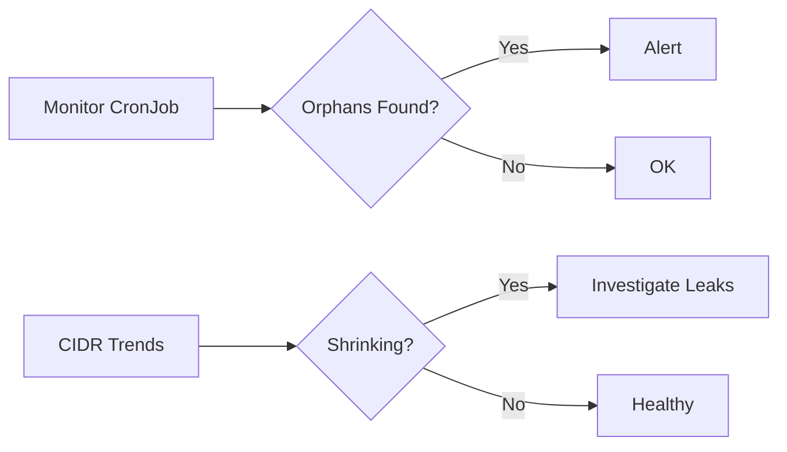

# Monitoring Node Termination in Cilium IPAM

Author: [nawazdhandala](https://github.com/nawazdhandala)

Tags: Cilium, Kubernetes, IPAM, Monitoring, Node Management

Description: How to monitor Cilium IPAM node termination events to detect orphaned resources, leaked IPs, and cleanup failures in production clusters.

---

## Introduction

Monitoring node termination in Cilium IPAM catches cleanup failures before they accumulate into IP address exhaustion. Every orphaned CiliumNode holds a CIDR allocation that cannot be reused. In clusters with frequent node churn, even a small cleanup failure rate leads to significant IP pool shrinkage over time.

Key monitoring signals are CiliumNode count vs Kubernetes node count divergence, CIDR pool utilization trends, operator GC event frequency, and orphan age.

## Prerequisites

- Kubernetes cluster with Cilium installed
- Prometheus and Grafana deployed
- kubectl configured

## Metrics for Node Termination

```promql
# Track node count divergence
abs(kube_node_info - cilium_operator_ces_slice_count) > 0

# Operator GC events
rate(cilium_operator_ipam_node_release_total[1h])

# Available CIDRs trending down
cilium_ipam_available
```

## Custom Monitoring Script

```bash
#!/bin/bash
# monitor-node-termination.sh

NODE_COUNT=$(kubectl get nodes --no-headers | wc -l)
CN_COUNT=$(kubectl get ciliumnodes --no-headers | wc -l)

DIFF=$((CN_COUNT - NODE_COUNT))

if [ "$DIFF" -gt 0 ]; then
  echo "ALERT: $DIFF orphaned CiliumNodes detected"
  
  NODES=$(kubectl get nodes -o jsonpath='{.items[*].metadata.name}' | tr ' ' '\n' | sort)
  for cn in $(kubectl get ciliumnodes -o jsonpath='{.items[*].metadata.name}'); do
    if ! echo "$NODES" | grep -qw "$cn"; then
      AGE=$(kubectl get ciliumnode "$cn" -o jsonpath='{.metadata.creationTimestamp}')
      echo "  Orphan: $cn (created: $AGE)"
    fi
  done
elif [ "$DIFF" -lt 0 ]; then
  echo "WARN: $((0 - DIFF)) nodes missing CiliumNodes"
else
  echo "OK: Node counts match ($NODE_COUNT)"
fi
```



## Alert Rules

```yaml
apiVersion: monitoring.coreos.com/v1
kind: PrometheusRule
metadata:
  name: cilium-node-termination-alerts
  namespace: monitoring
spec:
  groups:
    - name: node-termination
      rules:
        - alert: OrphanedCiliumNodes
          expr: >
            count(kube_node_info) != count(cilium_nodes_all)
          for: 30m
          labels:
            severity: warning
          annotations:
            summary: "CiliumNode count does not match Kubernetes node count"
```

## Verification

```bash
kubectl get nodes --no-headers | wc -l
kubectl get ciliumnodes --no-headers | wc -l
cilium status | grep IPAM
```

## Troubleshooting

- **Persistent orphans**: Operator GC interval may be too long. Decrease it or run manual cleanup.
- **CIDR pool shrinking**: Track over time with Prometheus. Correlate with scaling events.
- **Alert fatigue during upgrades**: Exclude maintenance windows. Nodes being replaced during upgrades temporarily create mismatches.

## Conclusion

Monitoring node termination cleanup prevents slow IP pool leaks. Track CiliumNode-to-node parity, alert on orphans, and watch CIDR utilization trends. Automated cleanup scripts complement monitoring for environments with high node churn.