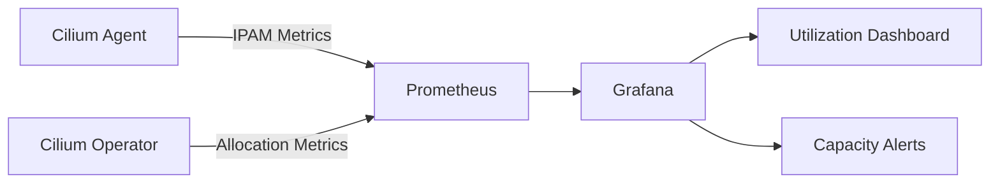

# Monitoring Cilium IPAM Operational Metrics

Author: [nawazdhandala](https://github.com/nawazdhandala)

Tags: Cilium, Kubernetes, IPAM, Monitoring, Observability

Description: How to monitor Cilium IPAM operational metrics including IP allocation rates, pool utilization, and capacity trends for production clusters.

---

## Introduction

Monitoring Cilium IPAM gives you visibility into IP address allocation health, utilization trends, and potential exhaustion before it affects pod scheduling. IPAM issues are among the most impactful Cilium problems because they directly prevent pods from starting.

The key metrics to track are per-node IP utilization, allocation and release rates, operator reconciliation performance, and overall cluster IP capacity. These metrics help you plan capacity and detect issues proactively.

## Prerequisites

- Kubernetes cluster with Cilium installed
- Prometheus and Grafana deployed
- kubectl and Cilium CLI configured

## IPAM Metrics Collection

Enable metrics in Cilium:

```yaml
prometheus:
  enabled: true
  serviceMonitor:
    enabled: true
operator:
  prometheus:
    enabled: true
    serviceMonitor:
      enabled: true
```

Key IPAM metrics:

```promql
# Available IPs per node
cilium_ipam_available

# Used IPs per node
cilium_ipam_used

# IP allocation operations
rate(cilium_ipam_allocation_ops_total[5m])

# IP release operations
rate(cilium_ipam_release_ops_total[5m])

# Allocation failures
rate(cilium_ipam_allocation_ops_total{status="failure"}[5m])
```

## Custom IPAM Monitoring Script

```bash
#!/bin/bash
# monitor-ipam.sh

echo "=== Cilium IPAM Status ==="
echo "Date: $(date)"

kubectl get ciliumnodes -o json | jq -r '
  .items[] | {
    node: .metadata.name,
    used: (.status.ipam.used // {} | length),
    cidrs: (.spec.ipam.podCIDRs // [])
  } | "\(.node): \(.used) IPs used, CIDRs: \(.cidrs)"'

echo ""
echo "Total endpoints:"
kubectl get ciliumendpoints --all-namespaces --no-headers | wc -l
```



## Alert Rules

```yaml
apiVersion: monitoring.coreos.com/v1
kind: PrometheusRule
metadata:
  name: cilium-ipam-alerts
  namespace: monitoring
spec:
  groups:
    - name: cilium-ipam
      rules:
        - alert: CiliumIPAMNearExhaustion
          expr: cilium_ipam_available < 20
          for: 10m
          labels:
            severity: warning
          annotations:
            summary: "Node {{ $labels.node }} has fewer than 20 IPs available"
        - alert: CiliumIPAMAllocationFailures
          expr: rate(cilium_ipam_allocation_ops_total{status="failure"}[5m]) > 0
          for: 5m
          labels:
            severity: critical
          annotations:
            summary: "IPAM allocation failures detected"
```

## Verification

```bash
cilium status | grep IPAM
kubectl port-forward -n kube-system svc/cilium-agent 9962:9962 &
curl -s http://localhost:9962/metrics | grep cilium_ipam
```

## Troubleshooting

- **IPAM metrics not appearing**: Ensure Prometheus metrics are enabled and ServiceMonitor is configured.
- **Utilization shows 100%**: Expand CIDRs immediately. Pods will fail to schedule.
- **Allocation rate spikes**: Correlate with deployment events. Sudden spikes during scaling are normal.
- **Metrics lag**: Check Prometheus scrape interval and agent health.

## Conclusion

IPAM monitoring is critical for production Cilium clusters. Track per-node utilization, alert on low capacity, and monitor allocation rates to detect issues before they affect pod scheduling. Plan capacity expansions based on utilization trends rather than reacting to exhaustion events.