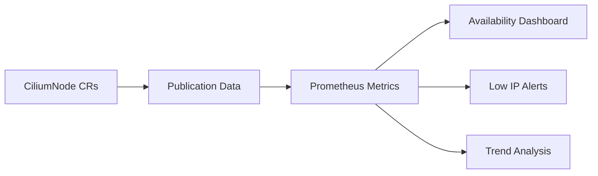

# Monitoring IP Availability Publication in Cilium IPAM

Author: [nawazdhandala](https://github.com/nawazdhandala)

Tags: Cilium, Kubernetes, IPAM, Monitoring, Networking

Description: How to monitor Cilium IPAM IP availability publication to ensure continuous and accurate reporting of available IP addresses per node.

---

## Introduction

Monitoring IP availability publication ensures that the data Cilium publishes about available IPs remains accurate and current. This is particularly important for clusters using autoscalers that rely on this data to make scaling decisions.

Key monitoring targets are publication frequency, data accuracy over time, and alerts when nodes report critically low IP availability.

## Prerequisites

- Kubernetes cluster with Cilium installed
- Prometheus and Grafana deployed
- kubectl configured

## Metrics for IP Publication

```promql
# Available IPs per node
cilium_ipam_available

# Used IPs per node
cilium_ipam_used

# IP allocation rate
rate(cilium_ipam_allocation_ops_total[5m])

# IP release rate
rate(cilium_ipam_release_ops_total[5m])
```

## Custom Monitoring Script

```bash
#!/bin/bash
# monitor-ip-publication.sh

echo "=== IP Publication Monitor ==="
echo "Timestamp: $(date -u)"

kubectl get ciliumnodes -o json | jq -r '.items[] |
  ((.spec.ipam.pool // {} | length) - (.status.ipam.used // {} | length)) as $avail |
  "\(.metadata.name): \($avail) IPs available, \((.status.ipam.used // {} | length)) used"'
```



## Alert Rules

```yaml
apiVersion: monitoring.coreos.com/v1
kind: PrometheusRule
metadata:
  name: cilium-ip-publication-alerts
  namespace: monitoring
spec:
  groups:
    - name: ip-publication
      rules:
        - alert: NodeIPsNearExhaustion
          expr: cilium_ipam_available < 5
          for: 5m
          labels:
            severity: critical
          annotations:
            summary: "Node {{ $labels.node }} has fewer than 5 IPs available"
        - alert: IPAllocationFailureRate
          expr: rate(cilium_ipam_allocation_ops_total{status="failure"}[5m]) > 0
          for: 5m
          labels:
            severity: critical
          annotations:
            summary: "IP allocation failures on {{ $labels.node }}"
```

## Verification

```bash
kubectl port-forward -n kube-system svc/cilium-agent 9962:9962 &
curl -s http://localhost:9962/metrics | grep cilium_ipam
cilium status
```

## Troubleshooting

- **Metrics not available**: Enable Prometheus metrics in Cilium Helm values.
- **Available count seems stale**: Check agent health on that node.
- **Alerts too noisy**: Adjust thresholds based on your node capacity.

## Conclusion

Monitoring IP publication ensures accurate data flows to autoscalers and scheduling systems. Track available IPs, alert on low capacity, and correlate allocation rates with scaling events for a complete picture.