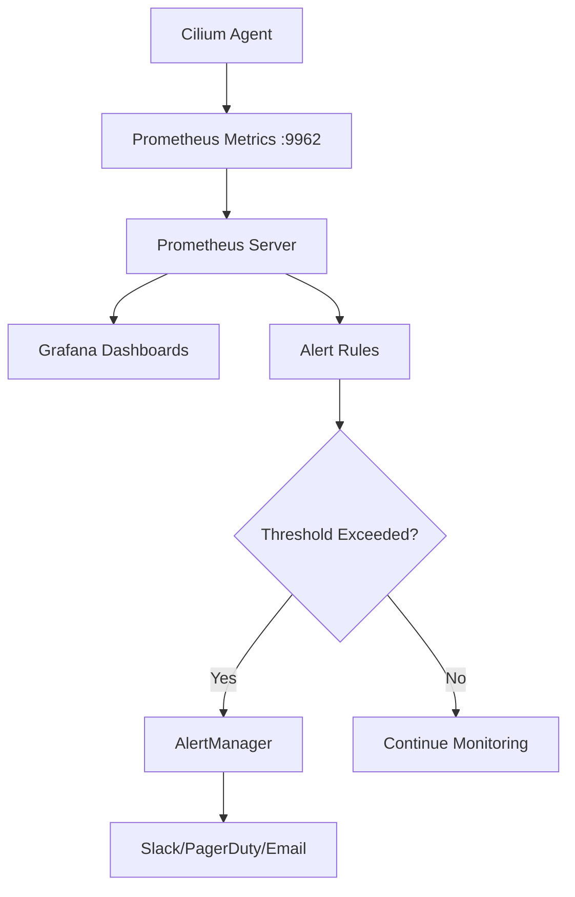

# How to Monitor Solution in Cilium configuration

Author: [nawazdhandala](https://github.com/nawazdhandala)

Tags: Cilium, Monitoring, Configuration

Description: A practical guide covering how to monitor solution in cilium configuration with step-by-step instructions and real-world examples for production Kubernetes clusters.

---

## Introduction

Cilium provides solutions for common Kubernetes networking challenges including service mesh, network policy enforcement, load balancing, and observability. Proper configuration ensures these solutions work together effectively.

In this guide, we cover Cilium solution configuration in a Kubernetes environment. Cilium leverages eBPF technology to provide high-performance networking, security, and observability for cloud-native workloads. The eBPF programs are loaded directly into the Linux kernel, enabling efficient packet processing without the overhead of traditional iptables-based networking stacks.

Whether you are running a small development cluster or a large production environment with thousands of pods, the techniques in this guide will help you maintain a reliable Cilium deployment. We provide step-by-step instructions with real commands and configuration examples that you can adapt to your environment.

## Prerequisites

- A running Kubernetes cluster (v1.21+) with Cilium installed (v1.14+)
- `kubectl` configured for cluster access
- `cilium` CLI installed (matching your Cilium version)
- Helm 3.x for configuration management
- Basic familiarity with Kubernetes networking concepts
- Access to cluster nodes for troubleshooting (recommended)
- Prometheus and Grafana for metrics visualization (recommended)

## Setting Up Monitoring

Enable Prometheus metrics collection for Cilium to gain visibility into the networking stack.

```bash
# Enable Prometheus metrics in Cilium
helm upgrade cilium cilium/cilium \
  --namespace kube-system \
  --reuse-values \
  --set prometheus.enabled=true \
  --set operator.prometheus.enabled=true \
  --set hubble.enabled=true \
  --set hubble.metrics.enableOpenMetrics=true

# Verify metrics endpoint is accessible
kubectl exec -n kube-system -l k8s-app=cilium -c cilium-agent -- curl -s http://localhost:9962/metrics | head -10
```

## Key Metrics to Monitor

Track these critical metrics for Cilium solution configuration:

```bash
# Identity management metrics
cilium metrics list | grep -E "identity_count|identity_creation"

# Endpoint health metrics
cilium metrics list | grep -E "endpoint_count|endpoint_regeneration"

# Policy metrics
cilium metrics list | grep -E "policy_count|policy_regeneration"

# Datapath performance metrics
cilium metrics list | grep -E "datapath|forward|drop"

# Agent resource metrics
cilium metrics list | grep -E "process_cpu|process_resident_memory"
```

## Creating Dashboards and Alerts

### Grafana Dashboard

Import the official Cilium Grafana dashboards for comprehensive visualization:

```bash
# The Cilium Helm chart can deploy Grafana dashboards automatically
helm upgrade cilium cilium/cilium \
  --namespace kube-system \
  --reuse-values \
  --set hubble.ui.enabled=true
```

### Prometheus Alert Rules

```yaml
# cilium-monitoring-alerts.yaml
# Alert rules for Cilium monitoring
apiVersion: monitoring.coreos.com/v1
kind: PrometheusRule
metadata:
  name: cilium-monitoring
  namespace: kube-system
spec:
  groups:
    - name: cilium-monitoring
      rules:
        - alert: CiliumAgentUnhealthy
          expr: cilium_unreachable_health_endpoints > 0
          for: 5m
          labels:
            severity: warning
          annotations:
            summary: "Cilium has unreachable health endpoints"
        - alert: CiliumPolicyRegenerationSlow
          expr: rate(cilium_policy_regeneration_time_stats_seconds_sum[5m]) / rate(cilium_policy_regeneration_time_stats_seconds_count[5m]) > 5
          for: 10m
          labels:
            severity: warning
          annotations:
            summary: "Cilium policy regeneration is slow"
        - alert: CiliumHighDropRate
          expr: rate(cilium_drop_count_total[5m]) > 100
          for: 5m
          labels:
            severity: critical
          annotations:
            summary: "Cilium is dropping packets at a high rate"
```

```bash
# Apply the alert rules
kubectl apply -f cilium-monitoring-alerts.yaml
```



## Ongoing Monitoring Best Practices

```bash
# Set up a daily health check script
#!/bin/bash
# cilium-health-check.sh

echo "=== Cilium Health Check $(date) ==="
echo ""
echo "Agent Status:"
cilium status --brief
echo ""
echo "Identity Count: $(cilium identity list 2>/dev/null | wc -l)"
echo "Endpoint Count: $(cilium endpoint list 2>/dev/null | wc -l)"
echo ""
echo "Resource Usage:"
kubectl top pods -n kube-system -l k8s-app=cilium --no-headers 2>/dev/null
echo ""
echo "Recent Errors:"
kubectl logs -n kube-system -l k8s-app=cilium --tail=50 --since=24h 2>/dev/null | grep -c -i error
```


## Verification

After completing the steps above, run a comprehensive verification to confirm everything is working as expected.

```bash
# Check overall Cilium deployment health
cilium status --verbose

# Verify inter-node connectivity
cilium health status

# Confirm all Cilium pods are running and ready
kubectl get pods -n kube-system -l k8s-app=cilium -o wide

# Verify the Cilium operator is healthy
kubectl get pods -n kube-system -l name=cilium-operator

# Check for recent error events
kubectl get events -n kube-system --sort-by='.lastTimestamp' | grep cilium | tail -10

# Run a connectivity test to validate the data plane
cilium connectivity test --single-node

# Verify endpoint count matches expected pod count
echo "Cilium endpoints: $(cilium endpoint list -o json 2>/dev/null | python3 -c 'import json,sys; print(len(json.load(sys.stdin)))' 2>/dev/null || echo 'N/A')"
```

## Troubleshooting

If you encounter issues during or after the steps in this guide, use the following troubleshooting procedures:

- **Cilium agent not starting**: Check resource limits and node capacity with `kubectl describe pod -n kube-system -l k8s-app=cilium`. Verify the BPF filesystem is mounted at `/sys/fs/bpf` and the kernel version is 4.19 or later. Check init container logs with `kubectl logs -n kube-system <pod> -c cilium-init`.

- **Connectivity failures**: Run `cilium connectivity test` and inspect the specific failing test case. Check for conflicting network policies with `cilium policy get`. Verify inter-node tunnel connectivity with `cilium bpf tunnel list`.

- **Configuration not applied**: Verify the Helm values or ConfigMap are correctly formatted. Run `kubectl rollout restart daemonset/cilium -n kube-system` and wait for the rollout to complete. Confirm with `cilium config view`.

- **High resource usage**: Review resource consumption with `kubectl top pods -n kube-system -l k8s-app=cilium`. Consider tuning label exclusion to reduce identity count. Increase agent memory limits if needed. Check `cilium metrics list | grep process_resident_memory`.

- **Endpoints stuck in regenerating state**: This usually indicates the agent is overloaded or encountering errors during BPF program compilation. Check agent logs with `kubectl logs -n kube-system -l k8s-app=cilium --tail=200 | grep -i error`.

- **Policy not being enforced**: Verify the policy selectors match the intended pods using `cilium endpoint list`. Confirm the policy is applied with `cilium policy get`. Check that the endpoint has the correct identity with `cilium endpoint get <id>`.

To collect a comprehensive diagnostic bundle for further analysis:

```bash
# Generate a Cilium sysdump containing all diagnostic information
# This collects logs, configs, BPF maps, and cluster state
cilium sysdump --output-filename cilium-diag-$(date +%Y%m%d)
```

## Conclusion

This guide covered Cilium solution configuration with practical steps you can apply to your Kubernetes cluster. Regular monitoring, systematic validation, and proactive management are essential for maintaining a healthy Cilium deployment at any scale.

Key takeaways from this guide:

- Always assess the current state before making changes to your Cilium configuration
- Use Helm for configuration management to ensure consistency and reproducibility across environments
- Monitor Cilium metrics through Prometheus to detect issues before they impact workloads
- Test changes in a staging environment before applying them to production clusters
- Maintain runbooks documenting your Cilium configuration decisions and operational procedures
- Use `cilium sysdump` to collect comprehensive diagnostic data when investigating issues

As your cluster grows and evolves, revisit these configurations periodically and adjust them to match your current requirements. The Cilium community and documentation are excellent resources for staying current with best practices and new features.
