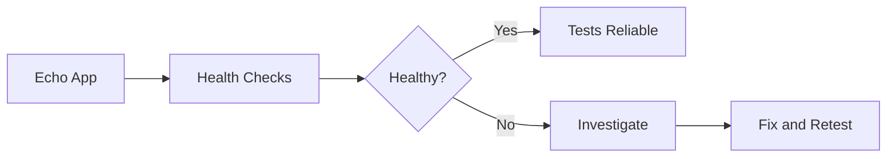

# Monitoring the Cilium Echo App for Test Reliability

Author: [nawazdhandala](https://github.com/nawazdhandala)

Tags: Cilium, Kubernetes, Testing, Monitoring, Echo App

Description: How to monitor the Cilium echo app to ensure test reliability and catch false positives in connectivity and policy testing.

---

## Introduction

Monitoring the echo app ensures your test environment is reliable. If the echo app is unhealthy, connectivity tests produce false negatives that waste debugging time. Monitoring catches echo app issues early so you can trust test results.

## Prerequisites

- Kubernetes cluster with Cilium and echo app deployed
- kubectl and Hubble configured

## Monitoring Echo App Health

```bash
#!/bin/bash
# monitor-echo-app.sh

echo "=== Echo App Health Monitor ==="

# Pod health
kubectl get pods -n cilium-test -o wide

# Service endpoints
kubectl get endpoints -n cilium-test echo-server

# Test responsiveness
RESPONSE=$(kubectl exec -n cilium-test deploy/echo-client -- \
  curl -s -w "%{http_code}" --max-time 5 http://echo-server:8080/ 2>/dev/null)
echo "Echo server response: $RESPONSE"

# Restart count
kubectl get pods -n cilium-test -o json | jq '.items[] | {
  name: .metadata.name,
  restarts: .status.containerStatuses[0].restartCount
}'
```

## Using Hubble to Monitor Echo Traffic

```bash
# Watch echo app traffic
hubble observe -n cilium-test --last 20

# Check for drops
hubble observe -n cilium-test --verdict DROPPED --last 10
```



## Automated Health Check

```yaml
# echo-monitor-cronjob.yaml
apiVersion: batch/v1
kind: CronJob
metadata:
  name: echo-health-check
  namespace: cilium-test
spec:
  schedule: "*/5 * * * *"
  jobTemplate:
    spec:
      template:
        spec:
          containers:
            - name: check
              image: quay.io/cilium/alpine-curl:v1.9.0
              command:
                - /bin/sh
                - -c
                - |
                  if curl -sf --max-time 5 http://echo-server:8080/; then
                    echo "OK"
                  else
                    echo "FAIL: Echo app unreachable"
                    exit 1
                  fi
          restartPolicy: OnFailure
```

## Verification

```bash
kubectl get pods -n cilium-test
kubectl get cronjobs -n cilium-test
kubectl get jobs -n cilium-test
```

## Troubleshooting

- **Health check job fails**: Check echo app pods are running. Review service endpoints.
- **Intermittent failures**: May indicate network instability. Check Cilium agent health.
- **High restart count**: Check resource limits and readiness probes.

## Conclusion

Monitor the echo app to ensure test reliability. Automated health checks catch issues early so you can trust your connectivity test results.