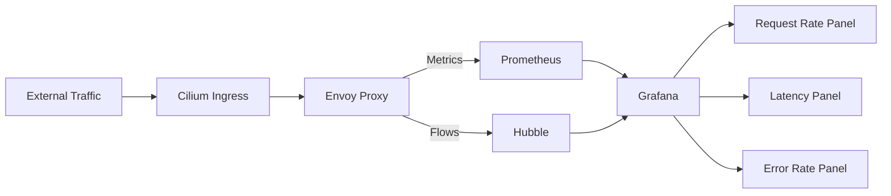

# Monitoring Cilium Ingress Traffic and Health

Author: [nawazdhandala](https://github.com/nawazdhandala)

Tags: Cilium, Kubernetes, Ingress, Monitoring, Observability

Description: How to monitor Cilium Ingress controller traffic, latency, error rates, and health using Prometheus metrics and Hubble flows.

---

## Introduction

Monitoring Cilium Ingress provides visibility into external traffic entering your cluster. Key metrics include request rates, latency percentiles, error rates, and backend health. Cilium exposes these through Envoy proxy metrics and Hubble flow data.

Effective Ingress monitoring helps you detect performance degradation, identify misconfigured routes, and plan capacity for your external-facing services.

## Prerequisites

- Kubernetes cluster with Cilium Ingress enabled
- Prometheus and Grafana deployed
- Hubble enabled

## Envoy Proxy Metrics

Enable Envoy metrics collection:

```yaml
# cilium-ingress-monitoring.yaml
envoy:
  enabled: true
  prometheus:
    enabled: true
    serviceMonitor:
      enabled: true

hubble:
  enabled: true
  metrics:
    enabled:
      - dns
      - drop
      - tcp
      - flow
      - "httpV2:exemplars=true;labelsContext=source_ip,destination_ip"
```

```bash
helm upgrade cilium cilium/cilium \
  --namespace kube-system \
  --reuse-values \
  -f cilium-ingress-monitoring.yaml
```

Key metrics:

```promql
# Request rate by route
rate(envoy_http_downstream_rq_total[5m])

# Latency percentiles
histogram_quantile(0.99, rate(envoy_http_downstream_rq_time_bucket[5m]))

# Error rate (5xx)
rate(envoy_http_downstream_rq_xx{envoy_response_code_class="5"}[5m])

# Active connections
envoy_http_downstream_cx_active
```

## Hubble Flow Monitoring

```bash
# Watch Ingress traffic in real time
hubble observe --to-service kube-system/cilium-ingress --last 50

# Filter for errors
hubble observe --to-service kube-system/cilium-ingress \
  --verdict DROPPED --last 20
```



## Alert Rules

```yaml
apiVersion: monitoring.coreos.com/v1
kind: PrometheusRule
metadata:
  name: cilium-ingress-alerts
  namespace: monitoring
spec:
  groups:
    - name: cilium-ingress
      rules:
        - alert: IngressHighErrorRate
          expr: >
            rate(envoy_http_downstream_rq_xx{
              envoy_response_code_class="5"}[5m]) /
            rate(envoy_http_downstream_rq_total[5m]) > 0.05
          for: 5m
          labels:
            severity: warning
          annotations:
            summary: "Ingress error rate exceeding 5%"
        - alert: IngressHighLatency
          expr: >
            histogram_quantile(0.99,
              rate(envoy_http_downstream_rq_time_bucket[5m])) > 5
          for: 10m
          labels:
            severity: warning
          annotations:
            summary: "Ingress p99 latency exceeding 5 seconds"
```

## Verification

```bash
kubectl port-forward -n kube-system svc/cilium-envoy 9090:9090 &
curl -s http://localhost:9090/metrics | grep envoy_http
cilium status | grep -i ingress
```

## Troubleshooting

- **No Envoy metrics**: Ensure Envoy is enabled and metrics port is exposed.
- **Latency spikes**: Check backend service health and resource limits.
- **High 5xx rate**: Review Envoy access logs and check backend pod readiness.
- **Hubble shows drops**: Check network policies that may be blocking Ingress traffic.

## Conclusion

Monitor Cilium Ingress with Envoy proxy metrics for request rates, latency, and errors, supplemented by Hubble flows for traffic visibility. Set up alerts for error rates and latency to catch issues before they impact users.