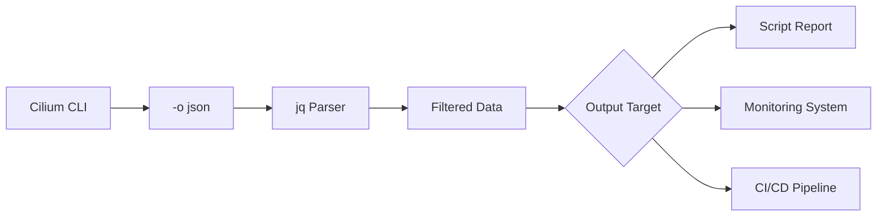

# How to Parse Output from cilium-agent completion fish

Author: [nawazdhandala](https://github.com/nawazdhandala)

Tags: Cilium, CLI

Description: A practical guide covering how to parse output from cilium-agent completion fish with step-by-step instructions and real-world examples for production Kubernetes clusters.

---

## Introduction

Shell completion dramatically improves CLI productivity by providing tab-completion for commands, subcommands, flags, and arguments. Setting up completion for Fish takes only a few minutes and saves significant time in daily operations.

In this guide, we cover cilium-agent shell completion for Fish in a Kubernetes environment. Cilium leverages eBPF technology to provide high-performance networking, security, and observability for cloud-native workloads. The eBPF programs are loaded directly into the Linux kernel, enabling efficient packet processing without the overhead of traditional iptables-based networking stacks.

Whether you are running a small development cluster or a large production environment with thousands of pods, the techniques in this guide will help you maintain a reliable Cilium deployment. We provide step-by-step instructions with real commands and configuration examples that you can adapt to your environment.

## Prerequisites

- A running Kubernetes cluster (v1.21+) with Cilium installed (v1.14+)
- `kubectl` configured for cluster access
- `cilium` CLI installed (matching your Cilium version)
- Helm 3.x for configuration management
- Basic familiarity with Kubernetes networking concepts
- Access to cluster nodes for troubleshooting (recommended)
- Prometheus and Grafana for metrics visualization (recommended)

## Understanding Output Formats

Cilium CLI commands support multiple output formats that are suitable for different parsing needs.

```bash
# Default human-readable output
cilium status

# JSON output for programmatic parsing
cilium status -o json

# JSON output for endpoint listing
cilium endpoint list -o json

# JSON output for identity listing
cilium identity list -o json
```

## Parsing with jq

The `jq` tool is the most effective way to parse Cilium JSON output.

```bash
# Parse endpoint list to extract specific fields
cilium endpoint list -o json | jq '.[] | {id: .id, state: .status.state, identity: .status.identity.id}'

# Count endpoints by state
cilium endpoint list -o json | jq '[.[] | .status.state] | group_by(.) | map({state: .[0], count: length})'

# Extract identity labels
cilium identity list -o json | jq '.[] | {id: .id, labels: .labels}'

# Filter for specific conditions
cilium endpoint list -o json | jq '[.[] | select(.status.state != "ready")] | length'

# Parse service list
cilium service list -o json | jq '.[] | {id: .spec.id, frontend: .spec.frontend_address, backends: (.spec.backend_addresses | length)}'
```

## Building Scripts with Parsed Output

```bash
#!/bin/bash
# cilium-report.sh
# Generate a structured report from Cilium CLI output

echo "=== Cilium Cluster Report ==="
echo "Date: $(date -u +%Y-%m-%dT%H:%M:%SZ)"
echo ""

# Parse status
STATUS=$(cilium status -o json 2>/dev/null)
if [ $? -eq 0 ]; then
    echo "Cilium State: $(echo "$STATUS" | jq -r '.cilium.state // "unknown"')"
    echo "Cluster Mesh: $(echo "$STATUS" | jq -r '.cluster_mesh.state // "disabled"')"
fi

# Parse endpoints
ENDPOINTS=$(cilium endpoint list -o json 2>/dev/null)
if [ $? -eq 0 ]; then
    TOTAL=$(echo "$ENDPOINTS" | jq 'length')
    READY=$(echo "$ENDPOINTS" | jq '[.[] | select(.status.state == "ready")] | length')
    echo "Endpoints: $READY/$TOTAL ready"
fi

# Parse identities
IDENTITIES=$(cilium identity list -o json 2>/dev/null)
if [ $? -eq 0 ]; then
    echo "Identities: $(echo "$IDENTITIES" | jq 'length')"
fi
```

## Integration with Monitoring Tools

```bash
# Output metrics in a format suitable for custom exporters
cilium metrics list 2>/dev/null | while IFS= read -r line; do
    # Parse the metric name and value
    metric_name=$(echo "$line" | awk '{print $1}')
    metric_value=$(echo "$line" | awk '{print $NF}')
    echo "cilium.$metric_name $metric_value $(date +%s)"
done
```



## Error Handling in Parsing Scripts

```bash
# Robust parsing with error handling
parse_cilium_data() {
    local cmd="$1"
    local output
    
    output=$($cmd 2>/dev/null)
    if [ $? -ne 0 ]; then
        echo "ERROR: Command failed: $cmd" >&2
        return 1
    fi
    
    # Validate JSON
    echo "$output" | jq . > /dev/null 2>&1
    if [ $? -ne 0 ]; then
        echo "ERROR: Invalid JSON from: $cmd" >&2
        return 1
    fi
    
    echo "$output"
}

# Usage
parse_cilium_data "cilium endpoint list -o json" | jq length
```


## Verification

After completing the steps above, run a comprehensive verification to confirm everything is working as expected.

```bash
# Check overall Cilium deployment health
cilium status --verbose

# Verify inter-node connectivity
cilium health status

# Confirm all Cilium pods are running and ready
kubectl get pods -n kube-system -l k8s-app=cilium -o wide

# Verify the Cilium operator is healthy
kubectl get pods -n kube-system -l name=cilium-operator

# Check for recent error events
kubectl get events -n kube-system --sort-by='.lastTimestamp' | grep cilium | tail -10

# Run a connectivity test to validate the data plane
cilium connectivity test --single-node

# Verify endpoint count matches expected pod count
echo "Cilium endpoints: $(cilium endpoint list -o json 2>/dev/null | python3 -c 'import json,sys; print(len(json.load(sys.stdin)))' 2>/dev/null || echo 'N/A')"
```

## Troubleshooting

If you encounter issues during or after the steps in this guide, use the following troubleshooting procedures:

- **Cilium agent not starting**: Check resource limits and node capacity with `kubectl describe pod -n kube-system -l k8s-app=cilium`. Verify the BPF filesystem is mounted at `/sys/fs/bpf` and the kernel version is 4.19 or later. Check init container logs with `kubectl logs -n kube-system <pod> -c cilium-init`.

- **Connectivity failures**: Run `cilium connectivity test` and inspect the specific failing test case. Check for conflicting network policies with `cilium policy get`. Verify inter-node tunnel connectivity with `cilium bpf tunnel list`.

- **Configuration not applied**: Verify the Helm values or ConfigMap are correctly formatted. Run `kubectl rollout restart daemonset/cilium -n kube-system` and wait for the rollout to complete. Confirm with `cilium config view`.

- **High resource usage**: Review resource consumption with `kubectl top pods -n kube-system -l k8s-app=cilium`. Consider tuning label exclusion to reduce identity count. Increase agent memory limits if needed. Check `cilium metrics list | grep process_resident_memory`.

- **Endpoints stuck in regenerating state**: This usually indicates the agent is overloaded or encountering errors during BPF program compilation. Check agent logs with `kubectl logs -n kube-system -l k8s-app=cilium --tail=200 | grep -i error`.

- **Policy not being enforced**: Verify the policy selectors match the intended pods using `cilium endpoint list`. Confirm the policy is applied with `cilium policy get`. Check that the endpoint has the correct identity with `cilium endpoint get <id>`.

To collect a comprehensive diagnostic bundle for further analysis:

```bash
# Generate a Cilium sysdump containing all diagnostic information
# This collects logs, configs, BPF maps, and cluster state
cilium sysdump --output-filename cilium-diag-$(date +%Y%m%d)
```

## Conclusion

This guide covered cilium-agent shell completion for Fish with practical steps you can apply to your Kubernetes cluster. Regular monitoring, systematic validation, and proactive management are essential for maintaining a healthy Cilium deployment at any scale.

Key takeaways from this guide:

- Always assess the current state before making changes to your Cilium configuration
- Use Helm for configuration management to ensure consistency and reproducibility across environments
- Monitor Cilium metrics through Prometheus to detect issues before they impact workloads
- Test changes in a staging environment before applying them to production clusters
- Maintain runbooks documenting your Cilium configuration decisions and operational procedures
- Use `cilium sysdump` to collect comprehensive diagnostic data when investigating issues

As your cluster grows and evolves, revisit these configurations periodically and adjust them to match your current requirements. The Cilium community and documentation are excellent resources for staying current with best practices and new features.
