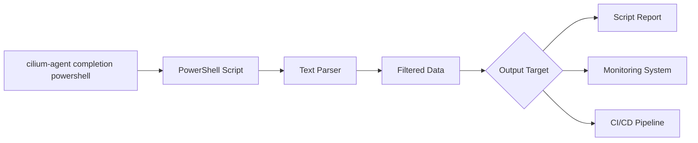

# How to Parse Output from cilium-agent completion powershell

Author: [nawazdhandala](https://github.com/nawazdhandala)

Tags: Cilium, CLI

Description: A practical guide covering how to parse output from cilium-agent completion powershell with step-by-step instructions and real-world examples for production Kubernetes clusters.

---

## Introduction

Shell completion dramatically improves CLI productivity by providing tab-completion for commands, subcommands, flags, and arguments. Setting up completion for PowerShell takes only a few minutes and saves significant time in daily operations.

In this guide, we cover the output generated by `cilium-agent completion powershell` in a Kubernetes environment. Cilium leverages eBPF technology to provide high-performance networking, security, and observability for cloud-native workloads. The eBPF programs are loaded directly into the Linux kernel, enabling efficient packet processing without the overhead of traditional iptables-based networking stacks.

Whether you are running a small development cluster or a large production environment with thousands of pods, the techniques in this guide will help you maintain a reliable Cilium deployment. We provide step-by-step instructions with real commands and configuration examples that you can adapt to your environment.

## Prerequisites

- A running Kubernetes cluster with Cilium installed
- `kubectl` configured for cluster access if you are generating the script from a Cilium pod
- Access to the `cilium-agent` binary, either locally or inside a Cilium agent pod
- PowerShell 5.0+ or PowerShell 7+
- Basic familiarity with Kubernetes networking concepts

## Understanding Output Formats

The `cilium-agent completion powershell` command writes a PowerShell completion script to standard output. It does not support JSON output; the generated script is intended to be loaded by PowerShell or inspected as text.

```powershell
# Generate the completion script

cilium-agent completion powershell

# Generate the script without completion descriptions
cilium-agent completion powershell --no-descriptions

# Load completions in the current PowerShell session
cilium-agent completion powershell | Out-String | Invoke-Expression
```

```bash
# Generate the script from a Cilium agent pod
POD=$(kubectl -n kube-system get pod -l k8s-app=cilium -o jsonpath='{.items[0].metadata.name}')
kubectl -n kube-system exec "$POD" -c cilium-agent -- cilium-agent completion powershell > cilium-agent-completion.ps1
```

## Parsing with PowerShell

Because the output is a PowerShell script, PowerShell string and regular expression tools are the most direct way to parse it.

```powershell
# Capture the generated script as a single string
$completion = cilium-agent completion powershell | Out-String

# Confirm that it registers a PowerShell argument completer
$completion -match 'Register-ArgumentCompleter'

# Extract the command name registered by the script
([regex]::Match($completion, "-CommandName\s+'([^']+)'")).Groups[1].Value

# Check whether descriptions are present in the generated script
$completion -match 'CompletionResult'

# Count generated script lines
($completion -split "`r?`n").Count
```

## Building Scripts with Parsed Output

```powershell
# cilium-agent-completion-report.ps1
# Generate a structured report from the PowerShell completion script

$completion = cilium-agent completion powershell | Out-String

$commandName = ([regex]::Match($completion, "-CommandName\s+'([^']+)'")).Groups[1].Value
$hasCompleter = $completion -match 'Register-ArgumentCompleter'
$usesDynamicCompletion = $completion -match '__complete'

[pscustomobject]@{
    CommandName = $commandName
    HasCompleter = $hasCompleter
    UsesDynamicCompletion = $usesDynamicCompletion
    LineCount = ($completion -split "`r?`n").Count
    GeneratedAt = (Get-Date).ToUniversalTime().ToString("o")
}
```

```bash
#!/usr/bin/env bash
# cilium-agent-completion-report.sh
# Validate the generated completion script from a shell pipeline

set -euo pipefail

script=$(cilium-agent completion powershell)

printf 'command=%s\n' 'cilium-agent'
printf 'has_argument_completer=%s\n' "$(printf '%s' "$script" | grep -q 'Register-ArgumentCompleter' && echo true || echo false)"
printf 'uses_dynamic_completion=%s\n' "$(printf '%s' "$script" | grep -q '__complete' && echo true || echo false)"
printf 'line_count=%s\n' "$(printf '%s\n' "$script" | wc -l | tr -d ' ')"
```

## Integration with Monitoring Tools

```bash
# Output a simple metric for custom automation
if cilium-agent completion powershell 2>/dev/null | grep -q 'Register-ArgumentCompleter'; then
    echo "cilium_agent_completion_powershell_valid 1 $(date +%s)"
else
    echo "cilium_agent_completion_powershell_valid 0 $(date +%s)"
fi
```



## Error Handling in Parsing Scripts

```powershell
# Robust parsing with error handling
function Get-CiliumAgentPowerShellCompletion {
    $completion = cilium-agent completion powershell 2>$null | Out-String
    if ($LASTEXITCODE -ne 0) {
        throw "cilium-agent completion powershell failed"
    fi

    if ([string]::IsNullOrWhiteSpace($completion)) {
        throw "Completion script was empty"
    fi

    if ($completion -notmatch 'Register-ArgumentCompleter') {
        throw "Completion script did not register an argument completer"
    }

    $completion
}

# Usage
Get-CiliumAgentPowerShellCompletion | Select-String 'Register-ArgumentCompleter'
```


## Verification

After completing the steps above, run a comprehensive verification to confirm everything is working as expected.

```bash
# Verify the cilium-agent binary is available
cilium-agent completion powershell --help

# Generate the PowerShell completion script
cilium-agent completion powershell > cilium-agent-completion.ps1

# Verify that the generated script contains the completer registration
grep -q 'Register-ArgumentCompleter' cilium-agent-completion.ps1

# Confirm all Cilium pods are running and ready
kubectl get pods -n kube-system -l k8s-app=cilium -o wide

# Generate the script from a running Cilium pod if the binary is not local
POD=$(kubectl -n kube-system get pod -l k8s-app=cilium -o jsonpath='{.items[0].metadata.name}')
kubectl -n kube-system exec "$POD" -c cilium-agent -- cilium-agent completion powershell > cilium-agent-completion.ps1

# Load completions in a PowerShell session
pwsh -NoProfile -Command "Get-Content ./cilium-agent-completion.ps1 | Out-String | Invoke-Expression"
```

## Troubleshooting

If you encounter issues during or after the steps in this guide, use the following troubleshooting procedures:

- **`cilium-agent` command not found**: The `cilium-agent` binary is normally available inside Cilium agent pods. Use `kubectl exec` against a Cilium pod, or install the matching Cilium binary locally before generating completions.

- **PowerShell completion does not load**: Confirm you are piping the generated script through `Out-String | Invoke-Expression` in the current PowerShell session. For persistent completions, add the generated script content to your PowerShell profile.

- **Generated script is empty**: Run `cilium-agent completion powershell --help` and verify the command exits successfully. If you are using `kubectl exec`, confirm the pod name and container name are correct.

- **Descriptions are not wanted**: Use `cilium-agent completion powershell --no-descriptions` to generate a smaller script without completion descriptions.

- **Parsing checks fail**: Treat the generated completion as a script, not as JSON. Validate for PowerShell constructs such as `Register-ArgumentCompleter` instead of using JSON parsers such as `jq`.

- **Cilium agent pod is not running**: Check resource limits and node capacity with `kubectl describe pod -n kube-system -l k8s-app=cilium`. Verify the BPF filesystem is mounted at `/sys/fs/bpf` and check init container logs with `kubectl logs -n kube-system <pod> -c cilium-init`.

To collect a comprehensive diagnostic bundle for further analysis:

```bash
# Generate a Cilium sysdump containing all diagnostic information
# This collects logs, configs, BPF maps, and cluster state
cilium sysdump --output-filename cilium-diag-$(date +%Y%m%d)
```

## Conclusion

This guide covered how to generate, load, and parse `cilium-agent completion powershell` output with practical steps you can apply to your Kubernetes cluster. Regular monitoring, systematic validation, and proactive management are essential for maintaining a healthy Cilium deployment at any scale.

Key takeaways from this guide:

- The PowerShell completion command emits a script, not JSON
- Use `Out-String | Invoke-Expression` to load completions in the current PowerShell session
- Use `--no-descriptions` when you want a smaller generated script
- Generate completions from a Cilium pod when `cilium-agent` is not installed locally
- Maintain runbooks documenting your Cilium completion setup and operational procedures
- Use `cilium sysdump` to collect comprehensive diagnostic data when investigating issues

As your cluster grows and evolves, revisit these configurations periodically and adjust them to match your current requirements. The Cilium community and documentation are excellent resources for staying current with best practices and new features.
