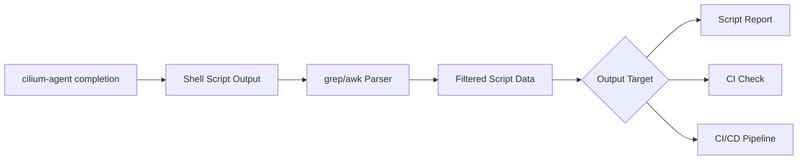

# How to Parse Output from cilium-agent completion

Author: [nawazdhandala](https://github.com/nawazdhandala)

Tags: Cilium, CLI

Description: A practical guide covering how to parse output from cilium-agent completion with step-by-step instructions and real-world examples for production Kubernetes clusters.

---

## Introduction

Shell completion dramatically improves CLI productivity by providing tab-completion for commands, subcommands, flags, and arguments. Setting up completion for your shell takes only a few minutes and saves significant time in daily operations.

In this guide, we cover cilium-agent shell completion output and how to inspect it safely. Cilium leverages eBPF technology to provide high-performance networking, security, and observability for cloud-native workloads. The eBPF programs are loaded directly into the Linux kernel, enabling efficient packet processing without the overhead of traditional iptables-based networking stacks.

Whether you are checking generated completion scripts during an upgrade or packaging completions for developer workstations, the techniques in this guide will help you inspect the output consistently. We provide step-by-step instructions with real commands and examples that you can adapt to your environment.

## Prerequisites

- The `cilium-agent` binary available in your shell or inside the Cilium agent container image
- A shell supported by the completion command: bash, zsh, fish, or PowerShell
- `bash-completion` installed if you plan to load bash completions interactively
- Basic familiarity with shell pipelines
- Standard text processing tools such as `grep`, `awk`, `sed`, and `wc`

## Understanding Output Formats

The `cilium-agent completion` command generates shell-specific completion scripts. It does not emit JSON; choose the shell subcommand that matches the format you want to inspect.

```bash
# Bash completion script
cilium-agent completion bash

# Zsh completion script
cilium-agent completion zsh

# Fish completion script
cilium-agent completion fish

# PowerShell completion script
cilium-agent completion powershell

# Disable completion descriptions where supported
cilium-agent completion bash --no-descriptions
```

## Parsing with grep and awk

Because completion output is a shell script, use shell-aware checks and conservative text filters rather than a JSON parser.

```bash
# Save bash completion output for repeatable inspection
cilium-agent completion bash > /tmp/cilium-agent-completion.bash

# Confirm the script contains cilium-agent completion definitions
grep -n 'cilium-agent' /tmp/cilium-agent-completion.bash | head

# List long flags embedded in the generated bash completion script
grep -Eo -- '--[A-Za-z0-9][A-Za-z0-9_-]*' /tmp/cilium-agent-completion.bash | sort -u

# Count generated completion lines for a quick smoke check
wc -l /tmp/cilium-agent-completion.bash

# Inspect fish completion entries
cilium-agent completion fish | awk '/^complete -c cilium-agent/ {print}'
```

## Building Scripts with Parsed Output

```bash
#!/bin/bash
# cilium-completion-report.sh
# Generate a structured report from cilium-agent completion output

echo "=== cilium-agent Completion Report ==="
echo "Date: $(date -u +%Y-%m-%dT%H:%M:%SZ)"
echo ""

for shell in bash zsh fish powershell; do
    output=$(cilium-agent completion "$shell" 2>/dev/null)
    if [ $? -ne 0 ]; then
        echo "$shell: generation failed"
        continue
    fi

    lines=$(printf '%s\n' "$output" | wc -l | awk '{print $1}')
    flags=$(printf '%s\n' "$output" | grep -Eo -- '--[A-Za-z0-9][A-Za-z0-9_-]*' | sort -u | wc -l | awk '{print $1}')
    echo "$shell: $lines lines, $flags long-flag references"
done
```

## Integration with Monitoring Tools

```bash
# Output simple CI-friendly checks for generated completion scripts
for shell in bash zsh fish powershell; do
    if cilium-agent completion "$shell" >/tmp/cilium-agent-completion-"$shell" 2>/dev/null; then
        bytes=$(wc -c </tmp/cilium-agent-completion-"$shell")
        echo "cilium_agent_completion_bytes{shell=\"$shell\"} $bytes"
    else
        echo "cilium_agent_completion_generation_failed{shell=\"$shell\"} 1"
    fi
done
```



## Error Handling in Parsing Scripts

```bash
# Robust parsing with error handling
parse_cilium_data() {
    local output
    
    output=$("$@" 2>/dev/null)
    if [ $? -ne 0 ]; then
        echo "ERROR: Command failed: $*" >&2
        return 1
    fi
    
    # Validate that the generated script references cilium-agent
    printf '%s\n' "$output" | grep -q 'cilium-agent'
    if [ $? -ne 0 ]; then
        echo "ERROR: Unexpected completion output from: $*" >&2
        return 1
    fi
    
    printf '%s\n' "$output"
}

# Usage
parse_cilium_data cilium-agent completion bash | wc -l
```


## Verification

After completing the steps above, run a comprehensive verification to confirm everything is working as expected.

```bash
# Confirm the completion command exists
cilium-agent completion --help

# Generate bash completion output
cilium-agent completion bash > /tmp/cilium-agent-completion.bash

# Verify the generated file is not empty
test -s /tmp/cilium-agent-completion.bash

# Confirm the generated script references cilium-agent
grep -q 'cilium-agent' /tmp/cilium-agent-completion.bash

# Check zsh generation
cilium-agent completion zsh >/tmp/cilium-agent-completion.zsh

# Check fish generation
cilium-agent completion fish >/tmp/cilium-agent-completion.fish

# Check PowerShell generation
cilium-agent completion powershell >/tmp/cilium-agent-completion.ps1
```

## Troubleshooting

If you encounter issues during or after the steps in this guide, use the following troubleshooting procedures:

- **`cilium-agent` not found**: Verify that the Cilium agent binary is on your `PATH`, or run the command from an environment that contains the Cilium agent image.

- **Bash completions do not load**: Install the `bash-completion` package, then load the generated script with `source <(cilium-agent completion bash)` or install it under `/etc/bash_completion.d/cilium-agent`.

- **Zsh completions do not load**: Ensure completion is initialized in zsh with `autoload -U compinit; compinit`, then place the generated `_cilium-agent` file in a directory listed in `$fpath`.

- **Fish completions do not load**: Write the generated script to `~/.config/fish/completions/cilium-agent.fish` and start a new shell.

- **PowerShell completions do not load**: Pipe the generated script to `Out-String | Invoke-Expression` for the current session or add the generated content to your PowerShell profile.

- **Parsed output changes after an upgrade**: Regenerate the completion script after upgrading Cilium, because flags and subcommands can change between releases.

To collect a reusable completion file for further analysis:

```bash
# Generate a dated bash completion script
cilium-agent completion bash > cilium-agent-completion-$(date +%Y%m%d).bash
```

## Conclusion

This guide covered cilium-agent shell completion output with practical steps you can apply to your scripts and CI checks. Regular validation is useful when you package completions or upgrade Cilium versions.

Key takeaways from this guide:

- Generate completion output for the specific shell you need to support
- Treat completion output as shell script, not JSON
- Use `grep`, `awk`, `sed`, and `wc` for lightweight inspection
- Use `--no-descriptions` when you need a smaller completion script without descriptions
- Regenerate completion files after upgrading Cilium
- Validate that generated scripts are non-empty before publishing them

As your environment grows and evolves, revisit these scripts periodically and adjust them to match your current Cilium version. The Cilium community and documentation are excellent resources for staying current with best practices and new features.
