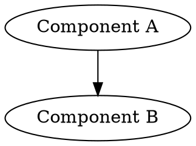

# Parsing Output from Cilium Agent Hive

Author: [nawazdhandala](https://github.com/nawazdhandala)

Tags: Cilium, Hive, Parsing, Kubernetes, Scripting, Automation

Description: Learn how to parse the output of cilium-agent hive commands to extract component information, build dependency maps, and create monitoring dashboards for Cilium's internal architecture.

---

## Introduction

The `cilium-agent hive` command outputs structured information about the agent's dependency injection framework. This output, typically in DOT graph format, contains the full component tree with dependency relationships. Parsing this output programmatically enables you to build monitoring dashboards, detect architectural changes, and generate documentation.

Understanding the output format and applying the right parsing techniques lets you transform raw DOT graph data into actionable intelligence about your Cilium deployment's internal structure.

This guide covers parsing techniques using standard tools, Python, and integration with monitoring systems.

## Prerequisites

- Access to cilium-agent hive output (from a running pod or saved file)
- `grep`, `awk`, `sed` for shell-based parsing
- Python 3.x with `pydot` or `networkx` for structured analysis
- Graphviz installed for DOT format handling

## Understanding the Output Format

The `cilium-agent hive dot-graph` command produces DOT format output:

```bash
# Capture the output
CILIUM_POD=$(kubectl -n kube-system get pods -l k8s-app=cilium \
  -o jsonpath='{.items[0].metadata.name}')

kubectl -n kube-system exec "$CILIUM_POD" -c cilium-agent -- \
  cilium-agent hive dot-graph > /tmp/hive-output.dot

# Examine the structure
head -20 /tmp/hive-output.dot
```

The DOT format contains nodes (components) and edges (dependencies):



## Shell-Based Parsing

Extract components and relationships using standard Unix tools:

```bash
#!/bin/bash
# parse-hive-shell.sh
# Extract components and dependencies from hive DOT output

INPUT="/tmp/hive-output.dot"

echo "=== Components ==="
grep -oP '\[label="[^"]*"\]' "$INPUT" | \
  sed 's/\[label="//;s/"\]//' | \
  sort -u

echo ""
echo "=== Dependencies ==="
grep -E '^\s*"[^"]*"\s*->\s*"[^"]*"' "$INPUT" | \
  sed 's/.*"\(.*\)".*->.*"\(.*\)".*/\1 depends on \2/' | \
  sort -u

echo ""
echo "=== Statistics ==="
NODES=$(grep -c '\[label=' "$INPUT" 2>/dev/null || echo 0)
EDGES=$(grep -c '\->' "$INPUT" 2>/dev/null || echo 0)
echo "Total components: $NODES"
echo "Total dependencies: $EDGES"
```

## Python Structured Parsing

For deeper analysis, use Python to build a proper graph:

```python
#!/usr/bin/env python3
"""Parse cilium-agent hive DOT output into structured data."""

import re
import json
import sys
from collections import defaultdict

def parse_dot_graph(filepath):
    """Parse DOT format into nodes and edges."""
    with open(filepath, 'r') as f:
        content = f.read()

    nodes = {}
    edges = []

    # Parse node definitions: "id" [label="Label Name"]
    node_pattern = re.compile(r'"([^"]+)"\s*\[label="([^"]+)"\]')
    for match in node_pattern.finditer(content):
        node_id = match.group(1)
        label = match.group(2)
        nodes[node_id] = {'id': node_id, 'label': label}

    # Parse edges: "source" -> "target"
    edge_pattern = re.compile(r'"([^"]+)"\s*->\s*"([^"]+)"')
    for match in edge_pattern.finditer(content):
        source = match.group(1)
        target = match.group(2)
        edges.append({'from': source, 'to': target})

    return {'nodes': nodes, 'edges': edges}

def find_root_components(graph):
    """Find components with no incoming dependencies."""
    targets = {e['to'] for e in graph['edges']}
    sources = {e['from'] for e in graph['edges']}
    roots = sources - targets
    return [graph['nodes'].get(r, {'id': r}) for r in roots]

def find_leaf_components(graph):
    """Find components with no outgoing dependencies."""
    sources = {e['from'] for e in graph['edges']}
    targets = {e['to'] for e in graph['edges']}
    leaves = targets - sources
    return [graph['nodes'].get(l, {'id': l}) for l in leaves]

def compute_dependency_depth(graph):
    """Compute the maximum dependency depth for each node."""
    adj = defaultdict(list)
    for edge in graph['edges']:
        adj[edge['from']].append(edge['to'])

    depths = {}
    def dfs(node, visited=None):
        if visited is None:
            visited = set()
        if node in depths:
            return depths[node]
        if node in visited:
            return 0  # cycle detected
        visited.add(node)
        if not adj[node]:
            depths[node] = 0
            return 0
        max_depth = max(dfs(child, visited) for child in adj[node])
        depths[node] = max_depth + 1
        return depths[node]

    for node in graph['nodes']:
        dfs(node)
    return depths

if __name__ == '__main__':
    filepath = sys.argv[1] if len(sys.argv) > 1 else '/tmp/hive-output.dot'
    graph = parse_dot_graph(filepath)

    print(f"Components: {len(graph['nodes'])}")
    print(f"Dependencies: {len(graph['edges'])}")
    print(f"\nRoot components (no dependencies on them):")
    for r in find_root_components(graph):
        print(f"  - {r.get('label', r['id'])}")
    print(f"\nLeaf components (no outgoing deps):")
    for l in find_leaf_components(graph):
        print(f"  - {l.get('label', l['id'])}")

    # Output full JSON
    print(f"\n--- JSON Output ---")
    print(json.dumps(graph, indent=2))
```

## Converting to Other Formats

Transform parsed data for different consumers:

```bash
#!/bin/bash
# Convert hive graph to CSV for spreadsheet analysis

INPUT="/tmp/hive-output.dot"

echo "source,target" > /tmp/hive-edges.csv
grep -E '"\w+" -> "\w+"' "$INPUT" | \
  sed 's/.*"\([^"]*\)".*->.*"\([^"]*\)".*/\1,\2/' >> /tmp/hive-edges.csv

echo "id,label" > /tmp/hive-nodes.csv
grep '\[label=' "$INPUT" | \
  sed 's/.*"\([^"]*\)".*label="\([^"]*\)".*/\1,\2/' >> /tmp/hive-nodes.csv

echo "Exported to /tmp/hive-edges.csv and /tmp/hive-nodes.csv"
wc -l /tmp/hive-edges.csv /tmp/hive-nodes.csv
```

## Verification

```bash
# Verify parsing produces valid output
python3 parse_hive.py /tmp/hive-output.dot | tail -5

# Verify CSV export
head -5 /tmp/hive-edges.csv
head -5 /tmp/hive-nodes.csv

# Validate JSON output
python3 parse_hive.py /tmp/hive-output.dot 2>/dev/null | \
  sed -n '/--- JSON Output ---/,$ p' | tail -n +2 | jq . > /dev/null && \
  echo "JSON is valid"
```

## Troubleshooting

- **Empty parsing results**: The DOT format may vary between Cilium versions. Check the raw file and adjust regex patterns accordingly.
- **Python pydot import errors**: Install with `pip install pydot`. The manual regex approach above works without external dependencies.
- **Malformed DOT output**: Some versions may include stderr messages. Redirect stderr separately: `cilium-agent hive dot-graph 2>/dev/null`.
- **Very large graphs causing slow parsing**: For production clusters with many components, stream-process rather than loading the full file into memory.

## Conclusion

Parsing cilium-agent hive output transforms opaque dependency graphs into structured data you can analyze, monitor, and visualize. Whether using shell tools for quick inspection or Python for deep graph analysis, these techniques give you programmatic access to the agent's architectural blueprint.
