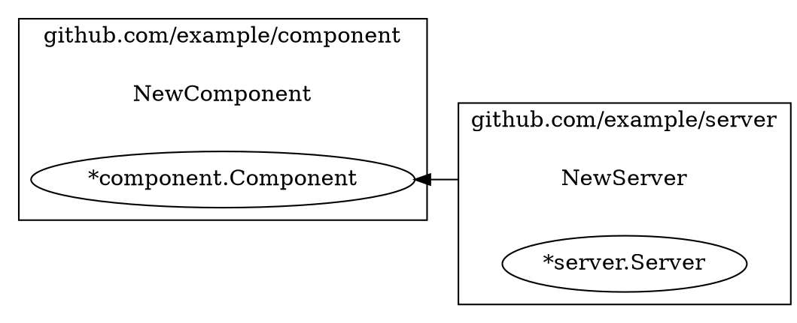

# Parsing Output from Cilium Agent Hive

Author: [nawazdhandala](https://github.com/nawazdhandala)

Tags: Cilium, Hive, Parsing, Kubernetes, Scripting, Automation

Description: Learn how to parse the output of cilium-agent hive commands to extract component information, build dependency maps, and create monitoring dashboards for Cilium's internal architecture.

---

## Introduction

The `cilium-agent hive` command outputs structured information about the agent's dependency injection framework. Its `dot-graph` subcommand outputs the provider dependency graph in DOT format. Parsing this output programmatically enables you to build monitoring dashboards, detect architectural changes, and generate documentation.

Understanding the output format and applying the right parsing techniques lets you transform raw DOT graph data into actionable intelligence about your Cilium deployment's internal structure.

This guide covers parsing techniques using standard tools, Python, and integration with monitoring systems.

## Prerequisites

- Access to cilium-agent hive output (from a running pod or saved file)
- `grep`, `awk`, `sed` for shell-based parsing
- Python 3.x for structured analysis, with `pydot` or `networkx` optional for more advanced graph work
- Graphviz installed for DOT format handling

## Understanding the Output Format

The `cilium-agent hive dot-graph` command produces DOT format output:

```bash
# Capture the output

CILIUM_POD=$(kubectl -n kube-system get pods -l k8s-app=cilium \
  -o jsonpath='{.items[0].metadata.name}')

kubectl -n kube-system exec "$CILIUM_POD" -c cilium-agent -- \
  cilium-agent hive dot-graph > /tmp/hive-output.dot

# Examine the structure
head -20 /tmp/hive-output.dot
```

The DOT format is generated by Hive's dependency injection layer. It contains constructor nodes, provided-value nodes, and edges from constructors to the values they require:


```dot
digraph {
  rankdir=RL;
  graph [compound=true];
  subgraph cluster_0 {
    label = "github.com/example/component";
    constructor_0 [shape=plaintext label="NewComponent"];
    "*component.Component" [label=<*component.Component>];
  }
  subgraph cluster_1 {
    label = "github.com/example/server";
    constructor_1 [shape=plaintext label="NewServer"];
    "*server.Server" [label=<*server.Server>];
  }
  constructor_1 -> "*component.Component" [ltail=cluster_1];
}
```

## Shell-Based Parsing

Extract components and relationships using standard Unix tools:

```bash
#!/bin/bash
# parse-hive-shell.sh
# Extract components and dependencies from hive DOT output

INPUT="/tmp/hive-output.dot"

echo "=== Components ==="
grep -E '^[[:space:]]*"[^"]+"[[:space:]]+\[.*label=<' "$INPUT" | \
  sed 's/^[[:space:]]*"\([^"]*\)".*/\1/' | \
  sort -u

echo ""
echo "=== Dependencies ==="
awk '
  /constructor_[0-9]+ \[.*label="/ {
    id = $1
    label = $0
    sub(/.*label="/, "", label)
    sub(/".*/, "", label)
    ctor[id] = label
  }
  /constructor_[0-9]+ -> "[^"]+"/ {
    target = $0
    sub(/.*-> "/, "", target)
    sub(/".*/, "", target)
    source = ($1 in ctor) ? ctor[$1] : $1
    print source " depends on " target
  }
' "$INPUT" | \
  sort -u

echo ""
echo "=== Statistics ==="
NODES=$(grep -Ec '^[[:space:]]*"[^"]+"[[:space:]]+\[.*label=<' "$INPUT" 2>/dev/null || echo 0)
EDGES=$(grep -Ec 'constructor_[0-9]+ -> "[^"]+"' "$INPUT" 2>/dev/null || echo 0)
echo "Total components: $NODES"
echo "Total dependencies: $EDGES"
```

## Python Structured Parsing

For deeper analysis, use Python to build a proper graph:

```python
#!/usr/bin/env python3
"""Parse cilium-agent hive DOT output into structured data."""

import re
import json
import sys
from collections import defaultdict

def parse_dot_graph(filepath):
    """Parse DOT format into nodes and edges."""
    nodes = {}
    constructors = {}
    edges = []
    current_constructor = None

    # Cilium Hive uses go.uber.org/dig visualization. Constructors are named
    # constructor_N, and provided values are quoted DOT nodes with label=<...>.
    constructor_pattern = re.compile(r'(constructor_\d+)\s+\[.*label="([^"]+)"')
    result_pattern = re.compile(r'"([^"]+)"\s+\[.*label=<([^>]+)>')
    edge_pattern = re.compile(r'(constructor_\d+)\s*->\s*"([^"]+)"')

    with open(filepath, 'r') as f:
        for line in f:
            constructor_match = constructor_pattern.search(line)
            if constructor_match:
                ctor_id, name = constructor_match.groups()
                constructors[ctor_id] = {'id': ctor_id, 'name': name, 'provides': []}
                current_constructor = ctor_id
                continue

            result_match = result_pattern.search(line)
            if result_match:
                node_id, label = result_match.groups()
                label = ' '.join(label.split())
                nodes[node_id] = {'id': node_id, 'label': label}
                if current_constructor in constructors:
                    constructors[current_constructor]['provides'].append(node_id)
                continue

            edge_match = edge_pattern.search(line)
            if edge_match:
                source, target = edge_match.groups()
                source_name = constructors.get(source, {}).get('name', source)
                edges.append({'from': source, 'from_name': source_name, 'to': target})

    return {'nodes': nodes, 'constructors': constructors, 'edges': edges}

def find_root_components(graph):
    """Find provided values that no constructor requires."""
    targets = {e['to'] for e in graph['edges']}
    provided = set(graph['nodes'])
    roots = provided - targets
    return [graph['nodes'].get(r, {'id': r}) for r in roots]

def find_leaf_components(graph):
    """Find required values that are not provided by a constructor in the graph."""
    targets = {e['to'] for e in graph['edges']}
    provided = set(graph['nodes'])
    leaves = targets - provided
    return [graph['nodes'].get(l, {'id': l}) for l in leaves]

def compute_dependency_depth(graph):
    """Compute the maximum dependency depth for each constructor."""
    provider_by_type = {}
    for ctor_id, ctor in graph['constructors'].items():
        for provided in ctor['provides']:
            provider_by_type[provided] = ctor_id

    adj = defaultdict(list)
    for edge in graph['edges']:
        provider = provider_by_type.get(edge['to'])
        if provider:
            adj[edge['from']].append(provider)

    depths = {}
    def dfs(node, visited=None):
        if visited is None:
            visited = set()
        if node in depths:
            return depths[node]
        if node in visited:
            return 0  # cycle detected
        visited = visited | {node}
        if not adj[node]:
            depths[node] = 0
            return 0
        max_depth = max(dfs(child, visited) for child in adj[node])
        depths[node] = max_depth + 1
        return depths[node]

    for constructor in graph['constructors']:
        dfs(constructor)
    return depths

if __name__ == '__main__':
    filepath = sys.argv[1] if len(sys.argv) > 1 else '/tmp/hive-output.dot'
    graph = parse_dot_graph(filepath)

    print(f"Provided values: {len(graph['nodes'])}")
    print(f"Constructors: {len(graph['constructors'])}")
    print(f"Dependencies: {len(graph['edges'])}")
    print(f"\nProvided values not required by another constructor:")
    for r in find_root_components(graph):
        print(f"  - {r.get('label', r['id'])}")
    print(f"\nRequired values not provided in this graph:")
    for l in find_leaf_components(graph):
        print(f"  - {l.get('label', l['id'])}")

    # Output full JSON
    print(f"\n--- JSON Output ---")
    print(json.dumps(graph, indent=2))
```

## Converting to Other Formats

Transform parsed data for different consumers:

```bash
#!/bin/bash
# Convert hive graph to CSV for spreadsheet analysis

INPUT="/tmp/hive-output.dot"

echo "source,target" > /tmp/hive-edges.csv
awk '
  function csv(s) { gsub(/"/, "\"\"", s); return "\"" s "\"" }
  /constructor_[0-9]+ \[.*label="/ {
    id = $1
    label = $0
    sub(/.*label="/, "", label)
    sub(/".*/, "", label)
    ctor[id] = label
  }
  /constructor_[0-9]+ -> "[^"]+"/ {
    target = $0
    sub(/.*-> "/, "", target)
    sub(/".*/, "", target)
    source = ($1 in ctor) ? ctor[$1] : $1
    print csv(source) "," csv(target)
  }
' "$INPUT" >> /tmp/hive-edges.csv

echo "id,label" > /tmp/hive-nodes.csv
awk '
  function csv(s) { gsub(/"/, "\"\"", s); return "\"" s "\"" }
  /^[[:space:]]*"[^"]+"[[:space:]]+\[.*label=</ {
    id = $0
    label = $0
    sub(/^[[:space:]]*"/, "", id)
    sub(/".*/, "", id)
    sub(/.*label=</, "", label)
    sub(/>.*/, "", label)
    print csv(id) "," csv(label)
  }
' "$INPUT" >> /tmp/hive-nodes.csv

echo "Exported to /tmp/hive-edges.csv and /tmp/hive-nodes.csv"
wc -l /tmp/hive-edges.csv /tmp/hive-nodes.csv
```

## Verification

```bash
# Verify parsing produces valid output
python3 parse_hive.py /tmp/hive-output.dot | tail -5

# Verify CSV export
head -5 /tmp/hive-edges.csv
head -5 /tmp/hive-nodes.csv

# Validate JSON output
python3 parse_hive.py /tmp/hive-output.dot 2>/dev/null | \
  sed -n '/--- JSON Output ---/,$ p' | tail -n +2 | jq . > /dev/null && \
  echo "JSON is valid"
```

## Troubleshooting

- **Empty parsing results**: The DOT format may vary between Cilium versions. Check the raw file and adjust regex patterns accordingly.
- **Python pydot import errors**: Install with `pip install pydot`. The manual regex approach above works without external dependencies.
- **Malformed DOT output**: Some versions may include stderr messages. Redirect stderr separately: `cilium-agent hive dot-graph 2>/dev/null`.
- **Very large graphs causing slow parsing**: For production clusters with many components, stream-process rather than loading the full file into memory.

## Conclusion

Parsing cilium-agent hive output transforms opaque dependency graphs into structured data you can analyze, monitor, and visualize. Whether using shell tools for quick inspection or Python for deep graph analysis, these techniques give you programmatic access to the agent's architectural blueprint.
