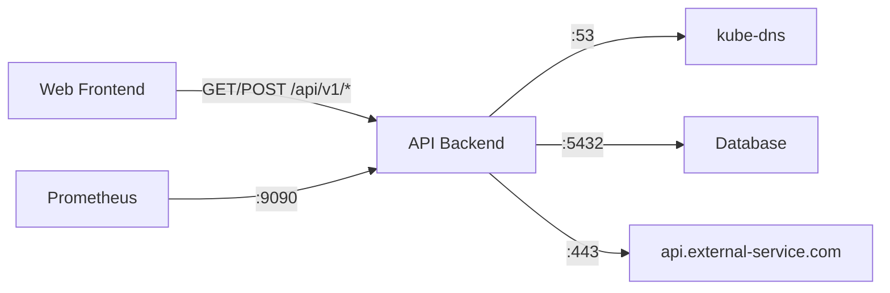

# Securing a Sample Network Policy in Cilium

Author: [nawazdhandala](https://github.com/nawazdhandala)

Tags: Cilium, Kubernetes, Network Policy, Security, Best Practices

Description: How to create and secure a sample CiliumNetworkPolicy with best practices for identity-based access control, L7 filtering, and DNS-aware rules.

---

## Introduction

A well-crafted CiliumNetworkPolicy is the building block of Kubernetes network security. Cilium extends standard Kubernetes NetworkPolicy with identity-based enforcement, L7 HTTP/gRPC filtering, DNS-aware rules, and CIDR-based access control. This guide walks through creating a comprehensive sample policy that demonstrates these capabilities.

Understanding how to build secure policies from scratch is essential before applying them to production workloads. The sample policy in this guide covers common patterns you will encounter in real deployments.

## Prerequisites

- Kubernetes cluster with Cilium installed
- kubectl configured
- A test application deployed

## Sample Application Setup

```yaml
# sample-app.yaml
apiVersion: apps/v1
kind: Deployment
metadata:
  name: web-frontend
  namespace: default
  labels:
    app: web-frontend
spec:
  replicas: 2
  selector:
    matchLabels:
      app: web-frontend
  template:
    metadata:
      labels:
        app: web-frontend
    spec:
      containers:
        - name: nginx
          image: nginx:1.27
          ports:
            - containerPort: 80
---
apiVersion: apps/v1
kind: Deployment
metadata:
  name: api-backend
  namespace: default
  labels:
    app: api-backend
spec:
  replicas: 2
  selector:
    matchLabels:
      app: api-backend
  template:
    metadata:
      labels:
        app: api-backend
    spec:
      containers:
        - name: api
          image: nginx:1.27
          ports:
            - containerPort: 8080
```

## Comprehensive Sample Policy

```yaml
# secure-sample-policy.yaml
apiVersion: cilium.io/v2
kind: CiliumNetworkPolicy
metadata:
  name: secure-api-backend
  namespace: default
spec:
  # Select the pods this policy applies to
  endpointSelector:
    matchLabels:
      app: api-backend
  
  # Ingress rules - who can reach this service
  ingress:
    # Allow frontend to access API on port 8080
    - fromEndpoints:
        - matchLabels:
            app: web-frontend
      toPorts:
        - ports:
            - port: "8080"
              protocol: TCP
          rules:
            http:
              - method: GET
                path: "/api/v1/.*"
              - method: POST
                path: "/api/v1/.*"
    # Allow monitoring to scrape metrics
    - fromEndpoints:
        - matchLabels:
            app: prometheus
      toPorts:
        - ports:
            - port: "9090"
              protocol: TCP
  
  # Egress rules - what this service can reach
  egress:
    # Allow DNS resolution
    - toEndpoints:
        - matchLabels:
            k8s:io.kubernetes.pod.namespace: kube-system
            k8s-app: kube-dns
      toPorts:
        - ports:
            - port: "53"
              protocol: UDP
    # Allow access to database
    - toEndpoints:
        - matchLabels:
            app: database
      toPorts:
        - ports:
            - port: "5432"
              protocol: TCP
    # Allow external API access by FQDN
    - toFQDNs:
        - matchName: "api.external-service.com"
      toPorts:
        - ports:
            - port: "443"
              protocol: TCP
```

```bash
kubectl apply -f secure-sample-policy.yaml
```



## Security Best Practices in the Policy

1. **Identity-based selectors** - Use labels instead of IP addresses
2. **L7 filtering** - Restrict HTTP methods and paths
3. **DNS-aware egress** - Use FQDN rules for external access
4. **Explicit ports** - Never use wildcard port rules
5. **Explicit protocols** - Always specify TCP/UDP

## Verification

```bash
# Check policy is applied
kubectl get ciliumnetworkpolicies -n default

# Verify endpoints enforce the policy
kubectl get ciliumendpoints -n default -o json | jq '.items[] | select(.metadata.labels.app == "api-backend") | .status.policy'

# Test allowed traffic
kubectl exec deploy/web-frontend -- curl -s http://api-backend:8080/api/v1/test

# Test denied traffic (wrong method)
kubectl exec deploy/web-frontend -- curl -s -X DELETE http://api-backend:8080/api/v1/test
```

## Troubleshooting

- **L7 rules not enforcing**: Enable L7 proxy with `l7Proxy=true`.
- **FQDN rules not matching**: DNS must resolve before FQDN rules work. Ensure DNS egress is allowed.
- **Policy too restrictive**: Use Hubble to see what is dropped and adjust rules.
- **Policy not selected**: Verify endpointSelector labels match pod labels exactly.

## Conclusion

This sample policy demonstrates identity-based access control, L7 HTTP filtering, DNS-aware egress, and explicit port/protocol rules. Use it as a template for your production policies, adjusting selectors and rules to match your application architecture.