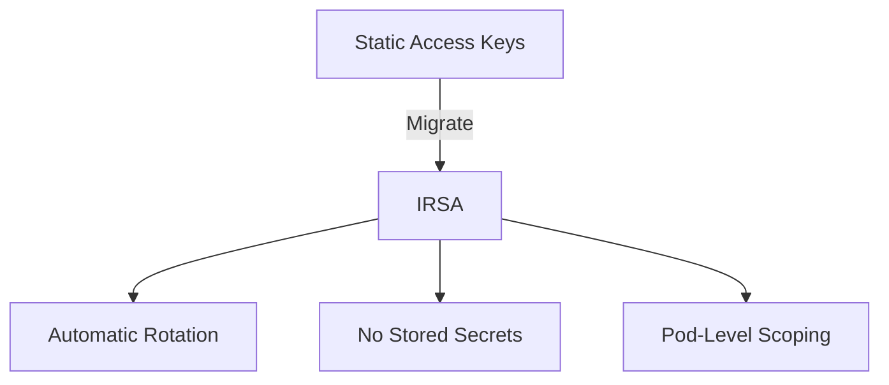

# Securing AWS Access Keys and IAM Roles in Cilium

Author: [nawazdhandala](https://github.com/nawazdhandala)

Tags: Cilium, Kubernetes, AWS, IAM, Security

Description: How to secure AWS access keys and IAM role configurations used by Cilium for ENI management and cloud-integrated networking.

---

## Introduction

Securing AWS access keys and IAM roles for Cilium prevents unauthorized access to your VPC networking. Cilium needs AWS credentials to manage ENIs in ENI IPAM mode, and these credentials must be locked down to prevent misuse.

The security hierarchy from least to most secure is: static access keys, instance profiles, and IAM roles for service accounts (IRSA). Production deployments should always use IRSA.

## Prerequisites

- EKS cluster with Cilium in ENI mode
- AWS CLI and kubectl configured
- IAM admin access for role management

## Migrating from Access Keys to IRSA

```bash
# Step 1: Create OIDC provider
eksctl utils associate-iam-oidc-provider --cluster my-cluster --approve

# Step 2: Create IAM role with trust policy
cat <<EOF > trust-policy.json
{
  "Version": "2012-10-17",
  "Statement": [{
    "Effect": "Allow",
    "Principal": {
      "Federated": "arn:aws:iam::123456789012:oidc-provider/oidc.eks.us-east-1.amazonaws.com/id/ABCDEF"
    },
    "Action": "sts:AssumeRoleWithWebIdentity",
    "Condition": {
      "StringEquals": {
        "oidc.eks.us-east-1.amazonaws.com/id/ABCDEF:sub": "system:serviceaccount:kube-system:cilium"
      }
    }
  }]
}
EOF

aws iam create-role --role-name cilium-eni-role --assume-role-policy-document file://trust-policy.json

# Step 3: Attach minimal policy
aws iam attach-role-policy --role-name cilium-eni-role \
  --policy-arn arn:aws:iam::123456789012:policy/CiliumMinimalPolicy

# Step 4: Annotate service account
kubectl annotate sa cilium -n kube-system \
  eks.amazonaws.com/role-arn=arn:aws:iam::123456789012:role/cilium-eni-role

# Step 5: Restart Cilium to pick up new credentials
kubectl rollout restart daemonset/cilium -n kube-system

# Step 6: Remove old static credentials
kubectl delete secret aws-creds -n kube-system
```



## Implementing Least-Privilege IAM

```json
{
  "Version": "2012-10-17",
  "Statement": [
    {
      "Sid": "CiliumENIManagement",
      "Effect": "Allow",
      "Action": [
        "ec2:CreateNetworkInterface",
        "ec2:AttachNetworkInterface",
        "ec2:DeleteNetworkInterface",
        "ec2:DescribeNetworkInterfaces",
        "ec2:DescribeSubnets",
        "ec2:DescribeVpcs",
        "ec2:DescribeSecurityGroups",
        "ec2:AssignPrivateIpAddresses",
        "ec2:UnassignPrivateIpAddresses"
      ],
      "Resource": "*"
    },
    {
      "Sid": "CiliumInstanceDiscovery",
      "Effect": "Allow",
      "Action": [
        "ec2:DescribeInstances",
        "ec2:DescribeInstanceTypes"
      ],
      "Resource": "*"
    }
  ]
}
```

## Setting Up Credential Monitoring

```bash
# Enable CloudTrail logging for the Cilium role
# Monitor for unusual patterns:
aws cloudtrail lookup-events \
  --lookup-attributes AttributeKey=Username,AttributeValue=cilium-eni-role \
  --max-items 20
```

## Verification

```bash
kubectl exec -n kube-system -l k8s-app=cilium -- aws sts get-caller-identity
cilium status | grep IPAM
kubectl get sa cilium -n kube-system -o yaml | grep eks.amazonaws.com
```

## Troubleshooting

- **IRSA not working after migration**: Check OIDC provider and trust policy condition.
- **Permission denied on ENI operations**: Update IAM policy with missing actions.
- **Old credentials still being used**: Restart all Cilium pods after IRSA setup.

## Conclusion

Secure AWS credentials for Cilium by migrating to IRSA, implementing least-privilege IAM policies, and monitoring credential usage. IRSA eliminates stored secrets and provides automatic rotation.