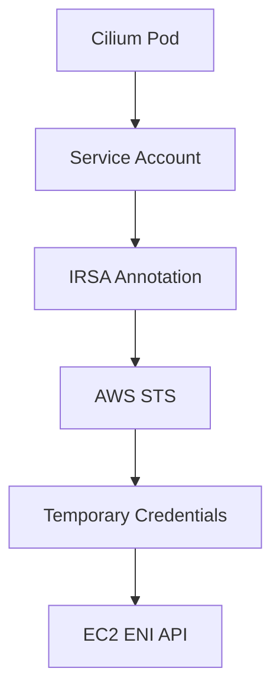

# Securing AWS Secrets in Cilium Network Security

Author: [nawazdhandala](https://github.com/nawazdhandala)

Tags: Cilium, Kubernetes, AWS, Security, Secrets

Description: How to secure AWS secrets used by Cilium for cloud-integrated networking, including credential rotation, least-privilege IAM, and Kubernetes secret management.

---

## Introduction

When Cilium runs on AWS with ENI IPAM mode, it needs AWS credentials to manage network interfaces and IP addresses. These credentials must be stored securely, rotated regularly, and granted only the minimum permissions required. A compromised Cilium credential could allow an attacker to manipulate your VPC networking.

This guide covers the security best practices for managing AWS secrets in Cilium deployments, including using IAM roles for service accounts (IRSA), limiting credential scope, and monitoring credential usage.

## Prerequisites

- EKS cluster or self-managed Kubernetes on AWS with Cilium
- AWS CLI configured
- kubectl and Helm configured
- IAM permissions to create roles and policies

## Using IAM Roles for Service Accounts (IRSA)

The most secure approach avoids static credentials entirely:

```bash
# Create an IAM OIDC provider for the EKS cluster
eksctl utils associate-iam-oidc-provider --cluster my-cluster --approve

# Create an IAM role for Cilium
eksctl create iamserviceaccount \
  --name cilium \
  --namespace kube-system \
  --cluster my-cluster \
  --attach-policy-arn arn:aws:iam::aws:policy/AmazonEKS_CNI_Policy \
  --approve \
  --override-existing-serviceaccounts
```

Configure Cilium to use the service account:

```yaml
# cilium-aws-irsa.yaml
serviceAccount:
  name: cilium
  annotations:
    eks.amazonaws.com/role-arn: "arn:aws:iam::123456789012:role/cilium-role"

eni:
  enabled: true

ipam:
  mode: eni
```

```bash
helm upgrade cilium cilium/cilium \
  --namespace kube-system \
  --reuse-values \
  -f cilium-aws-irsa.yaml
```



## Creating Least-Privilege IAM Policy

```json
{
  "Version": "2012-10-17",
  "Statement": [
    {
      "Effect": "Allow",
      "Action": [
        "ec2:CreateNetworkInterface",
        "ec2:AttachNetworkInterface",
        "ec2:DeleteNetworkInterface",
        "ec2:DescribeNetworkInterfaces",
        "ec2:DescribeSubnets",
        "ec2:DescribeVpcs",
        "ec2:DescribeSecurityGroups",
        "ec2:AssignPrivateIpAddresses",
        "ec2:UnassignPrivateIpAddresses",
        "ec2:ModifyNetworkInterfaceAttribute"
      ],
      "Resource": "*",
      "Condition": {
        "StringEquals": {
          "ec2:Vpc": "arn:aws:ec2:us-east-1:123456789012:vpc/vpc-abc123"
        }
      }
    },
    {
      "Effect": "Allow",
      "Action": [
        "ec2:DescribeInstances",
        "ec2:DescribeInstanceTypes"
      ],
      "Resource": "*"
    }
  ]
}
```

```bash
aws iam create-policy \
  --policy-name CiliumMinimalPolicy \
  --policy-document file://cilium-iam-policy.json
```

## Securing Kubernetes Secrets

If you must use static credentials:

```bash
# Create the secret with strict permissions
kubectl create secret generic aws-creds -n kube-system \
  --from-literal=AWS_ACCESS_KEY_ID=AKIA... \
  --from-literal=AWS_SECRET_ACCESS_KEY=...

# Restrict access with RBAC
cat <<EOF | kubectl apply -f -
apiVersion: rbac.authorization.k8s.io/v1
kind: Role
metadata:
  name: cilium-secrets-reader
  namespace: kube-system
rules:
  - apiGroups: [""]
    resources: ["secrets"]
    resourceNames: ["aws-creds"]
    verbs: ["get"]
EOF
```

## Verification

```bash
# Verify IRSA is working
kubectl exec -n kube-system -l k8s-app=cilium -- \
  aws sts get-caller-identity

# Verify Cilium can manage ENIs
cilium status | grep IPAM

# Check for credential errors
kubectl logs -n kube-system -l k8s-app=cilium | \
  grep -iE "auth|credential|forbidden" | tail -10
```

## Troubleshooting

- **"UnauthorizedAccess" errors**: Check IAM role trust policy includes the OIDC provider.
- **IRSA not working**: Verify the service account annotation and that the OIDC provider is set up.
- **Static credentials expired**: Rotate credentials and update the Kubernetes secret.
- **Insufficient permissions**: Review CloudTrail for denied API calls and update the IAM policy.

## Conclusion

Secure AWS secrets in Cilium by using IRSA instead of static credentials, applying least-privilege IAM policies, and monitoring credential usage. IRSA provides automatic credential rotation and eliminates the need for stored secrets, making it the recommended approach for production deployments.