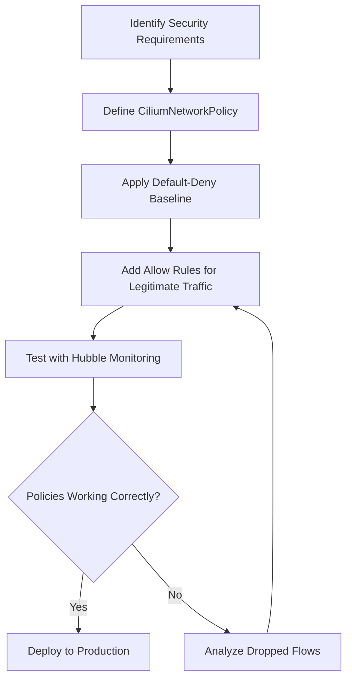

# Securing Policy Audit Mode Disabling in Cilium

Author: [nawazdhandala](https://github.com/nawazdhandala)

Tags: Cilium, Kubernetes, Network Security, Security Auditing, Policy Audit

Description: Learn how to secure audit mode transition in Cilium for Kubernetes. This guide covers practical hardening measures with real examples and commands.

---

## Introduction

Securing audit mode transition in Cilium is essential for maintaining a robust Kubernetes network security posture. Cilium leverages eBPF technology to provide deep visibility and control over network traffic, making it possible to enforce fine-grained security policies at the kernel level.

This guide focuses on practical steps to harden your enforcement mode activation using CiliumNetworkPolicy resources. You will learn how to create policies that restrict access, implement defense-in-depth strategies, and verify that your security controls are working as intended.

Whether you are setting up a new cluster or hardening an existing one, these security practices will help you reduce your attack surface and protect your workloads from unauthorized access.

## Prerequisites

- A running Kubernetes cluster (v1.24+)
- Cilium installed (v1.14+) via Helm
- `cilium` CLI tool installed
- `kubectl` configured for cluster access
- Hubble enabled for network flow observation
- Basic understanding of Kubernetes networking concepts

## Understanding the Security Model

Before implementing security controls, it is important to understand how Cilium handles audit mode transition.



### Initial Assessment

Run these commands to understand your current security posture:

```bash
# Verify Cilium is running and healthy
cilium status
```

```bash
# Check current policy enforcement mode
cilium config view | grep policy-enforcement
```

## Implementing Security Policies

Apply a CiliumNetworkPolicy to restrict access to your policy audit mode disabling resources.

```yaml
# Apply this policy to restrict access based on identity
apiVersion: "cilium.io/v2"
kind: CiliumClusterwideNetworkPolicy
metadata:
  name: enforce-mode-policy
  annotations:
    policy.cilium.io/audit-mode: "false"
spec:
  endpointSelector: {}
  ingress:
    - fromEntities:
        - cluster
        - health
  egress:
    - toEntities:
        - cluster
        - health
    - toEndpoints:
        - matchLabels:
            io.kubernetes.pod.namespace: kube-system
            k8s-app: kube-dns
      toPorts:
        - ports:
            - port: "53"
              protocol: ANY
```

```bash
# Apply the policy to your cluster
kubectl apply -f policy.yaml

# Verify the policy was accepted
kubectl get cnp -n production
```

### Hardening with Default-Deny

Implement a default-deny baseline to ensure no traffic flows unless explicitly allowed:

```yaml
# Default-deny policy ensures zero-trust networking
apiVersion: "cilium.io/v2"
kind: CiliumNetworkPolicy
metadata:
  name: default-deny-disable-audit
  namespace: production
spec:
  endpointSelector: {}
  ingress: []
  egress:
    - toEndpoints:
        - matchLabels:
            io.kubernetes.pod.namespace: kube-system
            k8s-app: kube-dns
      toPorts:
        - ports:
            - port: "53"
              protocol: ANY
```

### Monitoring Security Events

```bash
# Monitor for policy-related drops in real time
hubble observe --verdict DROPPED --namespace production --output compact

# Check endpoint security status
# List all active policies
cilium policy get -o json | jq '.[].metadata.name'
```

## Advanced Security Configuration

For enhanced protection, consider these additional hardening measures:

```bash
# Enable policy enforcement in strict mode
# This is configured during Cilium installation via Helm
# helm upgrade cilium cilium/cilium --namespace kube-system \
#   --set policyEnforcementMode=always

# Verify the current enforcement mode
cilium config view | grep policy-enforcement

# List all identities and verify they match expected workloads
cilium identity list
```


### Compliance Documentation and Evidence Collection

Maintaining proper documentation of your audit findings is critical for compliance frameworks such as SOC 2, ISO 27001, and PCI DSS. Generate structured evidence that maps to specific control requirements.

```bash
# Generate a timestamped evidence package
EVIDENCE_DIR="audit-evidence-$(date +%Y%m%d)"
mkdir -p "$EVIDENCE_DIR"

# Capture policy state as evidence
kubectl get cnp --all-namespaces -o yaml > "$EVIDENCE_DIR/all-policies.yaml"
kubectl get ccnp -o yaml > "$EVIDENCE_DIR/clusterwide-policies.yaml"

# Capture endpoint security state
cilium endpoint list -o json > "$EVIDENCE_DIR/endpoint-state.json"

# Capture identity mappings
cilium identity list -o json > "$EVIDENCE_DIR/identities.json"

# Capture Cilium configuration
cilium config view > "$EVIDENCE_DIR/cilium-config.txt"

# Generate a summary for auditors
echo "Audit Evidence Generated: $(date -u)" > "$EVIDENCE_DIR/summary.txt"
echo "Policies: $(kubectl get cnp -A --no-headers | wc -l)" >> "$EVIDENCE_DIR/summary.txt"
echo "Endpoints: $(cilium endpoint list -o json | jq length)" >> "$EVIDENCE_DIR/summary.txt"

tar -czf "$EVIDENCE_DIR.tar.gz" "$EVIDENCE_DIR"
echo "Evidence package created: $EVIDENCE_DIR.tar.gz"
```

Store audit evidence in a tamper-proof location with proper access controls. Retain evidence according to your organization's data retention policies, typically for a minimum of one year for most compliance frameworks.

## Verification

After applying security controls, verify they are working correctly:

```bash
# Verify policy is applied
cilium endpoint list
```

```bash
# Test connectivity
cilium connectivity test
```

```bash
# Monitor for policy drops
cilium monitor --type drop --output json | head -20
```

## Troubleshooting

- **Policy not taking effect**: Verify endpoint labels match policy selectors with `cilium endpoint list -o json | jq '.[] | .status.labels'`.
- **Legitimate traffic blocked**: Check Hubble for specific drop reasons with `hubble observe --verdict DROPPED --namespace production`.
- **High latency after policy application**: L7 policies route through Envoy proxy. Consider using L3/L4 policies where L7 inspection is not needed.
- **Cilium agent errors**: Check agent logs with `kubectl -n kube-system logs ds/cilium -c cilium-agent --tail=50`.

## Conclusion

Securing audit mode transition in Cilium requires a layered approach: implement default-deny baselines, create specific allow policies for legitimate traffic, and continuously monitor with Hubble. By following the steps in this guide, you have established strong security controls for your policy audit mode disabling workloads. Remember to regularly review and update your policies as your application architecture evolves, and always test changes in a staging environment before applying them to production.
