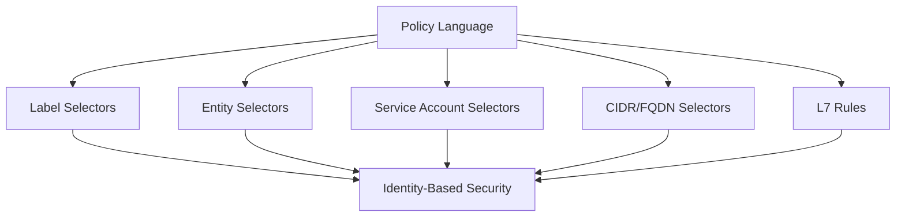

# Securing Cilium Policy Language: Advanced Policy Patterns

Author: [nawazdhandala](https://github.com/nawazdhandala)

Tags: Cilium, Kubernetes, Policy Language, Security, Network Policy

Description: How to use advanced CiliumNetworkPolicy language features including entity selectors, service accounts, CIDR groups, and conditional rules for comprehensive security.

---

## Introduction

Cilium policy language extends Kubernetes NetworkPolicy with powerful constructs for real-world security scenarios. Beyond simple label matching, Cilium supports entity selectors (world, cluster, host), service account-based policies, CIDR group references, and L7-aware rules.

Mastering the policy language lets you express complex security requirements that standard NetworkPolicy cannot handle.

## Prerequisites

- Kubernetes cluster with Cilium installed
- kubectl configured
- Understanding of basic CiliumNetworkPolicy

## Entity Selectors

```yaml
# Allow traffic from specific entities
apiVersion: cilium.io/v2
kind: CiliumNetworkPolicy
metadata:
  name: entity-based-policy
  namespace: default
spec:
  endpointSelector:
    matchLabels:
      app: web
  ingress:
    # Allow from within the cluster
    - fromEntities:
        - cluster
    # Allow from the host (kubelet probes)
    - fromEntities:
        - host
    # Allow from outside the cluster
    - fromEntities:
        - world
      toPorts:
        - ports:
            - port: "443"
              protocol: TCP
```

## Service Account-Based Policies

```yaml
apiVersion: cilium.io/v2
kind: CiliumNetworkPolicy
metadata:
  name: sa-based-policy
  namespace: default
spec:
  endpointSelector:
    matchLabels:
      app: secure-api
  ingress:
    - fromEndpoints:
        - matchLabels:
            io.cilium.k8s.policy.serviceaccount: authorized-sa
            io.cilium.k8s.policy.cluster: default
```

## CIDR Group References

```yaml
apiVersion: cilium.io/v2alpha1
kind: CiliumCIDRGroup
metadata:
  name: corporate-networks
spec:
  externalCIDRs:
    - "10.0.0.0/8"
    - "172.16.0.0/12"
---
apiVersion: cilium.io/v2
kind: CiliumNetworkPolicy
metadata:
  name: allow-corporate
  namespace: default
spec:
  endpointSelector:
    matchLabels:
      app: internal-app
  ingress:
    - fromCIDRSet:
        - cidrGroupRef: corporate-networks
```



## L7 HTTP Filtering

```yaml
apiVersion: cilium.io/v2
kind: CiliumNetworkPolicy
metadata:
  name: l7-http-policy
  namespace: default
spec:
  endpointSelector:
    matchLabels:
      app: api
  ingress:
    - fromEndpoints:
        - matchLabels:
            app: frontend
      toPorts:
        - ports:
            - port: "8080"
          rules:
            http:
              - method: GET
                path: "/api/v1/public/.*"
              - method: POST
                path: "/api/v1/data"
                headers:
                  - "Content-Type: application/json"
```

## Verification

```bash
kubectl get ciliumnetworkpolicies -n default
kubectl get ciliumcidrgroups
cilium endpoint list
hubble observe -n default --last 20
```

## Troubleshooting

- **Entity selector not matching**: Check entity names. Valid entities: world, cluster, host, init, health, unmanaged, kube-apiserver.
- **Service account policy not working**: Verify SA label format with `cilium endpoint list`.
- **CIDR group not resolving**: Check CiliumCIDRGroup exists and CRD is registered.
- **L7 headers not matching**: Headers are case-sensitive. Check exact format.

## Conclusion

The Cilium policy language provides entity selectors, service account matching, CIDR groups, and L7 filtering for comprehensive security. Use the right selector type for each security requirement and combine them for defense in depth.