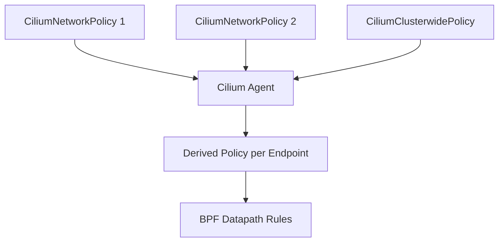

# Securing Derived Policy Validation in Cilium

Author: [nawazdhandala](https://github.com/nawazdhandala)

Tags: Cilium, Kubernetes, Derived Policy, Security, Validation

Description: How to secure and validate that Cilium derived policies correctly translate high-level policy intent into effective per-endpoint security rules.

---

## Introduction

Cilium derived policies are the internal representation of how high-level CiliumNetworkPolicy rules translate into per-endpoint enforcement rules. When you create a policy, Cilium computes the effective policy for each endpoint by combining all matching policies. The derived policy is what actually gets enforced in the BPF datapath.

Securing derived policy validation means ensuring that the translation from policy intent to endpoint enforcement is correct. Gaps in derived policies can create security holes where traffic is unexpectedly allowed.

## Prerequisites

- Kubernetes cluster with Cilium installed
- kubectl and Cilium CLI configured
- Network policies applied

## Understanding Derived Policies

```bash
# View the derived policy for a specific endpoint
cilium endpoint list
cilium endpoint get <endpoint-id> -o json | jq '.status.policy'

# See which policies are applied to an endpoint
cilium endpoint get <endpoint-id> -o json | \
  jq '.status.policy.realized.cidr-policy'
```



## Validating Derived Policies

```bash
#!/bin/bash
echo "=== Derived Policy Validation ==="

for ep_id in $(cilium endpoint list -o json | jq -r '.[].id'); do
  POLICY=$(cilium endpoint get "$ep_id" -o json 2>/dev/null | jq '.status.policy')
  INGRESS=$(echo "$POLICY" | jq '.realized."allowed-ingress-identities" | length')
  EGRESS=$(echo "$POLICY" | jq '.realized."allowed-egress-identities" | length')
  
  echo "Endpoint $ep_id: $INGRESS ingress rules, $EGRESS egress rules"
done
```

## Policy Trace for Validation

```bash
# Trace policy decision between two endpoints
cilium policy trace \
  --src-identity <source-identity-id> \
  --dst-identity <dest-identity-id> \
  --dport 8080

# This shows exactly how the derived policy evaluates the connection
```

## Verification

```bash
cilium policy get
cilium endpoint list
hubble observe -n default --last 10
```

## Troubleshooting

- **Derived policy allows unexpected traffic**: Check all policies that select the endpoint. Cilium unions (OR) matching policies.
- **Policy trace shows allow but Hubble shows drop**: May be a port/protocol mismatch not caught by identity trace.
- **Endpoint has no derived policy**: No policy selects this endpoint. Add a policy with matching selector.

## Conclusion

Derived policy validation ensures your security intent translates correctly to enforcement. Use policy trace and endpoint inspection to verify the effective policy on each endpoint matches your expectations.