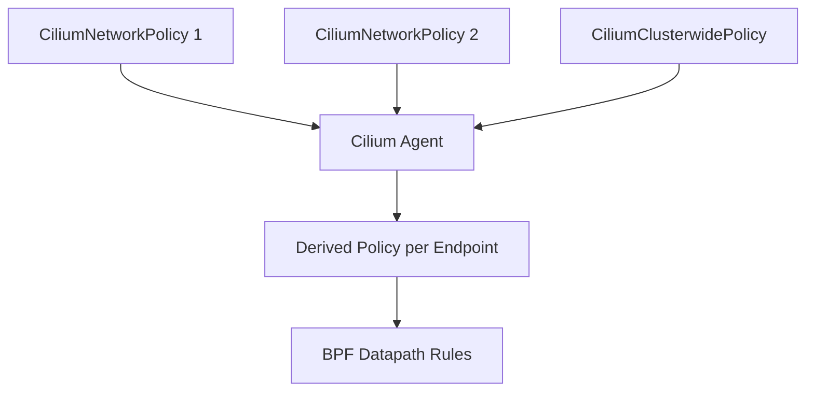

# Securing Derived Policy Validation in Cilium

Author: [nawazdhandala](https://github.com/nawazdhandala)

Tags: Cilium, Kubernetes, Derived Policy, Security, Validation

Description: How to secure and validate that Cilium derived policies correctly translate high-level policy intent into effective per-endpoint security rules.

---

## Introduction

Cilium derived policies are the internal representation of how high-level CiliumNetworkPolicy rules translate into per-endpoint enforcement rules. When you create a policy, Cilium computes the effective policy for each endpoint by combining all matching policies. The derived policy is what actually gets enforced in the BPF datapath.

Securing derived policy validation means ensuring that the translation from policy intent to endpoint enforcement is correct. Gaps in derived policies can create security holes where traffic is unexpectedly allowed.

## Prerequisites

- Kubernetes cluster with Cilium installed
- kubectl configured with access to the Cilium agent pods
- Network policies applied

## Understanding Derived Policies

```bash
# View the derived policy for a specific endpoint

kubectl -n kube-system exec ds/cilium -- cilium-dbg endpoint list
kubectl -n kube-system exec ds/cilium -- \
  cilium-dbg endpoint get <endpoint-id> -o json | jq '.status.policy'

# See the realized policy state for an endpoint
kubectl -n kube-system exec ds/cilium -- \
  cilium-dbg endpoint get <endpoint-id> -o json | \
  jq '.status.policy.realized'
```


```mermaid
graph TD
    A[CiliumNetworkPolicy 1] --> D[Cilium Agent]
    B[CiliumNetworkPolicy 2] --> D
    C[CiliumClusterwidePolicy] --> D
    D --> E[Derived Policy per Endpoint]
    E --> F[BPF Datapath Rules]
```

## Validating Derived Policies

```bash
#!/bin/bash
echo "=== Derived Policy Validation ==="

kubectl -n kube-system get pods -l k8s-app=cilium -o name | while read -r agent; do
  for ep_id in $(kubectl -n kube-system exec "$agent" -- \
    cilium-dbg endpoint list -o json | jq -r '.[].id'); do
    POLICY=$(kubectl -n kube-system exec "$agent" -- \
      cilium-dbg endpoint get "$ep_id" -o json 2>/dev/null | jq '.status.policy')
    INGRESS=$(printf '%s' "$POLICY" | jq '.realized."allowed-ingress-identities" // [] | length')
    EGRESS=$(printf '%s' "$POLICY" | jq '.realized."allowed-egress-identities" // [] | length')
  
    echo "$agent endpoint $ep_id: $INGRESS ingress identities, $EGRESS egress identities"
  done
done
```

## Policy Selector Validation

```bash
# Show cached selectors and the identities they match
kubectl -n kube-system exec ds/cilium -- cilium-dbg policy selectors

# List the identities that appear in endpoint policy output
kubectl -n kube-system exec ds/cilium -- cilium-dbg identity list

# Compare this with Hubble verdicts for the same source, destination, and port
```

## Verification

```bash
kubectl get ciliumendpoints --all-namespaces
kubectl -n kube-system exec ds/cilium -- cilium-dbg bpf policy get --all
hubble observe -n default --last 10
```

## Troubleshooting

- **Derived policy allows unexpected traffic**: Check all policies that select the endpoint. Cilium unions (OR) matching policies.
- **Selector inspection suggests allow but Hubble shows drop**: May be a port/protocol mismatch or a datapath policy-map difference.
- **Endpoint has no derived policy**: No policy selects this endpoint. Add a policy with matching selector.

## Conclusion

Derived policy validation ensures your security intent translates correctly to enforcement. Use selector, identity, datapath policy-map, and endpoint inspection to verify the effective policy on each endpoint matches your expectations.
