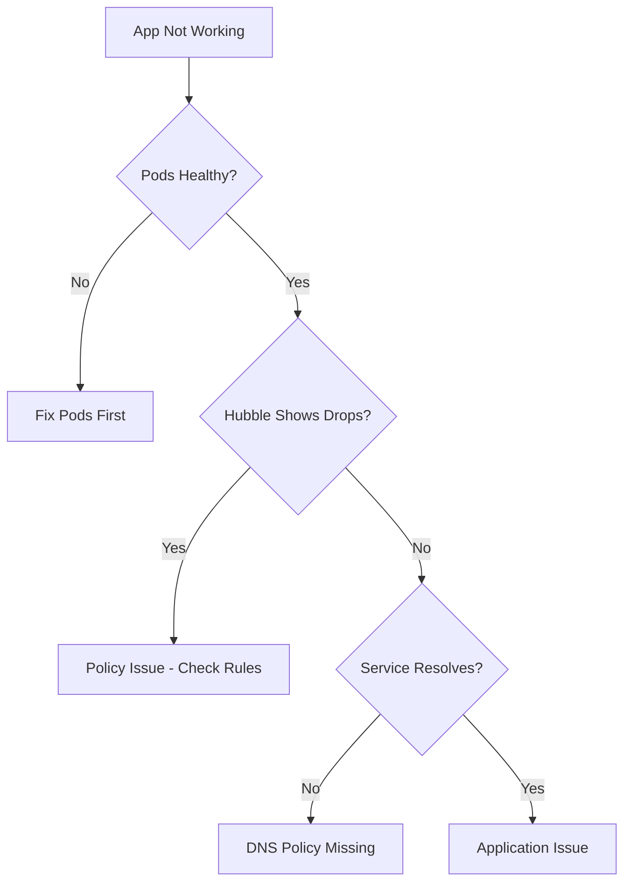

# Troubleshooting a Demo Application Secured with Cilium

Author: [nawazdhandala](https://github.com/nawazdhandala)

Tags: Cilium, Kubernetes, Troubleshooting, Demo Application, Security

Description: How to diagnose and fix connectivity issues in a demo application secured with CiliumNetworkPolicy rules.

---

## Introduction

When a secured demo application has connectivity issues, the challenge is determining whether the problem is the application itself or the network policies. Cilium provides tools to differentiate between the two.

## Prerequisites

- Kubernetes cluster with Cilium and a secured demo application
- kubectl, Cilium CLI, and Hubble configured

## Step-by-Step Diagnosis

```bash
# Step 1: Check pod health
kubectl get pods -n demo -o wide

# Step 2: Check policies are applied
kubectl get ciliumnetworkpolicies -n demo

# Step 3: Check endpoint policy status
kubectl get ciliumendpoints -n demo -o json | jq '.items[] | {name: .metadata.name, ingress: .status.policy.ingress.enforcing, egress: .status.policy.egress.enforcing}'

# Step 4: Use Hubble to see traffic
hubble observe -n demo --last 30
hubble observe -n demo --verdict DROPPED --last 20
```



## Common Fixes

```bash
# Fix 1: DNS not working
kubectl apply -f - <<EOF
apiVersion: cilium.io/v2
kind: CiliumNetworkPolicy
metadata:
  name: allow-dns
  namespace: demo
spec:
  endpointSelector: {}
  egress:
    - toEndpoints:
        - matchLabels:
            k8s:io.kubernetes.pod.namespace: kube-system
            k8s-app: kube-dns
      toPorts:
        - ports:
            - port: "53"
              protocol: UDP
EOF

# Fix 2: Wrong label in selector
kubectl get pods -n demo --show-labels
kubectl get ciliumnetworkpolicy <policy> -n demo -o yaml | grep -A5 matchLabels
```

## Verification

```bash
kubectl exec -n demo deploy/frontend -- curl -s http://api:8080/
hubble observe -n demo --verdict DROPPED --last 5
```

## Troubleshooting

- **All services unreachable**: DNS policy is likely missing.
- **Some paths work, others do not**: Check port numbers in policy rules.
- **Intermittent failures**: May be a pod readiness issue, not policy.

## Conclusion

Troubleshoot secured applications by checking pods first, then using Hubble to identify policy drops. DNS is the most common missing allow rule.