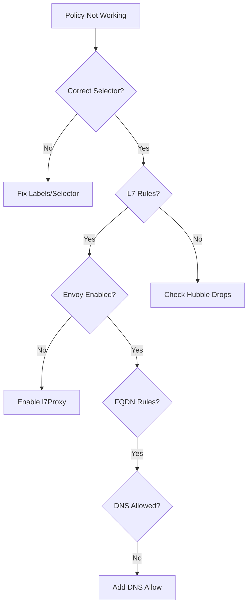

# Troubleshooting Sample Network Policies in Cilium

Author: [nawazdhandala](https://github.com/nawazdhandala)

Tags: Cilium, Kubernetes, Network Policy, Troubleshooting, Security

Description: How to diagnose and fix common issues when implementing CiliumNetworkPolicy rules including selector mismatches, L7 filtering failures, and FQDN resolution problems.

---

## Introduction

Network policy issues in Cilium typically fall into four categories: selector mismatches where the policy does not select the intended pods, L7 filtering not working because the proxy is not enabled, FQDN rules failing because DNS is blocked, and overly restrictive policies that block legitimate traffic.

## Prerequisites

- Kubernetes cluster with Cilium installed
- kubectl, Cilium CLI, and Hubble configured

## Diagnosing Policy Selection Issues

```bash
# Check which endpoints a policy selects
kubectl get ciliumnetworkpolicies -n default -o json | jq '.items[] | {name: .metadata.name, selector: .spec.endpointSelector}'

# Check if endpoints show the policy as enforcing
kubectl get ciliumendpoints -n default -o json | jq '.items[] | {name: .metadata.name, policy: .status.policy}'

# Compare pod labels with policy selector
kubectl get pods -n default --show-labels
kubectl get ciliumnetworkpolicy <name> -n default -o jsonpath='{.spec.endpointSelector}'
```



## Fixing L7 Filtering

```bash
# Ensure L7 proxy is enabled
cilium status | grep "L7 Proxy"

# If not enabled
helm upgrade cilium cilium/cilium \
  --namespace kube-system \
  --reuse-values \
  --set l7Proxy=true

# Check Hubble for L7 traffic
hubble observe --protocol http -n default --last 20
```

## Fixing FQDN Resolution

```bash
# Ensure DNS egress is allowed in the policy
# FQDN rules require DNS to resolve the name first
kubectl exec deploy/my-app -- nslookup api.example.com

# Check Cilium FQDN cache
cilium fqdn cache list
```

## Using Hubble for Policy Debugging

```bash
# See all drops for a specific pod
hubble observe --to-pod default/api-backend --verdict DROPPED --last 20

# See L7 traffic details
hubble observe --protocol http --to-pod default/api-backend --last 20 -o json | \
  jq '.flow.l7.http | {method: .method, url: .url, code: .code}'
```

## Verification

```bash
kubectl get ciliumnetworkpolicies -n default
hubble observe --verdict DROPPED -n default --last 5
cilium endpoint list
```

## Troubleshooting

- **Policy applied but traffic still flows**: Check if another policy allows the traffic. Cilium is additive.
- **L7 rules ignored**: Envoy must be enabled. Without it, only L3/L4 rules apply.
- **FQDN rule never matches**: Add explicit DNS allow rule. Check `cilium fqdn cache list`.
- **Wildcard path not matching**: Use regex format `/api/v1/.*` with proper escaping.

## Conclusion

Troubleshoot policies by verifying selectors, checking L7 proxy status, ensuring DNS works for FQDN rules, and using Hubble for flow analysis. Most issues are selector mismatches or missing proxy enablement.