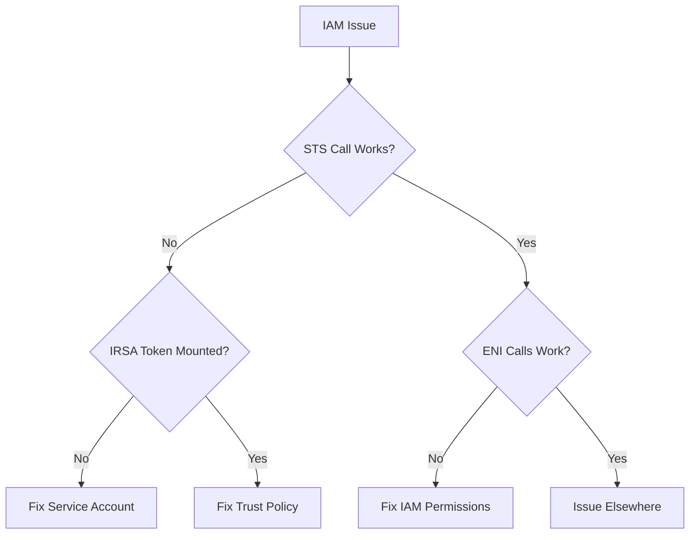

# Troubleshooting AWS Access Keys and IAM Roles in Cilium

Author: [nawazdhandala](https://github.com/nawazdhandala)

Tags: Cilium, Kubernetes, AWS, IAM, Troubleshooting

Description: How to diagnose and fix AWS access key and IAM role issues affecting Cilium ENI management and IPAM operations.

---

## Introduction

AWS access key and IAM role issues in Cilium prevent ENI management, causing pods to fail IP allocation. Troubleshooting requires checking the authentication chain from the Cilium pod to the AWS API.

## Prerequisites

- EKS cluster with Cilium
- kubectl and AWS CLI configured

## Diagnosing IAM Issues

```bash
# Check Cilium agent for auth errors
kubectl logs -n kube-system -l k8s-app=cilium | \
  grep -iE "unauthorized|forbidden|accessdenied" | tail -10

# Check what identity Cilium is using
kubectl exec -n kube-system -l k8s-app=cilium -- \
  aws sts get-caller-identity 2>&1

# Check IRSA token
kubectl exec -n kube-system -l k8s-app=cilium -- \
  cat /var/run/secrets/eks.amazonaws.com/serviceaccount/token 2>/dev/null | \
  head -c 50 && echo "...token exists"
```



## Common Fixes

```bash
# Fix trust policy mismatch
aws iam update-assume-role-policy --role-name cilium-role \
  --policy-document file://corrected-trust-policy.json

# Fix missing permissions
aws iam put-role-policy --role-name cilium-role \
  --policy-name CiliumENI \
  --policy-document file://eni-policy.json

# Restart Cilium after credential changes
kubectl rollout restart daemonset/cilium -n kube-system
```

## Verification

```bash
kubectl exec -n kube-system -l k8s-app=cilium -- aws sts get-caller-identity
cilium status
```

## Troubleshooting

- **"AssumeRoleWithWebIdentity" error**: OIDC provider not configured for the cluster.
- **Intermittent auth failures**: Token may be expiring. Check pod age and token refresh.
- **Wrong role assumed**: Check service account annotation matches the correct role ARN.

## Conclusion

Troubleshoot AWS IAM issues by following the authentication chain: token mounting, role assumption, and API permissions. Use `aws sts get-caller-identity` from the Cilium pod as your primary diagnostic.