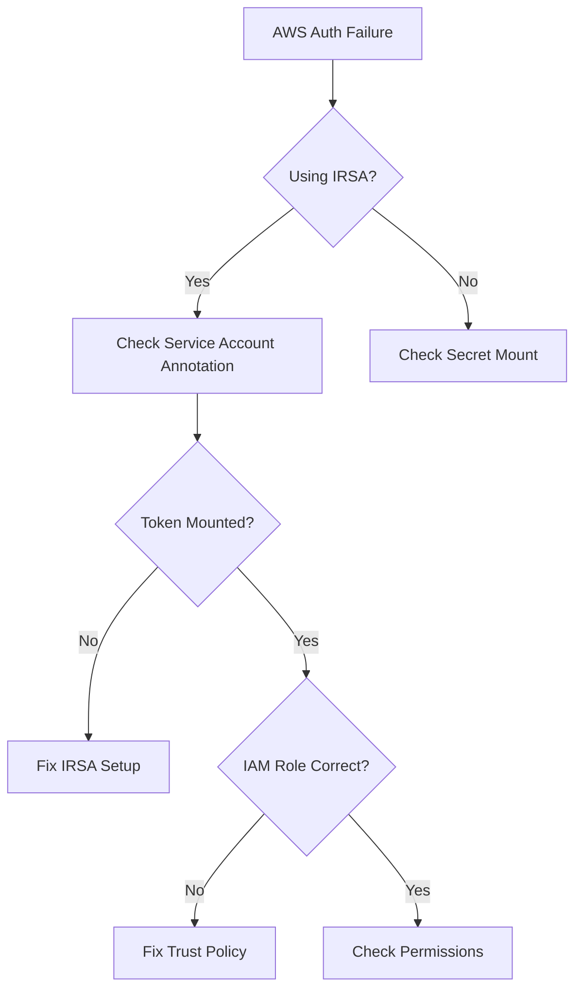

# Troubleshooting AWS Secrets Issues in Cilium Security

Author: [nawazdhandala](https://github.com/nawazdhandala)

Tags: Cilium, Kubernetes, AWS, Troubleshooting, Security

Description: How to diagnose and resolve AWS credential issues in Cilium including authentication failures, permission errors, and secret management problems.

---

## Introduction

AWS credential issues in Cilium prevent the agent and operator from managing ENIs and allocating IP addresses. When credentials fail, new pods cannot get IPs and existing pods may lose connectivity during scale events.

Common issues include IRSA misconfiguration, expired static credentials, insufficient IAM permissions, and secret mounting failures.

## Prerequisites

- EKS or AWS Kubernetes cluster with Cilium
- kubectl and AWS CLI configured
- Access to IAM console or CLI

## Diagnosing Credential Failures

```bash
# Check for auth errors in Cilium agent logs
kubectl logs -n kube-system -l k8s-app=cilium | \
  grep -iE "auth|credential|forbidden|unauthorized" | tail -20

# Check operator logs
kubectl logs -n kube-system -l name=cilium-operator | \
  grep -iE "auth|credential|forbidden" | tail -20

# Verify IRSA token is mounted
kubectl exec -n kube-system -l k8s-app=cilium -- \
  ls -la /var/run/secrets/eks.amazonaws.com/serviceaccount/

# Test AWS API access from Cilium pod
kubectl exec -n kube-system -l k8s-app=cilium -- \
  aws sts get-caller-identity
```



## Fixing IRSA Issues

```bash
# Verify service account annotation
kubectl get sa cilium -n kube-system -o yaml | grep eks.amazonaws.com

# Check OIDC provider
aws eks describe-cluster --name my-cluster --query "cluster.identity.oidc.issuer"

# Verify trust policy on the IAM role
aws iam get-role --role-name cilium-role --query "Role.AssumeRolePolicyDocument"

# Re-create service account binding
eksctl create iamserviceaccount \
  --name cilium \
  --namespace kube-system \
  --cluster my-cluster \
  --attach-policy-arn arn:aws:iam::123456789012:policy/CiliumPolicy \
  --approve \
  --override-existing-serviceaccounts
```

## Fixing Permission Issues

```bash
# Check CloudTrail for denied calls
aws cloudtrail lookup-events \
  --lookup-attributes AttributeKey=EventName,AttributeValue=CreateNetworkInterface \
  --max-items 10

# Update IAM policy with missing permissions
aws iam put-role-policy \
  --role-name cilium-role \
  --policy-name CiliumENIPolicy \
  --policy-document file://updated-policy.json
```

## Verification

```bash
kubectl exec -n kube-system -l k8s-app=cilium -- aws sts get-caller-identity
cilium status | grep IPAM
kubectl run test-pod --image=nginx:1.27 --restart=Never
kubectl get pod test-pod -o wide
kubectl delete pod test-pod
```

## Troubleshooting

- **"WebIdentityErr" in logs**: OIDC provider not configured correctly. Re-run eksctl setup.
- **"AccessDenied" for specific API**: Add the missing action to the IAM policy.
- **Credential timeout**: Check node time synchronization. AWS STS requires accurate clocks.
- **Secret not found**: Verify the secret exists in kube-system namespace.

## Conclusion

AWS credential troubleshooting in Cilium follows the authentication chain: verify IRSA token mounting, check IAM role trust policy, and validate permissions. Use CloudTrail to identify specific denied API calls.