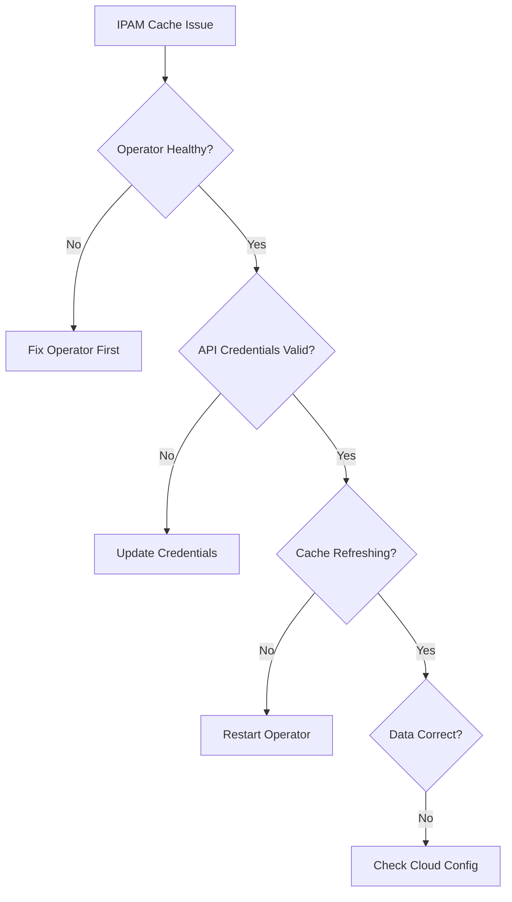

# Troubleshooting Interface and Subnet Cache Issues in Cilium IPAM

Author: [nawazdhandala](https://github.com/nawazdhandala)

Tags: Cilium, Kubernetes, IPAM, Troubleshooting, Cloud Networking

Description: How to diagnose and resolve caching issues with interfaces, subnets, and virtual networks in Cilium IPAM for cloud-provider deployments.

---

## Introduction

When Cilium IPAM caches become stale or incorrect in cloud environments, pods may fail to get IP addresses, allocate IPs from wrong subnets, or experience slow startup times. Cache issues are particularly tricky because the Cilium agent and operator may appear healthy while the underlying data they rely on is outdated.

Common cache problems include: stale interface lists after node scaling, missing subnet information after network changes, API authentication failures preventing cache updates, and race conditions during rapid node provisioning.

## Prerequisites

- Kubernetes cluster on a cloud provider with Cilium
- kubectl and Cilium CLI configured
- Access to cloud provider console for verification

## Diagnosing Cache Issues

```bash
# Check operator logs for cache-related errors
kubectl logs -n kube-system -l name=cilium-operator | \
  grep -iE "cache|resync|interface|subnet" | tail -30

# Check CiliumNode data freshness
kubectl get ciliumnode <node-name> -o json | \
  jq '.metadata.managedFields[-1].time'

# Compare CiliumNode data with actual cloud state
kubectl get ciliumnodes -o json | jq '.items[] | {
  name: .metadata.name,
  interfaces: (.spec.azure.interfaces // .spec.eni // {} | length)
}'
```



## Fixing Stale Interface Cache

```bash
# Force cache refresh by restarting operator
kubectl rollout restart deployment/cilium-operator -n kube-system

# Wait for reconciliation
kubectl rollout status deployment/cilium-operator -n kube-system

# Verify interface data is updated
kubectl get ciliumnodes -o json | jq '.items[] | {
  name: .metadata.name,
  lastUpdate: .metadata.managedFields[-1].time
}'
```

## Fixing API Authentication Issues

```bash
# Check operator logs for auth errors
kubectl logs -n kube-system -l name=cilium-operator | \
  grep -iE "auth|credential|permission|forbidden" | tail -20

# Verify cloud credentials are mounted
kubectl get deployment cilium-operator -n kube-system -o json | \
  jq '.spec.template.spec.containers[0].env[] | select(.name | test("AZURE|AWS|GCP"))'

# For Azure, check managed identity
kubectl logs -n kube-system -l name=cilium-operator | \
  grep -i "identity" | tail -10
```

## Handling Subnet Discovery Problems

```bash
# Check which subnets the operator sees
kubectl get ciliumnodes -o json | jq '[.items[].spec.ipam.pool // {} | keys] | flatten | unique'

# Verify subnet matches expected cloud configuration
kubectl get ciliumnodes -o json | jq '.items[0].spec.ipam'
```

## Verification

```bash
# After fixes, verify cache is working
cilium status | grep IPAM

# Test IP allocation
kubectl run cache-test --image=nginx:1.27 --restart=Never
kubectl get pod cache-test -o wide
kubectl delete pod cache-test

# Verify operator sync
kubectl logs -n kube-system -l name=cilium-operator --since=5m | \
  grep -c "resync"
```

## Troubleshooting

- **Cache never refreshes**: Check operator has network access to cloud API endpoints.
- **Partial interface data**: Some interfaces may be filtered. Check operator IPAM configuration.
- **Subnet shows zero available IPs**: Verify in cloud console. May need to expand subnet.
- **Cache refresh causes agent restart**: Check if operator updates trigger agent reconciliation.

## Conclusion

IPAM cache issues in cloud environments require checking the full chain from cloud API credentials to operator sync to CiliumNode data. Force a cache refresh by restarting the operator, verify credentials if syncs fail, and compare cached data with actual cloud state to identify discrepancies.