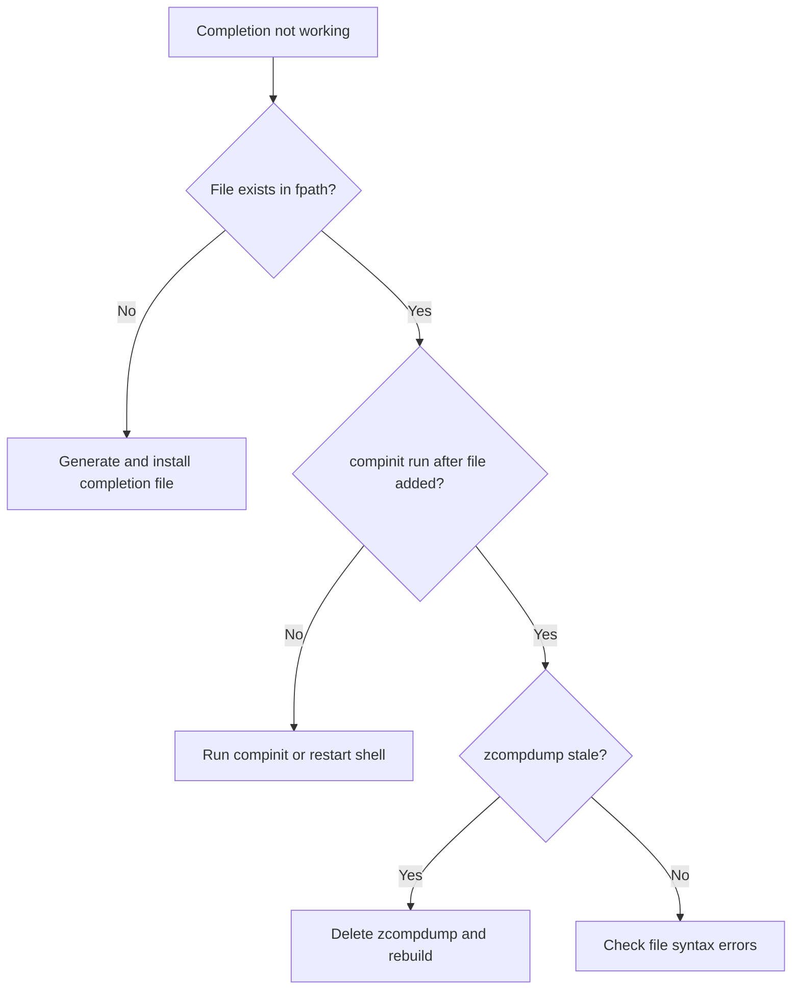

# Troubleshooting Cilium Agent Zsh Shell Completion

Author: [nawazdhandala](https://github.com/nawazdhandala)

Tags: Cilium, Zsh, Shell Completion, Troubleshooting, Kubernetes, CLI

Description: A practical guide to diagnosing and fixing common issues with cilium-agent zsh shell completions, from broken compdef directives to cache corruption.

---

## Introduction

Zsh shell completions for cilium-agent streamline daily operations, but when they break, you lose productivity and may struggle to find the root cause. Issues range from stale completion caches to incompatible zsh versions and missing function paths.

This guide covers the most common failure modes encountered when setting up or maintaining cilium-agent zsh completions, along with systematic steps to diagnose and resolve each one.

Understanding how zsh loads and caches completions is key to effective troubleshooting. The completion system relies on `fpath`, `compinit`, and cached dump files that can become stale or corrupted.

## Prerequisites

- Zsh shell (v5.0+)
- `cilium-agent` binary or access to a Cilium pod
- Basic familiarity with zsh configuration (`.zshrc`, `fpath`)
- `kubectl` access to a Cilium-enabled cluster

## Diagnosing Completion Loading Failures

Start by checking whether zsh recognizes the completion function at all:

```bash
# Check if the completion function is defined
print -l $fpath | head -20

# Look for the cilium-agent completion file in fpath directories
for dir in $fpath; do
  if [[ -f "$dir/_cilium-agent" ]]; then
    echo "Found: $dir/_cilium-agent"
  fi
done

# Check if the completion is registered
echo ${_comps[cilium-agent]}
```

If no file is found, the completion was never installed or is in a directory not on your `fpath`.



## Fixing Stale Completion Cache

The most common issue is a stale `~/.zcompdump` file. Zsh caches completion definitions for performance, but the cache does not auto-detect new files.

```bash
# Remove all zcompdump cache files
rm -f ~/.zcompdump*

# Rebuild the completion system
autoload -Uz compinit && compinit

# Verify cilium-agent is now registered
echo ${_comps[cilium-agent]}
```

If you use Oh My Zsh, it may create versioned dump files:

```bash
# Remove Oh My Zsh specific dumps
rm -f ~/.zcompdump-*
exec zsh
```

## Resolving fpath and Permission Issues

If the completion file exists but zsh cannot find it, your `fpath` may be misconfigured:

```bash
# Check current fpath
echo $fpath | tr ' ' '\n'

# Add a custom completion directory to fpath in .zshrc
# This line MUST appear before compinit is called
fpath=(~/.zsh/completions $fpath)
autoload -Uz compinit && compinit
```

Permission issues can also prevent loading:

```bash
# Check file permissions
ls -la /usr/local/share/zsh/site-functions/_cilium-agent

# Fix permissions if needed
chmod 644 /usr/local/share/zsh/site-functions/_cilium-agent

# Ensure the directory is readable
chmod 755 /usr/local/share/zsh/site-functions
```

## Handling Syntax Errors in Generated Completions

Occasionally the generated completion file may be truncated or corrupted:

```bash
# Check if the file is valid zsh by sourcing it in a subshell
zsh -c "autoload -Uz compinit && compinit; source /usr/local/share/zsh/site-functions/_cilium-agent" 2>&1

# Regenerate the completion file
cilium-agent completion zsh > /tmp/_cilium-agent_test

# Verify it contains the expected compdef line
head -5 /tmp/_cilium-agent_test
# Should contain something like: #compdef cilium-agent

# Check file size is reasonable (should be several KB)
wc -c /tmp/_cilium-agent_test
```

If the binary is not available locally, extract from a pod:

```bash
CILIUM_POD=$(kubectl -n kube-system get pods -l k8s-app=cilium \
  -o jsonpath='{.items[0].metadata.name}')

kubectl -n kube-system exec "$CILIUM_POD" -c cilium-agent -- \
  cilium-agent completion zsh > /tmp/_cilium-agent_test

# Validate the output is not an error message
if head -1 /tmp/_cilium-agent_test | grep -q "^#compdef\|^#.*completion"; then
  echo "Valid completion file"
else
  echo "ERROR: Output may contain error messages instead of completions"
  head -5 /tmp/_cilium-agent_test
fi
```

## Version Compatibility Issues

Different Cilium versions may produce slightly different completion output:

```bash
# Check cilium-agent version
cilium-agent --version

# Check zsh version
zsh --version

# If using zsh < 5.3, some completion features may not work
# Upgrade zsh if possible
# macOS:
brew install zsh
# Debian/Ubuntu:
# sudo apt-get install zsh
```

## Verification

After applying fixes, verify everything works:

```bash
# Full verification sequence
rm -f ~/.zcompdump*
exec zsh

# Test that completion function is loaded
whence -v _cilium-agent

# Test actual completion (programmatically)
_cilium-agent 2>/dev/null && echo "Completion function callable"

# Interactive test - type and press Tab
cilium-agent <TAB>
```

## Troubleshooting

- **"_cilium-agent: function definition file not found"**: The file is in `fpath` but has incorrect naming. It must be named `_cilium-agent` (with underscore prefix).
- **Completions load but show no options**: The cilium-agent version may have changed its command structure. Regenerate the file.
- **"compdef: unknown command or service: cilium-agent"**: `compinit` was not called before the completion was registered. Reorder your `.zshrc`.
- **Slow shell startup after adding completions**: Use `compinit -C` to skip security checks, or ensure `zcompdump` is being cached properly.

## Conclusion

Most cilium-agent zsh completion issues stem from cache staleness, incorrect `fpath` configuration, or corrupted completion files. By following a systematic diagnostic approach -- checking file existence, cache state, permissions, and syntax -- you can resolve completion problems quickly and maintain a productive CLI workflow.
