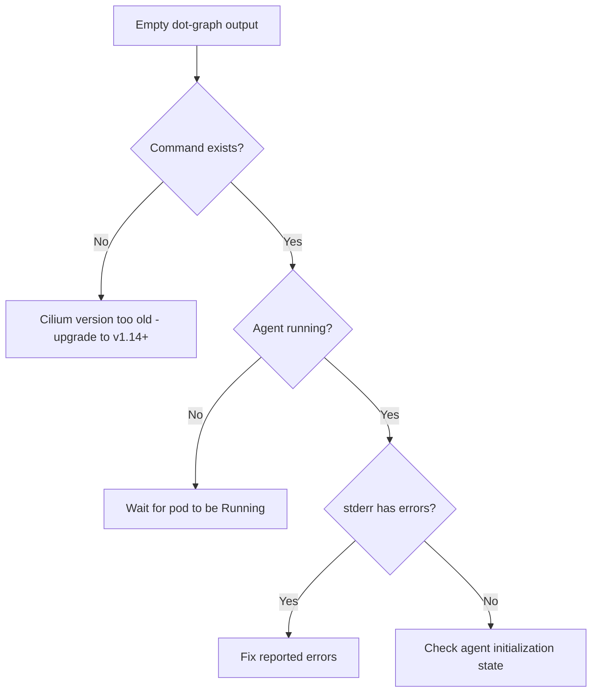

# Troubleshooting Cilium Agent Hive Dot-Graph Issues

Author: [nawazdhandala](https://github.com/nawazdhandala)

Tags: Cilium, Hive, Graphviz, Troubleshooting, Kubernetes, Debugging

Description: Diagnose and resolve issues with generating, rendering, and interpreting cilium-agent hive dot-graph output, from empty graphs to rendering failures.

---

## Introduction

The `cilium-agent hive dot-graph` command is a powerful tool for visualizing the agent's dependency structure, but several things can go wrong along the way. The output may be empty, malformed, or fail to render. The graph itself may reveal unexpected dependency patterns that indicate configuration issues.

This guide covers systematic troubleshooting of both the dot-graph generation process and the interpretation of problematic graph patterns.

## Prerequisites

- Kubernetes cluster with Cilium installed
- `kubectl` access to the cluster
- Graphviz installed for rendering tests
- Basic familiarity with DOT graph format

## Empty or Missing Output

The most common issue is the command producing no output:

```bash
CILIUM_POD=$(kubectl -n kube-system get pods -l k8s-app=cilium \
  -o jsonpath='{.items[0].metadata.name}')

# Check if the command exists in this version
kubectl -n kube-system exec "$CILIUM_POD" -c cilium-agent -- \
  cilium-agent hive --help 2>&1

# Attempt to capture both stdout and stderr
kubectl -n kube-system exec "$CILIUM_POD" -c cilium-agent -- \
  cilium-agent hive dot-graph > /tmp/hive-stdout.txt 2> /tmp/hive-stderr.txt

echo "stdout size: $(wc -c < /tmp/hive-stdout.txt)"
echo "stderr size: $(wc -c < /tmp/hive-stderr.txt)"
cat /tmp/hive-stderr.txt
```



## Malformed DOT Output

Sometimes the output is not valid DOT syntax:

```bash
# Validate DOT syntax
dot -Tcanon /tmp/hive-stdout.txt > /dev/null 2>&1
if [ $? -ne 0 ]; then
  echo "DOT syntax is invalid"

  # Check for common issues
  # Error messages mixed into output
  grep -n "^[^\"{}digraph]" /tmp/hive-stdout.txt | head -10

  # Missing closing brace
  tail -5 /tmp/hive-stdout.txt

  # Check for truncation
  wc -l /tmp/hive-stdout.txt
fi
```

Fix common DOT format issues:

```bash
#!/bin/bash
# fix-dot-output.sh
# Attempt to fix common DOT format problems

INPUT="/tmp/hive-stdout.txt"
OUTPUT="/tmp/hive-fixed.dot"

# Remove non-DOT lines (error messages, warnings)
grep -E '^\s*(digraph|"|{|})' "$INPUT" > "$OUTPUT"

# Ensure proper closing
if ! tail -1 "$OUTPUT" | grep -q "}"; then
  echo "}" >> "$OUTPUT"
fi

# Validate the fixed version
if dot -Tcanon "$OUTPUT" > /dev/null 2>&1; then
  echo "Fixed DOT file is valid"
else
  echo "Unable to fix automatically - manual inspection needed"
  # Show problematic lines
  dot -Tcanon "$OUTPUT" 2>&1 | head -5
fi
```

## Rendering Failures

When the DOT file is valid but rendering fails:

```bash
# Test with different output formats
dot -Tsvg /tmp/hive-fixed.dot -o /tmp/test.svg 2>&1
dot -Tpng /tmp/hive-fixed.dot -o /tmp/test.png 2>&1
dot -Tps /tmp/hive-fixed.dot -o /tmp/test.ps 2>&1

# Check Graphviz version
dot -V

# For very large graphs, increase memory limits
# The graph may have too many nodes for default settings
dot -Tsvg -Gnslimit=5 -Gmclimit=5 /tmp/hive-fixed.dot -o /tmp/test.svg

# Try alternative layout engines
neato -Tsvg /tmp/hive-fixed.dot -o /tmp/test-neato.svg 2>&1
sfdp -Tsvg /tmp/hive-fixed.dot -o /tmp/test-sfdp.svg 2>&1
```

## Diagnosing Unexpected Graph Patterns

The graph may render correctly but show unexpected patterns:

```bash
# Check for disconnected components (may indicate failed registrations)
python3 << 'PYEOF'
import re
from collections import defaultdict

with open('/tmp/hive-fixed.dot') as f:
    content = f.read()

# Build adjacency list
adj = defaultdict(set)
nodes = set()

for match in re.finditer(r'"([^"]+)"\s*\[label=', content):
    nodes.add(match.group(1))

for match in re.finditer(r'"([^"]+)"\s*->\s*"([^"]+)"', content):
    adj[match.group(1)].add(match.group(2))
    adj[match.group(2)].add(match.group(1))

# Find disconnected nodes
connected = set()
if nodes:
    stack = [next(iter(nodes))]
    while stack:
        node = stack.pop()
        if node in connected:
            continue
        connected.add(node)
        stack.extend(adj[node] - connected)

disconnected = nodes - connected
if disconnected:
    print(f"WARNING: {len(disconnected)} disconnected components:")
    for n in disconnected:
        print(f"  - {n}")
else:
    print("All components are connected")
PYEOF
```

## Permission and Access Issues

```bash
# Verify you can exec into the container
kubectl -n kube-system exec "$CILIUM_POD" -c cilium-agent -- whoami

# Check if the binary path is correct
kubectl -n kube-system exec "$CILIUM_POD" -c cilium-agent -- \
  which cilium-agent

# Try with the full path
kubectl -n kube-system exec "$CILIUM_POD" -c cilium-agent -- \
  /usr/bin/cilium-agent hive dot-graph

# Check RBAC if exec fails
kubectl auth can-i create pods/exec -n kube-system
```

## Verification

After resolving issues, verify the full pipeline works:

```bash
# End-to-end verification
CILIUM_POD=$(kubectl -n kube-system get pods -l k8s-app=cilium \
  -o jsonpath='{.items[0].metadata.name}')

kubectl -n kube-system exec "$CILIUM_POD" -c cilium-agent -- \
  cilium-agent hive dot-graph > /tmp/verify-hive.dot 2>/dev/null

# Validate DOT
dot -Tcanon /tmp/verify-hive.dot > /dev/null && echo "PASS: Valid DOT"

# Render
dot -Tsvg /tmp/verify-hive.dot -o /tmp/verify-hive.svg && echo "PASS: SVG rendered"

# Check content
NODES=$(grep -c '\[label=' /tmp/verify-hive.dot)
echo "Components in graph: $NODES"
[ "$NODES" -gt 0 ] && echo "PASS: Graph has content" || echo "FAIL: Graph is empty"
```

## Troubleshooting

- **"Error: <stdin>: syntax error in line N"**: The DOT file has non-graph content. Filter with the fix script above.
- **Graphviz segfaults on large graphs**: Update Graphviz to the latest version or reduce graph complexity by filtering subgraphs.
- **Timeout when collecting from pods**: Increase kubectl timeout with `--request-timeout=120s`.
- **Different graphs from different pods on the same cluster**: This is expected if nodes have different features enabled. Compare node configurations.

## Conclusion

Troubleshooting cilium-agent hive dot-graph issues follows a systematic path from verifying command availability, through validating output format, to diagnosing rendering problems and unexpected graph patterns. Most issues stem from version incompatibility, output corruption during collection, or Graphviz configuration. The techniques in this guide help you resolve each category efficiently.
