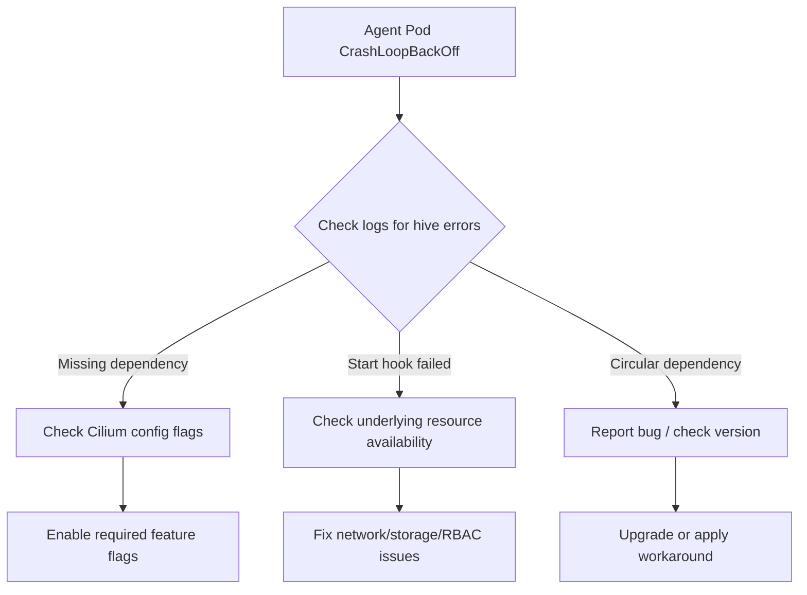

# Troubleshooting Cilium Agent Hive Dependency Issues

Author: [nawazdhandala](https://github.com/nawazdhandala)

Tags: Cilium, Hive, Troubleshooting, Kubernetes, Debugging, Networking

Description: Diagnose and resolve issues with the cilium-agent hive dependency injection framework, including startup failures, missing components, and circular dependency problems.

---

## Introduction

The Cilium agent's Hive framework manages the initialization and lifecycle of dozens of internal components. When something goes wrong in this dependency chain, the agent may fail to start, start in a degraded state, or exhibit unexpected behavior.

Hive-related issues typically surface during agent startup, after configuration changes, or following Cilium version upgrades. The symptoms range from pods stuck in CrashLoopBackOff to subtle feature unavailability where the agent runs but specific capabilities are missing.

This guide provides systematic approaches to diagnose and fix hive-related problems in the Cilium agent.

## Prerequisites

- Kubernetes cluster with Cilium installed
- `kubectl` access to the cluster
- Familiarity with Cilium agent logs
- Understanding of basic dependency injection concepts

## Identifying Hive Startup Failures

When the agent fails to start due to a hive issue, the pod logs contain specific error patterns:

```bash
# Check for hive-related errors in agent logs
CILIUM_POD=$(kubectl -n kube-system get pods -l k8s-app=cilium \
  -o jsonpath='{.items[0].metadata.name}')

kubectl -n kube-system logs "$CILIUM_POD" -c cilium-agent | \
  grep -iE "hive|cell|lifecycle|provide|invoke" | head -30
```

Common error patterns include:

```bash
# Missing provider: a component depends on something not registered
# "missing dependencies for function X: Y is not provided"

# Failed start: a component's Start hook returned an error
# "start hook failed for cell X: <error details>"

# Circular dependency: two components depend on each other
# "cycle detected in dependency graph involving X and Y"
```



## Diagnosing Missing Dependencies

Missing dependencies usually mean a feature is enabled that requires a component which is not configured:

```bash
# Get the full agent configuration
kubectl -n kube-system exec "$CILIUM_POD" -c cilium-agent -- \
  cilium-agent hive dot-graph 2>&1 | head -50

# Check the Cilium ConfigMap for relevant settings
kubectl -n kube-system get configmap cilium-config -o yaml | \
  grep -E "enable-|disable-" | sort

# Look for specific missing dependency errors
kubectl -n kube-system logs "$CILIUM_POD" -c cilium-agent --previous 2>/dev/null | \
  grep "not provided\|missing dep" | head -10
```

Common causes and fixes:

```bash
# If BGP component fails because KVStore is not configured
# Fix: Enable kvstore in cilium-config
kubectl -n kube-system patch configmap cilium-config --type merge \
  -p '{"data":{"kvstore":"etcd","kvstore-opt":"{\"etcd.config\":\"/var/lib/etcd-config/etcd.yaml\"}"}}'

# If Hubble relay component fails without Hubble enabled
# Fix: Enable Hubble
kubectl -n kube-system patch configmap cilium-config --type merge \
  -p '{"data":{"enable-hubble":"true"}}'
```

## Debugging Start Hook Failures

When a component is registered but its Start hook fails:

```bash
# Get detailed logs around the startup sequence
kubectl -n kube-system logs "$CILIUM_POD" -c cilium-agent | \
  grep -B5 -A10 "start hook failed"

# Check if the issue is transient (resources not ready yet)
kubectl -n kube-system logs "$CILIUM_POD" -c cilium-agent | \
  grep -c "start hook failed"
# If count is low and pod eventually starts, it may be a timing issue

# Check events for related issues
kubectl -n kube-system get events --sort-by='.lastTimestamp' | \
  grep cilium | tail -20
```

Common start hook failures and resolutions:

```bash
# IPAM component fails: check if the IPAM mode is compatible
kubectl -n kube-system get configmap cilium-config -o yaml | grep ipam

# KVStore component fails: check etcd connectivity
kubectl -n kube-system exec "$CILIUM_POD" -c cilium-agent -- \
  cilium-dbg kvstore get --recursive / 2>&1 | head -5

# Datapath fails: check eBPF filesystem mount
kubectl -n kube-system exec "$CILIUM_POD" -c cilium-agent -- \
  mount | grep bpf
```

## Resolving Version Mismatch Issues

After Cilium upgrades, the hive graph may change, introducing new dependencies:

```bash
# Check Cilium version across all pods
kubectl -n kube-system get pods -l k8s-app=cilium \
  -o jsonpath='{range .items[*]}{.metadata.name}{"\t"}{.spec.containers[0].image}{"\n"}{end}'

# Look for version skew
kubectl -n kube-system get pods -l k8s-app=cilium \
  -o jsonpath='{.items[*].spec.containers[0].image}' | tr ' ' '\n' | sort -u

# If mixed versions found, ensure all pods run the same version
# This is common during rolling upgrades
kubectl -n kube-system rollout status daemonset/cilium
```

## Inspecting the Live Hive State

If the agent is running but in a degraded state:

```bash
# Generate the current dependency graph
kubectl -n kube-system exec "$CILIUM_POD" -c cilium-agent -- \
  cilium-agent hive dot-graph > /tmp/current-hive.dot

# Count registered components
grep -c "label=" /tmp/current-hive.dot

# Look for disconnected nodes (components without edges)
# These might indicate optional components that failed silently
grep "label=" /tmp/current-hive.dot | while read -r line; do
  node=$(echo "$line" | grep -oP '"\w+"' | head -1 | tr -d '"')
  edges=$(grep -c "$node" /tmp/current-hive.dot)
  if [ "$edges" -le 1 ]; then
    echo "Isolated component: $node"
  fi
done
```

## Verification

After applying fixes, verify the agent is healthy:

```bash
# Check pod status
kubectl -n kube-system get pods -l k8s-app=cilium

# Verify agent health
kubectl -n kube-system exec "$CILIUM_POD" -c cilium-agent -- \
  cilium-dbg status --brief

# Confirm no hive errors in recent logs
kubectl -n kube-system logs "$CILIUM_POD" -c cilium-agent --since=5m | \
  grep -iE "hive|cell" | grep -i "error\|fail" || echo "No hive errors found"
```

## Troubleshooting

- **Pod keeps restarting with hive errors**: Check `--previous` logs for the initial failure, as restarts may produce different errors.
- **Agent starts but features are missing**: Some components fail silently. Check `cilium-dbg status` for disabled features.
- **Cannot exec into the pod**: If CrashLoopBackOff is too fast, add a `sleep 300` to the container command temporarily via a patch for debugging.
- **Hive errors only on specific nodes**: Check node-specific resources like available memory, kernel version, and mounted filesystems.

## Conclusion

Hive dependency issues in cilium-agent are systematic and diagnosable. By examining logs for specific error patterns, validating configuration flags, and inspecting the dependency graph, you can trace most startup and runtime failures to their root cause. Maintaining version consistency and validating configuration changes before rollout prevents the majority of hive-related incidents.
