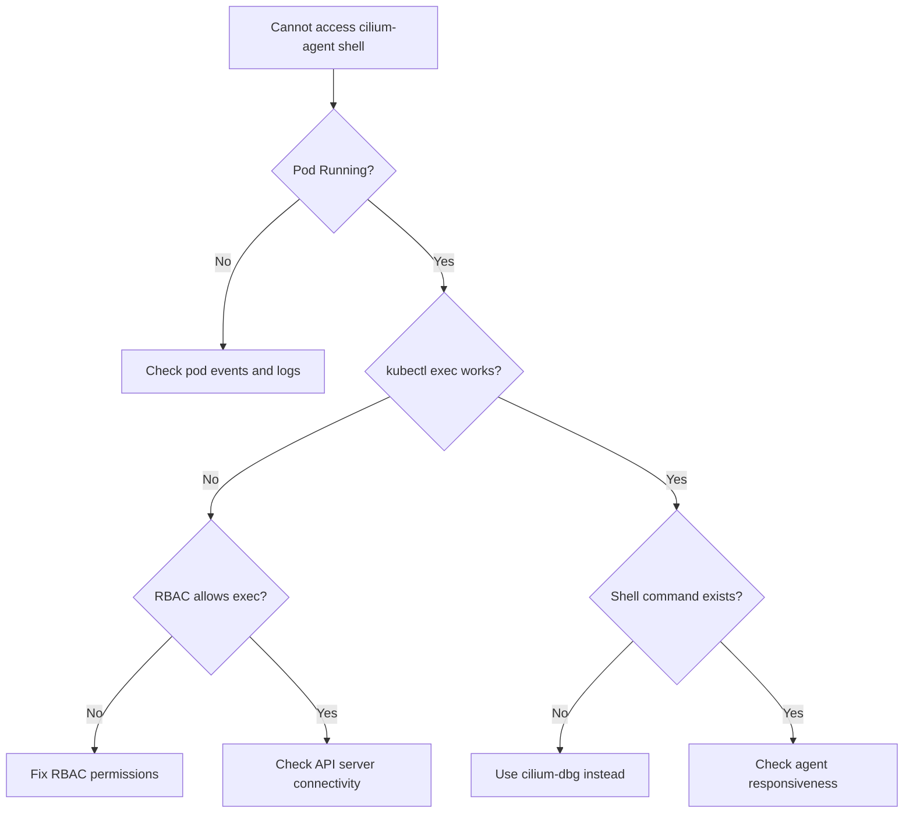

# Troubleshooting Cilium Agent Shell Access Issues

Author: [nawazdhandala](https://github.com/nawazdhandala)

Tags: Cilium, Troubleshooting, Kubernetes, Shell, Debugging, DevOps

Description: Diagnose and resolve problems accessing and using the cilium-agent shell, including connection failures, permission issues, and command execution errors.

---

## Introduction

The cilium-agent shell is essential for deep debugging of Cilium agent internals. When you cannot access it or commands fail within it, your ability to diagnose networking issues is severely limited. Problems range from kubectl exec failures to agent-side command errors.

This guide provides a systematic approach to diagnosing and resolving cilium-agent shell access issues, covering network connectivity, RBAC permissions, container state, and agent responsiveness.

## Prerequisites

- Kubernetes cluster with Cilium installed
- `kubectl` configured with cluster access
- Admin-level permissions for RBAC troubleshooting

## Diagnosing Connection Failures

When `kubectl exec` fails to connect to the cilium-agent container:

```bash
# Check pod status first
CILIUM_POD=$(kubectl -n kube-system get pods -l k8s-app=cilium \
  -o jsonpath='{.items[0].metadata.name}')

kubectl -n kube-system get pod "$CILIUM_POD" -o wide

# Check container status within the pod
kubectl -n kube-system get pod "$CILIUM_POD" \
  -o jsonpath='{range .status.containerStatuses[*]}{.name}: {.state}{"\n"}{end}'

# Test basic exec connectivity
kubectl -n kube-system exec "$CILIUM_POD" -c cilium-agent -- echo "exec works"
```



## Fixing RBAC Permissions

Exec into pods requires specific RBAC permissions:

```bash
# Check if your user/SA can exec into pods
kubectl auth can-i create pods/exec -n kube-system
# Expected: yes

# If no, create the necessary role
kubectl apply -f - << 'YAMLEOF'
apiVersion: rbac.authorization.k8s.io/v1
kind: ClusterRole
metadata:
  name: cilium-debug-access
rules:
- apiGroups: [""]
  resources: ["pods/exec"]
  verbs: ["create"]
- apiGroups: [""]
  resources: ["pods"]
  verbs: ["get", "list"]
- apiGroups: [""]
  resources: ["pods/log"]
  verbs: ["get"]
YAMLEOF

# Bind to your user or service account
kubectl create clusterrolebinding cilium-debug-binding \
  --clusterrole=cilium-debug-access \
  --user=your-username@example.com
```

## Agent Responsiveness Issues

If exec works but the shell is unresponsive:

```bash
# Check agent resource usage
kubectl -n kube-system top pod "$CILIUM_POD" --containers

# Check if the agent is in a healthy state
kubectl -n kube-system exec "$CILIUM_POD" -c cilium-agent -- \
  cilium-dbg status 2>&1 | head -20

# Check agent logs for errors
kubectl -n kube-system logs "$CILIUM_POD" -c cilium-agent --tail=50 | \
  grep -iE "error|warn|panic|fatal"

# Check if the agent API socket is accessible
kubectl -n kube-system exec "$CILIUM_POD" -c cilium-agent -- \
  ls -la /var/run/cilium/cilium.sock
```

## Container-Level Issues

The cilium-agent container may have problems that prevent shell access:

```bash
# Check for OOMKilled or other termination reasons
kubectl -n kube-system get pod "$CILIUM_POD" \
  -o jsonpath='{.status.containerStatuses[?(@.name=="cilium-agent")].lastState}'

# Check container restart count
kubectl -n kube-system get pod "$CILIUM_POD" \
  -o jsonpath='{.status.containerStatuses[?(@.name=="cilium-agent")].restartCount}'

# View events related to the pod
kubectl -n kube-system describe pod "$CILIUM_POD" | tail -30

# If CrashLoopBackOff, check previous logs
kubectl -n kube-system logs "$CILIUM_POD" -c cilium-agent --previous 2>/dev/null | \
  tail -30
```

## Alternative Access Methods

When the shell is unavailable, use alternative approaches:

```bash
# Use cilium-dbg directly instead of the shell
kubectl -n kube-system exec "$CILIUM_POD" -c cilium-agent -- \
  cilium-dbg status

# Access the agent API directly via curl
kubectl -n kube-system exec "$CILIUM_POD" -c cilium-agent -- \
  curl -s --unix-socket /var/run/cilium/cilium.sock \
  http://localhost/v1/healthz

# Use the Cilium CLI tool from outside the pod
cilium status --wait

# Debug with a temporary pod
kubectl run cilium-debug --rm -it --image=quay.io/cilium/cilium:v1.16.0 \
  --overrides='{"spec":{"nodeName":"'$(kubectl -n kube-system get pod "$CILIUM_POD" -o jsonpath='{.spec.nodeName}')'"}}' \
  -- /bin/bash
```

## Network Policy Blocking Exec

In rare cases, network policies may block the exec connection:

```bash
# Check if any network policies could affect kube-system
kubectl get networkpolicies -n kube-system

# Check Cilium network policies
kubectl get ciliumnetworkpolicies -n kube-system

# Temporarily check without policies (for diagnosis only)
kubectl -n kube-system exec "$CILIUM_POD" -c cilium-agent -- \
  cilium-dbg endpoint list 2>/dev/null | \
  grep kube-system
```

## Verification

After resolving access issues:

```bash
# Full access verification
echo "1. Pod status:"
kubectl -n kube-system get pod "$CILIUM_POD" -o wide

echo "2. Exec test:"
kubectl -n kube-system exec "$CILIUM_POD" -c cilium-agent -- echo "OK"

echo "3. Agent status:"
kubectl -n kube-system exec "$CILIUM_POD" -c cilium-agent -- \
  cilium-dbg status --brief

echo "4. Shell command test:"
kubectl -n kube-system exec "$CILIUM_POD" -c cilium-agent -- \
  cilium-dbg endpoint list | head -5
```

## Troubleshooting

- **"error: unable to upgrade connection: pod does not exist"**: The pod may have been rescheduled. Re-fetch the pod name.
- **"OOMKilled" in container status**: Increase the agent memory limits in the Cilium Helm values.
- **Exec works but commands hang**: The agent API may be blocked. Check for deadlocks in agent logs.
- **"container not found" error**: Specify the container explicitly with `-c cilium-agent`.

## Conclusion

Cilium agent shell access issues are typically caused by pod state problems, RBAC misconfigurations, or agent resource constraints. By following a systematic diagnostic path from pod status through RBAC to agent health, you can identify and resolve access problems quickly, restoring your ability to debug networking issues effectively.
