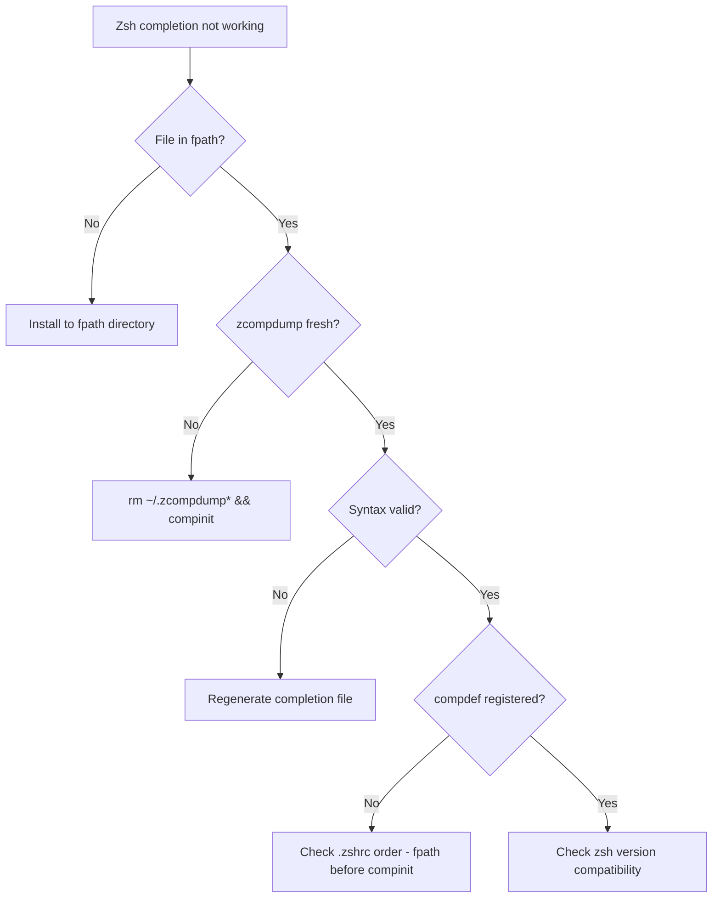

# Troubleshooting Cilium Bugtool Zsh Completion

Author: [nawazdhandala](https://github.com/nawazdhandala)

Tags: Cilium, Bugtool, Zsh, Troubleshooting, Shell

Description: Fix issues with cilium-bugtool zsh completions including cache corruption, fpath misconfiguration, and compinit problems.

---

## Introduction

Zsh provides one of the most powerful completion systems among Unix shells, with support for descriptions, grouping, and context-aware suggestions. The `cilium-bugtool completion zsh` command generates a completion script that takes advantage of these features.


Zsh completion issues are often more complex than bash or fish because of the caching layer (zcompdump), the fpath search mechanism, and the compinit initialization process. Understanding these components is key to effective troubleshooting.

This guide provides systematic approaches to diagnosing and resolving cilium-bugtool zsh completion problems.


## Prerequisites

- Zsh shell (v5.0+)
- `cilium-bugtool` binary available or access to a Cilium pod
- Understanding of zsh fpath and compinit (for troubleshooting)

## Diagnosing Completion Problems


### Step 1: Check File Existence

```bash
# Search fpath for the completion file
for dir in \$fpath; do
  [ -f "\$dir/_cilium-bugtool" ] && echo "Found: \$dir/_cilium-bugtool"
done
```

### Step 2: Check Cache State

```bash
# Remove stale cache
rm -f ~/.zcompdump*

# Rebuild
autoload -Uz compinit && compinit

# Verify registration
echo \$_comps[cilium-bugtool]
# Expected: _cilium-bugtool
```

### Step 3: Validate the Completion Script

```bash
# Check for syntax errors
zsh -c "source /usr/local/share/zsh/site-functions/_cilium-bugtool" 2>&1

# Check it has the compdef directive
head -5 /usr/local/share/zsh/site-functions/_cilium-bugtool
# Should contain #compdef cilium-bugtool
```

### Step 4: Fix fpath Issues

```bash
# Check current fpath
echo \$fpath | tr ' ' '\n'

# Ensure your completion directory is listed
# Add to .zshrc BEFORE compinit:
fpath=(~/.zsh/completions \$fpath)
autoload -Uz compinit && compinit
```




## Verification

```bash
# Full verification after fixes
rm -f ~/.zcompdump*
exec zsh
whence -v _cilium-bugtool
echo \$_comps[cilium-bugtool]
cilium-bugtool <TAB>
```

## Troubleshooting

- **"_cilium-bugtool: function definition file not found"**: File must be named `_cilium-bugtool` with underscore prefix and be in fpath.
- **Stale completions after upgrade**: Run `rm -f ~/.zcompdump*` and restart zsh.
- **Slow shell startup**: Use `compinit -C` to skip security checks on the dump file.
- **Oh My Zsh interference**: Place completions in `$ZSH_CUSTOM/plugins/` or ensure fpath is set before Oh My Zsh loads.

## Conclusion


Zsh completion troubleshooting follows a clear path: verify file existence, clear the cache, validate syntax, and check fpath configuration. Most issues resolve with a cache clear and compinit rebuild.

