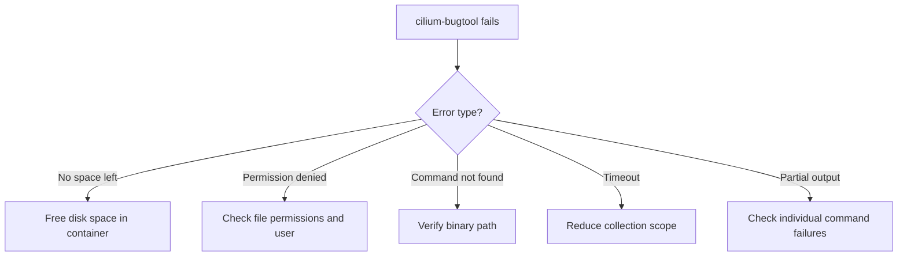

# Troubleshooting Cilium Bugtool Collection Issues

Author: [nawazdhandala](https://github.com/nawazdhandala)

Tags: Cilium, Bugtool, Troubleshooting, Kubernetes, Diagnostics

Description: Diagnose and resolve issues when cilium-bugtool fails to run, produces incomplete archives, or encounters disk space and permission problems during diagnostic data collection.

---

## Introduction

The cilium-bugtool is your primary tool for collecting comprehensive Cilium diagnostics, but it can fail for various reasons: disk space constraints, permission issues, timeout problems, or agent state issues. When bugtool itself has problems, you need to troubleshoot the troubleshooting tool.

This guide covers systematic approaches to diagnose and fix cilium-bugtool failures, ensuring you can always collect the diagnostic data you need.

## Prerequisites

- Kubernetes cluster with Cilium installed
- `kubectl` with cluster access
- Shell access to the Cilium pod

## Common Failure Modes



## Disk Space Issues

The most common failure -- bugtool writes to /tmp inside the container:

```bash
CILIUM_POD=$(kubectl -n kube-system get pods -l k8s-app=cilium \
  -o jsonpath='{.items[0].metadata.name}')

# Check available disk space
kubectl -n kube-system exec "$CILIUM_POD" -c cilium-agent -- \
  df -h /tmp

# Check existing bugtool archives consuming space
kubectl -n kube-system exec "$CILIUM_POD" -c cilium-agent -- \
  ls -lh /tmp/cilium-bugtool-*.tar.gz 2>/dev/null

# Clean up old archives
kubectl -n kube-system exec "$CILIUM_POD" -c cilium-agent -- \
  rm -f /tmp/cilium-bugtool-*.tar.gz

# Try again with a different output directory
kubectl -n kube-system exec "$CILIUM_POD" -c cilium-agent -- \
  cilium-bugtool --tmp /var/run/cilium/
```

## Permission Problems

```bash
# Check the user running inside the container
kubectl -n kube-system exec "$CILIUM_POD" -c cilium-agent -- whoami

# Check /tmp permissions
kubectl -n kube-system exec "$CILIUM_POD" -c cilium-agent -- \
  ls -la /tmp/

# Check if the bugtool binary is executable
kubectl -n kube-system exec "$CILIUM_POD" -c cilium-agent -- \
  ls -la $(which cilium-bugtool 2>/dev/null || echo "/usr/bin/cilium-bugtool")

# Try running with explicit path
kubectl -n kube-system exec "$CILIUM_POD" -c cilium-agent -- \
  /usr/bin/cilium-bugtool
```

## Timeout and Slow Collection

When bugtool takes too long or times out:

```bash
# Run with increased kubectl timeout
kubectl -n kube-system exec "$CILIUM_POD" -c cilium-agent \
  --request-timeout=300s -- cilium-bugtool

# Collect only specific categories to reduce time
kubectl -n kube-system exec "$CILIUM_POD" -c cilium-agent -- \
  cilium-bugtool --commands="cilium-dbg status,cilium-dbg endpoint list"

# Check what is slow by monitoring the process
kubectl -n kube-system exec "$CILIUM_POD" -c cilium-agent -- \
  sh -c "cilium-bugtool &>/tmp/bugtool-log.txt & echo \$!"

# Check progress
kubectl -n kube-system exec "$CILIUM_POD" -c cilium-agent -- \
  tail -f /tmp/bugtool-log.txt
```

## Incomplete Archives

When the archive is created but missing expected data:

```bash
# Extract and check what was collected
tar tzf /tmp/cilium-bugtool.tar.gz | wc -l
echo "Expected: 30+ files"

# Check for error markers in the archive
tar xzf /tmp/cilium-bugtool.tar.gz -C /tmp/bugtool-check/
find /tmp/bugtool-check/ -name "*.err" -o -name "*error*" | while read f; do
  echo "=== $f ==="
  cat "$f"
done

# Check which commands failed
find /tmp/bugtool-check/ -empty -name "cmd-output*" | while read f; do
  echo "Empty output: $f"
done
```

## Binary Not Found

```bash
# Find the bugtool binary
kubectl -n kube-system exec "$CILIUM_POD" -c cilium-agent -- \
  find / -name "cilium-bugtool" -type f 2>/dev/null

# Check the Cilium image version
kubectl -n kube-system get pod "$CILIUM_POD" \
  -o jsonpath='{.spec.containers[?(@.name=="cilium-agent")].image}'

# cilium-bugtool may have a different path in some versions
kubectl -n kube-system exec "$CILIUM_POD" -c cilium-agent -- \
  ls /usr/bin/cilium*
```

## Agent State Issues

If bugtool fails because the agent itself is unhealthy:

```bash
# Check agent status
kubectl -n kube-system exec "$CILIUM_POD" -c cilium-agent -- \
  cilium-dbg status --brief 2>&1 || echo "Agent unreachable"

# Check if the agent socket is available
kubectl -n kube-system exec "$CILIUM_POD" -c cilium-agent -- \
  ls -la /var/run/cilium/cilium.sock

# If agent is down, collect what you can manually
kubectl -n kube-system exec "$CILIUM_POD" -c cilium-agent -- sh -c '
  mkdir -p /tmp/manual-diag
  dmesg > /tmp/manual-diag/dmesg.txt 2>/dev/null
  ip addr > /tmp/manual-diag/ip-addr.txt 2>/dev/null
  ip route > /tmp/manual-diag/ip-route.txt 2>/dev/null
  cat /proc/meminfo > /tmp/manual-diag/meminfo.txt 2>/dev/null
  tar czf /tmp/manual-diag.tar.gz -C /tmp manual-diag
'
```

## Verification

After resolving issues, verify bugtool works end-to-end:

```bash
# Full verification
echo "1. Running bugtool..."
kubectl -n kube-system exec "$CILIUM_POD" -c cilium-agent -- \
  cilium-bugtool 2>&1

echo "2. Checking archive..."
ARCHIVE=$(kubectl -n kube-system exec "$CILIUM_POD" -c cilium-agent -- \
  ls -t /tmp/cilium-bugtool-*.tar.gz | head -1)
echo "  Archive: $ARCHIVE"

echo "3. Checking archive size..."
kubectl -n kube-system exec "$CILIUM_POD" -c cilium-agent -- \
  ls -lh "$ARCHIVE"

echo "4. Copying archive..."
kubectl -n kube-system cp \
  "$CILIUM_POD:$ARCHIVE" /tmp/verify-bugtool.tar.gz -c cilium-agent

echo "5. Verifying archive..."
tar tzf /tmp/verify-bugtool.tar.gz | wc -l
echo "  Files in archive"
```

## Troubleshooting

- **"tar: Error is not recoverable"**: The archive was corrupted during copy. Retry with `kubectl cp` or use `cat` piped through kubectl exec.
- **bugtool hangs indefinitely**: Kill the process and collect with `--commands` to identify which specific command hangs.
- **Empty archive (0 bytes)**: The bugtool binary may have crashed. Check for core dumps in /tmp and review agent logs.
- **"socket not found" errors**: The agent API server may not be running. Collect system-level data manually as shown above.

## Conclusion

Cilium bugtool failures are usually caused by resource constraints, permission issues, or agent state problems. By systematically checking disk space, permissions, binary availability, and agent health, you can resolve most issues quickly. When bugtool cannot run at all, manual data collection provides a fallback for gathering essential diagnostic information.
