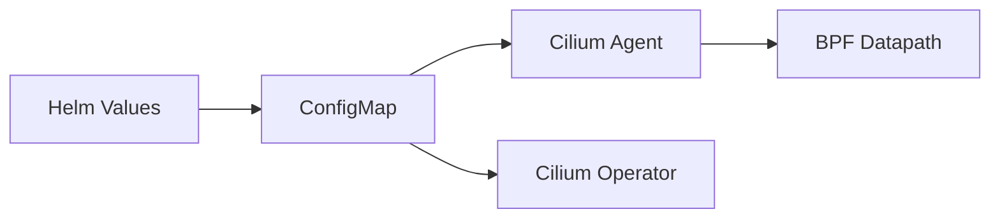

# Troubleshooting Cilium Configuration Issues in Kubernetes

Author: [nawazdhandala](https://github.com/nawazdhandala)

Tags: Cilium, Kubernetes, Troubleshooting, Configuration, CNI

Description: A practical guide to diagnosing and resolving Cilium configuration problems including agent startup failures, ConfigMap mismatches, and feature enablement issues.

---

## Introduction

Cilium configuration issues manifest as agent startup failures, connectivity problems, or features that silently do not work. Configuration flows from Helm values through a ConfigMap to the agent and operator. Problems can occur at any step.

The challenge is that many settings interact. Changing tunnel mode affects routing, changing IPAM mode affects IP allocation, and enabling encryption requires kernel support. A single misconfiguration can cascade into multiple symptoms.

This guide helps you systematically identify and fix configuration issues.

## Prerequisites

- Kubernetes cluster with Cilium installed
- kubectl, Cilium CLI, and Helm v3 installed
- Access to node-level debugging

## Configuration Flow Diagnosis



## Verifying Configuration State

```bash
# View active ConfigMap
kubectl get configmap cilium-config -n kube-system -o yaml

# Compare with Helm values
helm get values cilium -n kube-system

# Check what agent sees
kubectl exec -n kube-system -l k8s-app=cilium -- cilium status --verbose

# Verify specific settings
kubectl get configmap cilium-config -n kube-system \
  -o jsonpath='{.data.tunnel}'
kubectl get configmap cilium-config -n kube-system \
  -o jsonpath='{.data.enable-hubble}'
```

## Agent Startup Failures

```bash
# Check agent pod status
kubectl get pods -n kube-system -l k8s-app=cilium

# View startup errors
kubectl logs -n kube-system -l k8s-app=cilium --tail=100

# Check CrashLoopBackOff details
kubectl describe pod -n kube-system -l k8s-app=cilium | grep -A10 "Last State"
```

## ConfigMap Not Updating

```bash
# Check ConfigMap resource version
kubectl get configmap cilium-config -n kube-system \
  -o jsonpath='{.metadata.resourceVersion}'

# Force rolling restart
kubectl rollout restart daemonset/cilium -n kube-system
kubectl rollout status daemonset/cilium -n kube-system --timeout=300s
```

## Feature Not Working

```bash
cilium status | grep Hubble
cilium encrypt status
cilium bpf bandwidth list
```

## Common Configuration Conflicts

### Tunnel Mode vs Native Routing

```bash
# These are mutually exclusive
kubectl get configmap cilium-config -n kube-system \
  -o jsonpath='{.data.tunnel}'

# Switch from tunnel to native routing
helm upgrade cilium cilium/cilium \
  --namespace kube-system \
  --reuse-values \
  --set tunnel=disabled \
  --set autoDirectNodeRoutes=true \
  --set ipv4NativeRoutingCIDR="10.0.0.0/8"
```

## Verification

```bash
cilium status
cilium connectivity test
kubectl get pods -n kube-system -l k8s-app=cilium \
  -o jsonpath='{.items[*].spec.containers[0].image}' | tr ' ' '\n' | sort -u
```

## Troubleshooting

- **Agent CrashLoopBackOff after upgrade**: Roll back with `helm rollback cilium -n kube-system`. Check setting compatibility.
- **ConfigMap has old values**: Try `helm upgrade` with explicit `--set` flags.
- **Feature enabled but metrics show zero**: Restart agents. Some features need full agent restart.
- **Different agents running different configs**: Wait for rolling update to complete.

## Conclusion

Configuration troubleshooting follows the flow from Helm values to ConfigMap to agent behavior. Always verify what is actually running rather than what you intended. Use `cilium status --verbose` as your primary diagnostic tool.