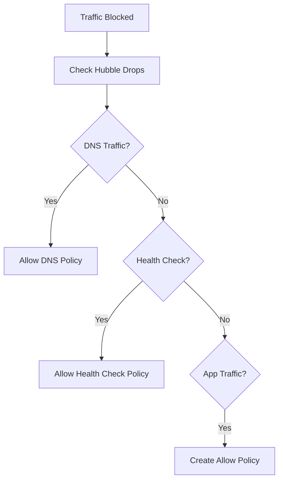

# Troubleshooting Cilium Default Deny Ingress Policy Issues

Author: [nawazdhandala](https://github.com/nawazdhandala)

Tags: Cilium, Kubernetes, Network Policy, Troubleshooting, Security

Description: How to diagnose and resolve issues with Cilium default deny ingress policies including blocked legitimate traffic, DNS failures, and health check problems.

---

## Introduction

Default deny ingress policies block all inbound traffic unless explicitly allowed. When things go wrong, the symptoms are clear: applications stop communicating. The challenge is identifying which traffic needs to be allowed and building the right policies without being too permissive.

Common issues include DNS resolution failing (because DNS traffic is also blocked), Kubernetes health checks being blocked (causing pods to restart), and inter-service communication breaking that was previously working implicitly.

## Prerequisites

- Kubernetes cluster with Cilium and default deny ingress applied
- kubectl and Cilium CLI configured
- Hubble enabled for flow observation

## Diagnosing Blocked Traffic

```bash
# Use Hubble to see what is being dropped
hubble observe --verdict DROPPED --last 50

# Filter for specific namespaces
hubble observe --verdict DROPPED -n default --last 50

# Filter for specific pods
hubble observe --verdict DROPPED --to-pod default/backend --last 20

# Check policy verdict details
hubble observe --verdict DROPPED -o json --last 10 | \
  jq '.flow | {src: .source.labels, dst: .destination.labels, port: .l4.TCP.destination_port}'
```



## Fixing DNS Resolution

DNS is almost always the first thing that breaks:

```yaml
# allow-dns.yaml
apiVersion: cilium.io/v2
kind: CiliumNetworkPolicy
metadata:
  name: allow-dns
  namespace: default
spec:
  endpointSelector: {}
  egress:
    - toEndpoints:
        - matchLabels:
            k8s:io.kubernetes.pod.namespace: kube-system
            k8s-app: kube-dns
      toPorts:
        - ports:
            - port: "53"
              protocol: UDP
            - port: "53"
              protocol: TCP
```

```bash
kubectl apply -f allow-dns.yaml

# Verify DNS works
kubectl exec -n default deploy/frontend -- nslookup kubernetes
```

## Fixing Health Check Failures

```yaml
# allow-health-checks.yaml
apiVersion: cilium.io/v2
kind: CiliumNetworkPolicy
metadata:
  name: allow-health-checks
  namespace: default
spec:
  endpointSelector: {}
  ingress:
    - fromEntities:
        - health
```

## Building Allow Policies from Hubble Data

```bash
# Collect flow data to understand communication patterns
hubble observe -n default --verdict DROPPED -o json --last 200 | \
  jq -r '.flow | "\(.source.labels | join(",")) -> \(.destination.labels | join(",")) port \(.l4.TCP.destination_port // .l4.UDP.destination_port)"' | \
  sort | uniq -c | sort -rn | head -20
```

This shows you the most common blocked flows, helping you build allow policies systematically.

## Verification

```bash
# Verify policies are applied
kubectl get ciliumnetworkpolicies -n default

# Check no unexpected drops
hubble observe --verdict DROPPED -n default --last 10

# Test application connectivity
kubectl exec -n default deploy/frontend -- \
  curl -s http://backend:8080
```

## Troubleshooting

- **Everything is blocked**: Start with DNS and health check allow policies before adding application policies.
- **Hubble shows drops from "reserved:host"**: These are kubelet probes. Add health entity allow policy.
- **Pods restarting**: Liveness/readiness probes are being blocked. Allow health check traffic.
- **Cannot reach external services**: You need egress policies too, not just ingress.

## Conclusion

Troubleshooting default deny ingress follows a pattern: use Hubble to see what is dropped, fix DNS first, allow health checks second, then build application-specific allow policies. Hubble is essential for this process as it shows you exactly which flows need to be permitted.