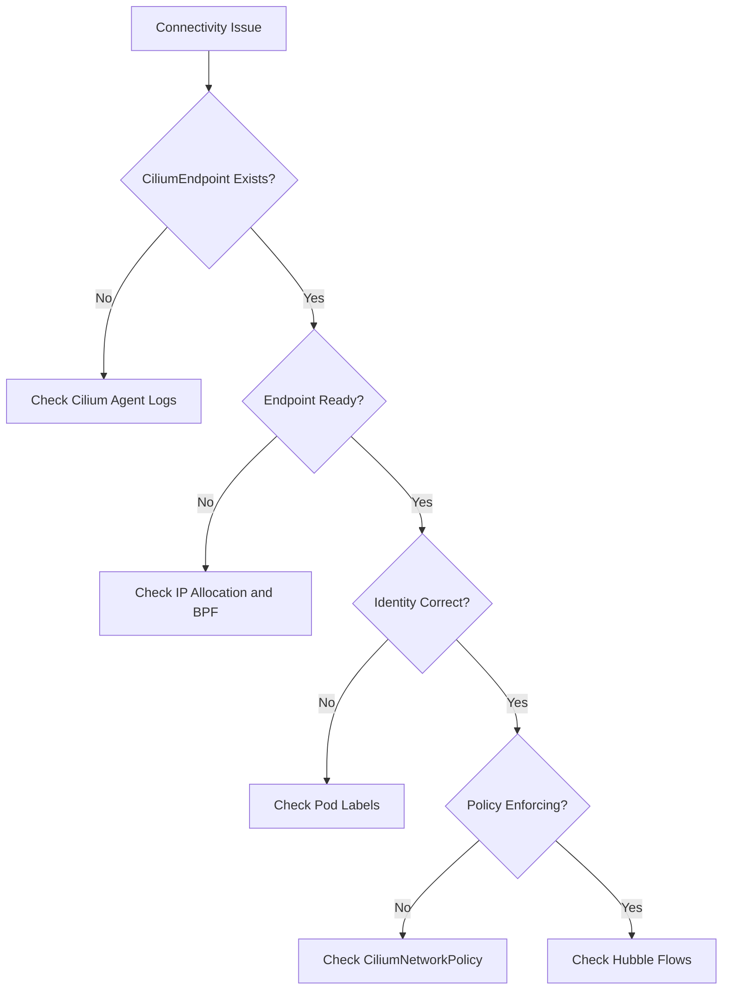

# Troubleshooting Cilium Endpoint CRD Issues in Kubernetes

Author: [nawazdhandala](https://github.com/nawazdhandala)

Tags: Cilium, Kubernetes, Troubleshooting, Endpoints, Networking

Description: A systematic guide to diagnosing and resolving common CiliumEndpoint CRD issues including missing endpoints, identity problems, policy enforcement failures, and state errors.

---

## Introduction

CiliumEndpoint custom resources are created automatically by the Cilium agent for every pod it manages. When things go wrong, symptoms range from pods that cannot communicate to policies that silently fail. Because CiliumEndpoints sit at the intersection of identity, networking, and policy, problems often manifest as confusing connectivity issues.

The most common problems are: endpoints that never get created, endpoints stuck in a non-ready state, identity mismatches that break policy, and stale endpoints that linger after pods are deleted.

This guide provides a systematic approach to troubleshooting each scenario.

## Prerequisites

- Kubernetes cluster with Cilium installed
- kubectl configured with cluster access
- Cilium CLI installed
- Access to node-level logs

## Diagnostic Workflow



## Diagnosing Missing CiliumEndpoints

```bash
# Compare pods to endpoints
kubectl get pods -n default -o name | sort > /tmp/pods.txt
kubectl get ciliumendpoints -n default -o name | sort > /tmp/endpoints.txt
diff /tmp/pods.txt /tmp/endpoints.txt

# Check Cilium agent on the affected node
NODE=$(kubectl get pod <pod-name> -n default -o jsonpath='{.spec.nodeName}')
kubectl get pods -n kube-system -l k8s-app=cilium --field-selector spec.nodeName=$NODE

# Check agent logs for endpoint errors
kubectl logs -n kube-system -l k8s-app=cilium \
  --field-selector spec.nodeName=$NODE | grep -i "endpoint" | tail -50
```

Common causes:
1. **Cilium agent not running on the node** - Check DaemonSet status
2. **CNI binary not installed** - Verify `/opt/cni/bin/cilium-cni` exists
3. **Pod using hostNetwork** - Host-networked pods do not get CiliumEndpoints

## Fixing Endpoints Stuck in Non-Ready State

```bash
# List non-ready endpoints
cilium endpoint list | grep -v "ready"

# Get detailed status
cilium endpoint get <endpoint-id>

# Check for BPF compilation errors
kubectl logs -n kube-system <cilium-pod> | grep "BPF" | grep -i "error"

# Check IP allocation failures
kubectl logs -n kube-system <cilium-pod> | grep "Unable to allocate" | tail -10
```

If stuck, try regenerating:

```bash
# Force endpoint regeneration
cilium endpoint config <endpoint-id> ConntrackLocal=Enabled

# If that fails, restart the agent on the affected node
kubectl delete pod -n kube-system <cilium-pod-on-affected-node>
```

## Resolving Identity Mismatches

```bash
# Check identity assigned to an endpoint
kubectl get ciliumendpoint <pod-name> -n <namespace> \
  -o jsonpath='{.status.identity}'

# List all identities
cilium identity list

# Compare endpoint labels with expected labels
kubectl get ciliumendpoint <pod-name> -n <namespace> \
  -o jsonpath='{.status.identity.labels}'
```

## Cleaning Up Stale Endpoints

```bash
# Find stale CiliumEndpoints (no matching pod)
for ep in $(kubectl get ciliumendpoints -n default \
    -o jsonpath='{.items[*].metadata.name}'); do
  if ! kubectl get pod "$ep" -n default &>/dev/null; then
    echo "Stale endpoint: $ep"
  fi
done

# Delete stale endpoints
kubectl delete ciliumendpoint <stale-endpoint-name> -n default
```

## Verification

```bash
cilium endpoint list | grep -c "ready"
cilium connectivity test
kubectl get ciliumendpoint <pod-name> -n <namespace> -o jsonpath='{.status.policy}'
```

## Troubleshooting

- **"Failed to create endpoint"**: Check IPAM pool exhaustion with `cilium status`.
- **"Identity allocation failed"**: Kvstore (etcd) may be unreachable. Check `cilium status` for kvstore health.
- **Endpoints constantly regenerating**: Look for label changes or conflicting admission webhooks.
- **"BPF program compilation failed"**: Check memory and kernel version on the node.

## Conclusion

Troubleshooting CiliumEndpoint issues follows a clear diagnostic path: verify existence, check state, validate identity, confirm policy enforcement. Most issues trace back to agent health, IP allocation, or label configuration.