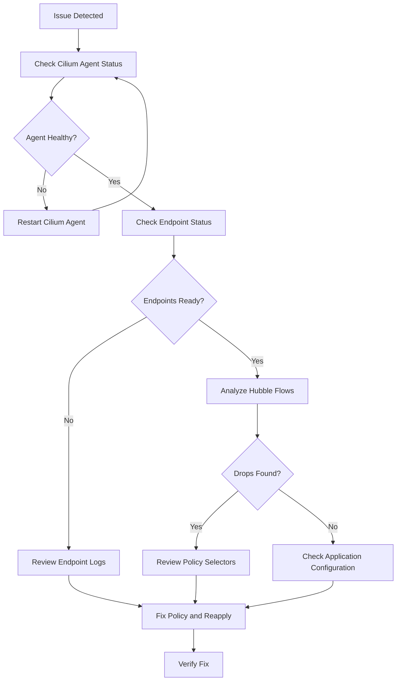

# Troubleshooting Envoy Proxy Integration in Cilium

Author: [nawazdhandala](https://github.com/nawazdhandala)

Tags: Cilium, Kubernetes, Network Security, Envoy, Troubleshooting

Description: Learn how to troubleshoot Envoy proxy configuration in Cilium for Kubernetes. This guide covers practical resolution techniques with real examples and commands.

---

## Introduction

Troubleshooting Envoy proxy configuration issues in Cilium requires a systematic approach to identify whether problems stem from policy misconfiguration, agent health, or network connectivity. This guide provides practical diagnostic steps for the most common issues.

When L7 proxy management are not working as expected, the impact can range from broken application connectivity to security policy gaps. Understanding Cilium's diagnostic tools and the typical failure modes helps you resolve issues quickly and minimize downtime.

This guide covers the complete troubleshooting workflow from initial diagnosis through verification of the fix.

## Prerequisites

- Kubernetes cluster with Cilium (v1.14+) installed
- `cilium` CLI, Hubble CLI, and access to `cilium-dbg` inside Cilium agent pods
- `kubectl` access to the cluster
- Familiarity with CiliumNetworkPolicy resources
- Access to Cilium agent logs

## Initial Diagnosis

Start by assessing the overall health of your Cilium deployment:

```bash
# Check Cilium agent health on all nodes

kubectl -n kube-system get pods -l k8s-app=cilium -o wide
```

```bash
# Select a Cilium agent pod for agent-local diagnostics
CILIUM_POD=$(kubectl -n kube-system get pods -l k8s-app=cilium \
  -o jsonpath='{.items[0].metadata.name}')

# Check detailed Cilium agent status
kubectl -n kube-system exec "$CILIUM_POD" -- cilium-dbg status --verbose
```

```bash
# View Cilium agent logs for errors
kubectl -n kube-system logs ds/cilium -c cilium-agent --tail=100 | grep -i error
```



## Common Issues and Solutions

### Issue 1: Endpoints Not Ready

When endpoints are stuck in a non-ready state, new or updated policies may not be enforced as expected.

```bash
# Check endpoint status for failures
kubectl -n kube-system exec "$CILIUM_POD" -- cilium-dbg endpoint list -o json | \
  jq '.[] | select(.status.state != "ready")'

# Get detailed status for a problematic endpoint
kubectl -n kube-system exec "$CILIUM_POD" -- cilium-dbg endpoint get <ENDPOINT_ID> -o json | \
  jq '{state: .status.state, health: .status.health, policy: .status.policy}'

# Check if the endpoint is being regenerated
kubectl -n kube-system logs ds/cilium -c cilium-agent | \
  grep "endpoint.*regenerat"
```

### Issue 2: Policy Not Matching Expected Traffic

Verify that your policy selectors correctly match the target endpoints:

```bash
# Check labels on target pods
kubectl get pods -n production --show-labels

# View the realized policy on a specific endpoint
kubectl -n kube-system exec "$CILIUM_POD" -- cilium-dbg endpoint list -o json | \
  jq '.[] | select(.status.identity.labels | any(contains("app="))) | {
    id: .id,
    labels: .status.identity.labels,
    ingress: .status.policy.realized.l4.ingress,
    egress: .status.policy.realized.l4.egress,
    policy_enabled: .status.policy.realized."policy-enabled"
  }'
```

```yaml
# Verify your policy selectors are correct
# This is the expected policy format:
apiVersion: "cilium.io/v2"
kind: CiliumNetworkPolicy
metadata:
  name: envoy-l7-policy
  namespace: production
spec:
  endpointSelector:
    matchLabels:
      app: api-server
  ingress:
    - fromEndpoints:
        - matchLabels:
            app: web-frontend
      toPorts:
        - ports:
            - port: "8080"
              protocol: TCP
          rules:
            http:
              - method: "GET"
                path: "/api/v1/.*"
              - method: "POST"
                path: "/api/v1/resources"
                headers:
                  - 'Content-Type: application/json'
```

### Issue 3: Hubble Shows Unexpected Drops

When Hubble reports drops that should be allowed, investigate the flow details:

```bash
# Get detailed drop information
hubble observe --verdict DROPPED --namespace production --output json | \
  jq '.flow | {
    src: .source.labels,
    dst: .destination.labels,
    port: (.l4.TCP.destination_port // .l4.UDP.destination_port),
    drop_reason: .drop_reason_desc,
    identity: .source.identity
  }' | head -30

# Check if the source identity is recognized
kubectl -n kube-system exec "$CILIUM_POD" -- cilium-dbg identity list | grep <IDENTITY_ID>
```

## Analyzing Agent Logs

Cilium agent logs contain valuable diagnostic information:

```bash
# Search for policy-related errors
kubectl -n kube-system logs ds/cilium -c cilium-agent --tail=200 | \
  grep -iE "error|warn|fail" | grep -i policy

# Check for BPF map issues
kubectl -n kube-system logs ds/cilium -c cilium-agent --tail=200 | \
  grep -i "bpf\|map"

# View recent endpoint regeneration events
kubectl -n kube-system logs ds/cilium -c cilium-agent --tail=200 | \
  grep "regenerat"
```

## Verification

After applying fixes, confirm the issue is resolved:

```bash
# Verify the fix resolved the issue
kubectl -n kube-system exec "$CILIUM_POD" -- cilium-dbg endpoint health <ENDPOINT_ID>
```

```bash
# Confirm no more unexpected drops
hubble observe --verdict DROPPED --last 50
```

```bash
# Run connectivity test to validate
cilium connectivity test
```

## Troubleshooting

- **Cilium agent CrashLoopBackOff**: Check resource limits and node capacity. Review crash logs with `kubectl -n kube-system logs ds/cilium -c cilium-agent --previous`.
- **Policy changes not propagating**: Inspect the endpoint's realized policy with `cilium-dbg endpoint get <ENDPOINT_ID>`. If the endpoint remains stale, delete and recreate the affected pod so Cilium allocates a fresh endpoint.
- **Hubble relay unavailable**: Check Hubble relay pod status with `kubectl -n kube-system get pods -l app.kubernetes.io/name=hubble-relay`.
- **Stale endpoint data**: Delete and recreate the affected pod to force a new endpoint allocation.

## Conclusion

Effective troubleshooting of Envoy proxy configuration in Cilium follows a consistent pattern: check agent health, verify endpoint status, analyze Hubble flows, and review policy selectors. By building familiarity with these diagnostic tools and common failure patterns, you can resolve most issues within minutes. Always verify your fixes with connectivity tests and Hubble flow monitoring before considering the issue resolved.
