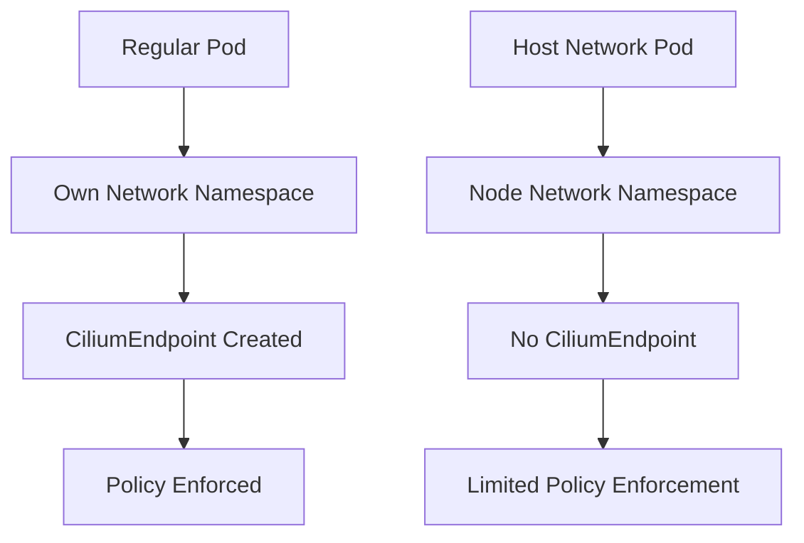

# Troubleshooting Cilium Host Network Mode

Author: [nawazdhandala](https://github.com/nawazdhandala)

Tags: Cilium, Kubernetes, Host Network, Troubleshooting, Networking

Description: How to diagnose and resolve issues when running pods in host network mode with Cilium, including policy enforcement gaps and connectivity problems.

---

## Introduction

Host network mode pods share the node network namespace instead of getting their own IP address. This creates unique challenges for Cilium because host-networked pods bypass many of the normal CNI networking controls. Cilium handles host-networked pods differently, and understanding these differences is key to troubleshooting.

Common issues include policies not applying to host-networked pods, host-networked pods not appearing as CiliumEndpoints, and connectivity issues between host-networked and regular pods.

## Prerequisites

- Kubernetes cluster with Cilium installed
- kubectl and Cilium CLI configured
- Pods running in host network mode

## Understanding Host Network Mode in Cilium

```yaml
# Host-networked pod
apiVersion: v1
kind: Pod
metadata:
  name: host-net-pod
spec:
  hostNetwork: true
  containers:
    - name: app
      image: nginx:1.27
      ports:
        - containerPort: 8080
          hostPort: 8080
```



## Diagnosing Host Network Issues

```bash
# Check if the pod is using host networking
kubectl get pod <pod-name> -o jsonpath='{.spec.hostNetwork}'

# Host-networked pods do NOT get CiliumEndpoints
kubectl get ciliumendpoints -n <namespace> | grep <pod-name>
# This will return nothing for host-networked pods

# Check Cilium host endpoint
cilium endpoint list | grep "reserved:host"

# Verify host policy is enabled
kubectl get configmap cilium-config -n kube-system \
  -o jsonpath='{.data.enable-host-firewall}'
```

## Enabling Host Firewall for Host Network Pods

```bash
# Enable host firewall to enforce policies on host-networked traffic
helm upgrade cilium cilium/cilium \
  --namespace kube-system \
  --reuse-values \
  --set hostFirewall.enabled=true
```

## Creating Policies for Host Network Traffic

```yaml
# host-network-policy.yaml
apiVersion: cilium.io/v2
kind: CiliumClusterwideNetworkPolicy
metadata:
  name: host-network-policy
spec:
  nodeSelector:
    matchLabels:
      kubernetes.io/os: linux
  ingress:
    - fromEntities:
        - cluster
      toPorts:
        - ports:
            - port: "8080"
              protocol: TCP
  egress:
    - toEntities:
        - world
```

## Fixing Connectivity Between Host and Regular Pods

```bash
# Check if traffic flows between host-networked and regular pods
kubectl exec host-net-pod -- curl -s http://10.0.0.5:80

# Check Hubble for traffic
hubble observe --from-label reserved:host --last 20
hubble observe --to-label reserved:host --last 20
```

## Verification

```bash
cilium status
cilium endpoint list | grep host
kubectl get ciliumclusterwidenetworkpolicies
```

## Troubleshooting

- **No CiliumEndpoint for host-networked pod**: This is expected. Host-networked pods use the node identity.
- **Policy not enforced on host traffic**: Enable host firewall with `hostFirewall.enabled=true`.
- **Host-networked pod cannot reach cluster services**: Check kube-proxy/eBPF service handling configuration.
- **Port conflicts**: Host-networked pods share the node port space. Ensure no port conflicts.

## Conclusion

Host network mode in Cilium requires special handling. Enable the host firewall for policy enforcement, understand that host-networked pods use the node identity, and create CiliumClusterwideNetworkPolicy for host-level traffic control.